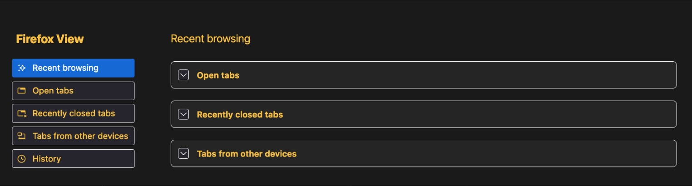

# High Contrast Mode (HCM) Media Queries

Firefox supports both the `prefers-contrast` and `forced-colors` media queries. These queries detect a user's display settings (in the browser and/or in their OS), and allow authors to adjust content styling accordingly. These queries are not interchangeable, and we should be intentional about using one or the other (or both!) when designing for accessibility.

## What activates these queries?

### Forced Colors
The `forced-colors` media query has two values: `active` and `none`. The resolved value of this media query is determined by the browser based on user settings (OS and Firefox).
* The `none` state indicates documents can use any colors to render content.
* The `active` state indicates a user has OS or browser settings that limit the color palette available to the User Agent.

In Firefox's default configuration, the `active` state is triggered when a user has Windows High Contrast Mode enabled, Linux High Contrast Themes, or [Firefox High Contrast Mode](https://firefox-source-docs.mozilla.org/accessible/ColorsAndHighContrastMode.html#the-colors-dialog) (FF HCM) enabled. All of these forced-colors modes offer users a limited amount of color customisation. In Windows, users can override seven colors, and with Firefox High Contrast Mode users can override four. On Linux, the entire system theme is overridden. MacOS's "Increase Contrast" setting does **not** trigger `forced-colors: active` because it does not limit the color palette available to UA's.
> **NOTE:** MacOS's "Increase Contrast" setting **will** trigger `forced-colors: active` (in non-chrome web content) if it is enabled in combination with FF HCM's "Only with High Contrast Themes" option. Because FF HCM defaults to "Never" on macOS, enabling  "Increase Contrast" alone will not trigger `forced-colors: active`. Similarly, if a user disables FF HCM while Win HCM or Linux HCT are enabled, `forced-colors` (in content) will evaluate to `none`.

#### CSS System Colors

Colors that are overridden by the forced-colors modes list above are inherited into the browser's [CSS System Colors](https://www.w3.org/TR/css-color-4/#css-system-colors). Designers must use these colors exclusively in their designs when designing for forced-colors modes. CSS System Colors are intended to be used in pairs: for example the `ButtonFace` and `ButtonText` colors should be used together to create styling for interactive controls. The full pairings are listed in the [system color pairings](https://www.w3.org/TR/css-color-4/#system-color-pairings) section of the CSS spec. Mozilla has additional design guidance for using CSS System Colors in our [HCM Design Guide](https://wiki.mozilla.org/Accessibility/Design_Guide). You can also check out our other docs to [learn more about color overriding](https://firefox-source-docs.mozilla.org/accessible/ColorsAndHighContrastMode.html).

### Prefers Contrast
The `prefers-contrast` media query has four values: `more`, `less`, `custom`, and `no-preference`.

* The `more` state is triggered when a user has macOS's "Increase Contrast" setting enabled, or when a forced-colors mode is active **and** the ratio between a user's [chosen foreground and background](https://searchfox.org/mozilla-central/rev/655f49c541108e3d0a232aa7173fbcb9af88d80b/layout/style/PreferenceSheet.cpp#123-126) is higher than 7:1. This check is done [in our style system](https://searchfox.org/mozilla-central/rev/655f49c541108e3d0a232aa7173fbcb9af88d80b/layout/style/nsMediaFeatures.cpp#287-308).
* The `less` state is triggered when a forced-colors mode is active and the foreground/background ratio is less than 4.5.
* When a forced-colors mode is enabled with a ratio between these two values, we return `custom`.
* Otherwise, if no forced-colors mode is active, and macOS's "Increase Contrast" is off, the media query resolves to `no-preference`.

## So what do I use?

Generally, this boils down to which operating systems you want your styling to apply to. In the past, we've often written code to target _all_ platforms within `prefers-contrast` blocks because the kinds of changes we make to target forced-colors mode also benefit "Increase Contrast" users on macOS; they allow system colors to propagate to the UA. The palette that macOS supplies when "Increase Contrast" is enabled is _also_ inherited to CSS System Colors, and may offer improvements over the standard palette for a design. It is still possible that changes made for forced-colors modes benefit "Increase Contrast" users, however we strongly encourage developers to consider whether diversifying our designs for these modes provides better UX.

On macOS, we aren't limited to the OS palette. Instead of modifying a design to use fewer colors, we can simply increase the contrast ratio of the existing colors to 7:1 to satisfy [the enhanced contrast criterion of Web Content Accessibility Guidelines (WCAG)](https://www.w3.org/WAI/WCAG22/Understanding/contrast-enhanced.html) for better accessibility. Consider the following designs.

Standard UX on macOS:


UX with increased contrast of existing colors on macOS:



Changes present in this example belong in a `prefers-contrast: more` block. This is **assuming these changes are appropriately overridden in the cascade for `forced-colors: active` users**. If they are not overridden, an additional query like `@media (-moz-platform: macos)` or `.. and (not (forced-colors))` should be combined with `prefers-contrast: more` to ensure these changes only apply to macOS.
For users who prefer less contrast, we can supply colors that lower the contrast ratios in the existing design and encase those changes in a `prefers-contrast: less` block.

UX with limited color palette in FF HCM on macOS:


In forced-colors modes, we require that designs reduce their palettes for compatibility. To accomplish this, we use CSS System Colors instead of the original design colors. This allows the overridden palette to "show through", since colors from the various forced-colors modes are inherited into CSS System Colors. It is possible that using CSS System Colors also increases contrast for users on macOS, but this more drastically changes the design at hand, and can detract from the overall user experience for users who are simply looking for more contrast. Designers should consider the additional guidelines on border use, removing gradients, etc. in our [HCM Design Guide](https://wiki.mozilla.org/Accessibility/Design_Guide).

> **NOTE:** Firefox's chrome style sheets are subject to different rules than web-author style sheets.

Firefox's chrome style sheets (including those in our `about:` pages) are not prevented from using colors that aren't system colors, even if a forced colors mode is enabled. In webpages, however, Firefox forces CSS System Colors regardless of the author's original specification. This is a safety mechanism to ensure pages render appropriately even if no `@media (prefers-contrast)` or `@media (forced-colors)` styling was specified.  To avoid this overriding, web authors can use the [forced-color-adjust: none;](https://developer.mozilla.org/en-US/docs/Web/CSS/forced-color-adjust) CSS property.

## Writing Maintainable Frontend Code

Where possible, we prefer color overriding for `prefers-contrast` and `forced-colors` take place in one block at the `root` level rather than in many blocks on an element-by-element basis. We encourage developers to use [design systems tokens](https://searchfox.org/mozilla-central/rev/c130c69b7b863d5e28ab9524b65c27c7a9507c48/toolkit/themes/shared/design-system/tokens-shared.css) with semantic naming when overriding. Consider the following.

```css
:root {
  --page-background: #cccccc;
  --page-text-color: #000000;

  @media (forced-colors) {
    --page-background: Canvas;
    --page-text-color: CanvasText;
  }
}

body {
  color: var(--page-text-color);
  background-color: var(--page-background);
}
```

Here, we've defined one set of color variables on `:root` and subsequently overridden them in a `forced-colors` block. We don't need to re-write the styling for `body` within our media query because the vars it references will correctly adapt when `forced-colors` is active.

Though `forced-colors` overriding doesn't happen in Firefox chrome style sheets, our style system _does_ force all instances of `transparent` to the [default color](https://searchfox.org/mozilla-central/rev/655f49c541108e3d0a232aa7173fbcb9af88d80b/servo/components/style/properties/cascade.rs#468-481) for a color attribute (usually `CanvasText`). This allows us to specify styles that appear only in forced-colors mode without an additional CSS keyword. It is also sometimes beneficial to define vars at the `:root` level with an initial value (eg. `transparent`, `0px`, `none`) so the vars exist for HCM overriding later (see: `--dialog-border-width`).

```css
:root {
  /* ... */
  --dialog-background: #ffffff;
  --dialog-color: #bbbbbb;
  --dialog-border-color: transparent;
  --dialog-border-width: 0px;

  @media (forced-colors) {
    /* ... */
    --dialog-background: Canvas;
    --dialog-color: CanvasText;
    /* No override for --dialog-borer-color, since it'll become
    * CanvasText when HCM is enabled, which matches the HCM spec. */
    --dialog-border-width: 1px;
  }
}

.dialog {
  color: var(--dialog-color);
  background-color: var(--dialog-background);
  border: var(--dialog-borer-width) solid var(--dialog-border-color);
}

/* ... */
```

In general, it is best to do overriding at the `:root` level, even if additional variables are required. It is _not_ recommended to do overriding on a class-by-class or element-by-element basis, like below:

```css
:root {
  /* ... */
  --button-background: #ffffff;
  --button-color: #bbbbbb;

  @media (forced-colors) {
    /* ... */
    --button-background: ButtonFace;
    --button-color: ButtonText;
    --button-border-color: var(--button-color);
  }
}

@media (forced-colors) {
  /* BAD: These rules are generic and should be outside of a @media block */
  .destroyButton {
    color: var(--button-color);
    background-color: var(--button-background);
    border: 1px solid var(--button-border-color);
  }
}

@media (not (forced-colors)) {
  /* BAD: These rules are generic and should be outside of a @media block */
  .destroyButton {
    color: var(--light-grey-20);
    background-color: var(--red-60);
  }
}
/*...*/
```

## Putting it all together!

Let's walk through an example on this sample website.

<iframe src="https://mreschenberg.com/sample_site.html" style="width: 100%; height: 60vh;"></iframe>

The majority of our site styling is done via color overriding on the root block.
```css
:root {
  /* General */
  --background: #202124;
  --color: #cccccc;
  --border-color: transparent;
  --border-size: 0;
  --table-background: #303134;
  /* Note */
  --note-background: gold;
  --note-color: var(--table-background);
  --note-opacity: .7;
  /* General Controls */
  --control-background: gray;
  --control-color: var(--color);
  --control-border-size: var(--border-size);
  --control-border-color: var(--border-color);
  /* Destructive Button */
  --destructive-button-background: tomato;
  --destructive-button-color: var(--table-background);
}
```

How might we adapt this website for users who prefer increased contrast? What about for users with forced colors?

Let's start with users who prefer increased contrast. We might decide to make the background and foreground easier to read by making the foreground text lighter, increasing the contrast ratio. We might also remove the note's opacity and darken its text color. We don't need to remove the note's golden background, since prefers-contrast doesn't require a reduced color palette.
```css
:root {
  /* ... */
  @media (prefers-contrast) and (not (forced-colors)) {
    /* General */
    --color: white;
    /* Note */
    --note-color: black;
    --note-opacity: 1;
    /* ... */
  }
}
```
To address these same issues in forced-colors mode, we should replace the colors with the semantically appropriate system color. Unlike our work in the `prefers-contrast` block above, we do need to modify the note's background, since `gold` is not a system color. We might end up with something like this:
```css
:root {
  /* ... */
  @media (forced-colors) {
    /* General */
    --background: Canvas;
    --color: CanvasText;
    --table-background: var(--background);
    /* Note */
    --note-background: var(--background);
    --note-color: var(--color);
    --note-opacity: 1;
    /* ... */
  }
}
```

After this change, you'll notice our page background, table background, and note background all share the same color. This makes them difficult to differentiate. To address this, we can add a contrasting border and override the previously transparent `--border-color` variable and its corresponding `--border-size`. This var applies to content areas but not controls.
```css
:root {
  /* ... */
  @media (forced-colors) {
    /* General */
    --background: Canvas;
    --color: CanvasText;
    --border-color: var(--color);
    --border-size: 1px;
    --table-background: var(--background);
    /* Note */
    --note-background: var(--background);
    --note-color: var(--color);
    --note-opacity: 1;
    /* ... */
  }
}
```

Next, let's look at the controls this page uses for the web form. We've got an input, a checkbox, a submit button, and a clear button. In the prefers-contrast case, we should ensure the controls contrast from the background as much as possible. It's possible to do this via color alone, but it can help to add borders for additional contrast. Here, again, we don't need to get rid of the clear button's `tomato` background, but we can update it to something brighter.
```css
:root {
  /* ... */
  @media (prefers-contrast) and (not (forced-colors)) {
    /* ... */
    /* General Controls */
    --control-background: color-mix(in srgb, gray, lightgray);
    --control-color: black;
    --control-border-size: 1px;
    --control-border-color: gray;
    /* Destructive Button */
    --destructive-button-background: red;
    --destructive-button-color: white;
    /* ... */
  }
}
```

Finally, let's style the page's controls for `forced-colors`. Unlike in prefers-contrast, we can't use color to differentiate between the submit button and the clear form button -- both should inherit from our button CSS system colors.
```css
:root {
  /* ... */
  @media (forced-colors) {
    /* General */
    --background: Canvas;
    --color: CanvasText;
    --border-color: var(--color);
    --border-size: 1px;
    --table-background: var(--background);
    /* Note */
    --note-background: var(--background);
    --note-color: var(--color);
    --note-opacity: 1;
    /* General Controls */
    --control-background: ButtonFace;
    --control-color: ButtonText;
    --control-border-color: ButtonText;
    /* Destructive Button */
    --destructive-button-background: var(--control-background);
    --destructive-button-color: var(--control-color);
  }
}
```

If we wanted to make the submit button stand out as a primary button, we could invert the styling on that button in particular. Something like:
```css
:root {
  /* ... */
  @media (forced-colors) {
    /* General */
    --background: Canvas;
    --color: CanvasText;
    --border-color: var(--color);
    --border-size: 1px;
    --table-background: var(--background);
    /* Note */
    --note-background: var(--background);
    --note-color: var(--color);
    --note-opacity: 1;
    /* General Controls */
    --control-background: ButtonFace;
    --control-color: ButtonText;
    --control-border-color: ButtonText;
    /* Destructive Button */
    --destructive-button-background: var(--control-background);
    --destructive-button-color: var(--control-color);
  }

  #submit {
    background: var(--control-color);
    color: var(--control-background);
    border: var(--control-border-size) solid currentColor;
  }
}
```

Now we've got a site that functions in multiple HCM scenerios :) Visit the <a href="https://mreschenberg.com/sample_site.html">live site</a> with HCM or Increase Contrast enabled to test it for yourself.
A few takeaways:
- `prefers-contrast` and `forced-colors` are not mutually exclusive. If you write two independent `forced-colors` and `prefers-contrast` media query blocks, they'll both apply when FF HCM is enabled (assuming your foreground/background contrast ratio is high, which it is by default). Adding an `and (not (forced-colors))` clause to your `@media (prefers-contrast)` declaration can help make the two blocks distinct if you'd like mac-centric styling in one and `forced-colors` styling in the other.
- `prefers-contrast` requires specific, case-by-case overriding, whereas `forced-colors` is largely about inheretince. In the former, page regions that are differentiated with color should stay that way (albeit with more contrasting colors). In `forced-colors` all page regions that aren't interactive should use `Canvas`/`CanvasText` and rely on borders for distinction. Once you've set `--background: Canvas;` at the root level, for ex. subsequent background vars should inherit from it.
- Where possible, aim to do overriding at the `:root` level using CSS variables, this makes it easier to update code in the future.
