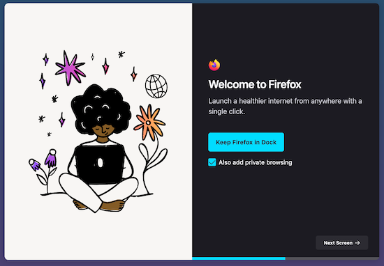

# About Welcome

## What is about:welcome
A full-page multistep onboarding experience on `about:welcome` that appears to all new Firefox users after Firefox has successfully been installed.

Onboarding experience on `about:welcome` shows screens following below precedence order:
- Has AMO attribution
  - Return to AMO custom onboarding screens
- Experiments
- Return  `MR_ABOUT_WELCOME_DEFAULT` [screens](https://searchfox.org/mozilla-central/rev/3b707c8fd7e978eebf24279ee51ccf07895cfbcb/browser/components/newtab/aboutwelcome/lib/AboutWelcomeDefaults.jsm#523) after applying dynamic rules inside [prepareContentForReact](https://searchfox.org/mozilla-central/rev/3b707c8fd7e978eebf24279ee51ccf07895cfbcb/browser/components/newtab/aboutwelcome/lib/AboutWelcomeDefaults.jsm#577) method. Each screen can additionally be dynamically configured to show/hide via [screen level targeting](https://searchfox.org/mozilla-central/rev/3b707c8fd7e978eebf24279ee51ccf07895cfbcb/browser/components/newtab/aboutwelcome/lib/AboutWelcomeDefaults.jsm#90).

Spotlight messaging surface shows `about:welcome` screens content with the appearance of a spotlight modal by using exposed window.AW* interfaces. This [Unified Onboarding](https://docs.google.com/document/d/1o8W-gEkgw2GC7KFSfQRkKfWzNJg1-6fpkVPrYmmot4Y/edit) approach enables reusing `about:welcome` as rendering engine for multiple messaging surfaces such as Spotlight and Feature Callout.

## Testing about:welcome screens

### Via Screens Pref:
1. Go to `about:config`, search for `browser.aboutwelcome.screens` and set it to the array of screens value to be used in JSON recipe
2. Go to about:welcome and you should see the about:welcome screen(s)
**Note:** If you are enrolled in a nimbus experiment, about.welcome.screens will not show up

### Via Experiments
You can test custom `about:welcome` UI by creating an experiment. [Messaging Journey](https://experimenter.info/messaging/desktop-messaging-journey) captures creating and testing experiments via Nimbus.

### Example JSON screens property
```
[
  {
    "id": "TEST_SCREEN_1",
    "content": {
      "position": "split",
      "split_narrow_bkg_position": "-155px",
      "progress_bar": "true",
      "background": "url('chrome://activity-stream/content/data/content/assets/mr-pintaskbar.svg') var(--mr-secondary-position) no-repeat #F8F6F4",
      "logo": {},
      "title": "Welcome to Firefox",
      "subtitle": "Launch a healthier internet from anywhere with a single click.",
      "primary_button": {
        "label": {
          "string_id": "mr2022-onboarding-pin-primary-button-label"
        },
        "action": {
          "navigate": true,
          "type": "PIN_FIREFOX_TO_TASKBAR"
        }
      },
      "checkbox": {
        "label": "Also add private browsing",
        "defaultValue": true,
        "action": {
          "type": "MULTI_ACTION",
          "navigate": true,
          "data": {
            "actions": [
              {
                "type": "PIN_FIREFOX_TO_TASKBAR",
                "data": {
                  "privatePin": true
                }
              },
              {
                "type": "PIN_FIREFOX_TO_TASKBAR"
              }
            ]
          }
        }
      },
      "secondary_button": {
        "label": "Next Screen",
        "action": {
          "navigate": true
        },
        "has_arrow_icon": true
      }
    }
  },
  {
    "id": "TEST_SCREEN_2",
    "content": {
      "position": "split",
      "progress_bar": "true",
      "split_narrow_bkg_position": "-228px",
      "background": "url('chrome://activity-stream/content/data/content/assets/mr-gratitude.svg') var(--mr-secondary-position) no-repeat #F8F6F4",
      "logo": {},
      "title": "You’re helping us build a better web",
      "subtitle": "With your support, we’re working to make the internet more open, accessible, and better for everyone.",
      "primary_button": {
        "label": "Start browsing",
        "action": {
          "navigate": true
        }
      }
    }
  }
]
```

### Example about:welcome screens

### Browser View



### Responsive View


