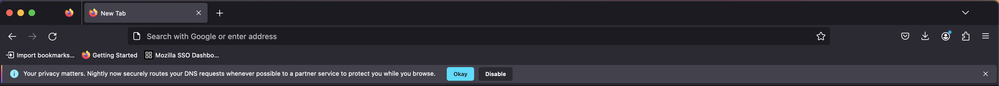

# Infobars
Infobars are shown at the top of the browser content area, these can be per tab (switching tabs hides it) or global (persistent across tabs).

## Example of a Infobar


## Testing Infobars

### Via the dev tools:
1. Go to `about:config`, set pref `browser.newtabpage.activity-stream.asrouter.devtoolsEnabled` to `true`
2. Open a new tab and go to `about:newtab#devtools` in the url bar
3. In devtools Messages section, select and show messages from `cfr` as provider
4. You should see example JSON messages with `"template": "infobar"`. Clicking `Show` next to infobar message should show respective message UI
5. You can directly modify the message in the text area with your changes or by pasting your custom message JSON. Clicking `Modify` shows your updated message.
6. Ensure that all required properties are covered according to the [Infobar Schema](https://searchfox.org/mozilla-central/source/browser/components/newtab/content-src/asrouter/templates/CFR/templates/InfoBar.schema.json)
7. Clicking `Share`, copies link to clipboard that can be pasted in the url bar to preview infobar message UI in browser and can be shared to get feedback from your team.
- **Note:** Overlapping infobars will not be shown when testing multiple infobar messages
- **Note:** Modifying the `label` property will change the text within the buttons, eg: `"label": "Disable"`

### Via Experiments:
You can test Infobar messaging surface by creating an experiment or landing message in tree. [Messaging Journey](https://experimenter.info/messaging/desktop-messaging-journey) captures creating and testing experiments via Nimbus.

### Example JSON for Infobar
```
{
  "content": {
    "text": "Your privacy matters. Nightly now securely routes your DNS requests whenever possible to a partner service to protect you while you browse.",

    "buttons": [
      {
        "label": "Okay",
        "action": {
          "type": "ACCEPT_DOH"
        },
        "primary": true
      },
      {
        "label": "Disable",
        "action": {
          "type": "DISABLE_DOH"
        }
      }
    ],
    "priority": 1,
    "bucket_id": "TEST_DOH_BUCKET"
  },
  "trigger": {
    "id": "openURL",
    "patterns": [
      "*://*/*"
    ]
  },
  "template": "infobar",
  "frequency": {
    "lifetime": 3
  },
  "targeting": "firefoxVersion >= 89",
  "id": "Test_Infobar"
}
```
