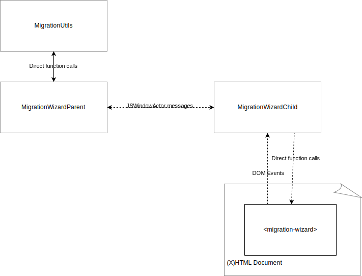

==========================
Migration Wizard Reference
==========================

The migration wizard is the piece of UI that allows users to migrate from other browsers to Firefox.

The migration wizard can be embedded in the following contexts:

1. In a top level stand-alone dialog window
2. Within privileged ``about:`` pages, like ``about:welcome``, and ``about:preferences``

To accommodate these contexts, the migration wizard was developed as a reusable component using pure HTML, with an architecture that decouples the control of the wizard from how the wizard is presented to the user. This architecture not only helps to ensure that the wizard can function similarly in these different contexts, but also makes the component viewable in tools like Storybook for easier development.

High-level Overview
-------------------

The following diagram tries to illustrate how the pieces of the migration wizard fit together:

``MigrationWizard`` reusable component
======================================

The ``MigrationWizard`` reusable component (``<migration-wizard>``) is a custom element that can be imported from ``migration-wizard.mjs``. The module is expected to load in a DOM window context, whereupon the custom element is automatically registered for that document.

After binding to the document, if the ``MigrationWizard`` has the ``auto-request-state`` attribute set on it, it will dispatch a ``MigrationWizard:RequestState`` custom event, which causes a ``MigrationWizardChild`` to instantiate and be associated with it. After receiving the migrator state from the ``MigrationWizardParent``, the ``MigrationWizardChild`` will dispatch a ``MigrationWizard:Ready`` event on the ``MigrationWizard``, mainly to aid in testing. The ``auto-request-state`` attribute is useful in situations where the ``MigrationWizard`` element is being used declaratively.

If the ``auto-request-state`` attribute is not set, calling ``requestState()`` on the ``MigrationWizard`` will perform the above step. This is useful in situations where the ``MigrationWizard`` element is being constructed dynamically and the callers wants finer-grain control over when the state will be requested.

There are also a handful of attributes that can be set to customize the experience that the ``MigrationWizard`` provides.
* ``option-expander-title-string``: The string of the label that is displayed next to the button that expands or hides the resource list on the selection page will be overwritten with the value of this attribute, if it is set.
* ``hide-option-expander-subtitle``: When set to true, this attribute hides the subtitle that is displayed underneath the resource list expander.
* ``import-button-string``: The string on the primary action button on the selection page is overridden with the value of this attribute when set.
* ``import-button-class``: When set, the value of this attribute will be added to the class list on the primary action button on the selection page.
* ``checkbox-margin-inline``: When set, the value of this attribute will be used to override the ``margin-inline`` of the labels in the resource list on the selection page.
* ``checkbox-margin-block``: When set, the value of this attribute will be used to override the ``margin-block`` of the labels in the resource list on the selection page.
* ``selection-header-string``: When set, overrides the text content of the header on the selection page with the set string.
* ``selection-subheader-string``: When set, presents a subheader on the selection page with the set string.
* ``data-import-complete-success-string``: When set, this attribute will be used to override the text content of the header of the import complete screen when the import was successful.
* ``header-font-size``: Overrides the default ``font-size`` of all headers with the value of this string.
* ``header-font-weight``: Overrides the default ``font-weight`` of all headers with the value of this string.
* ``header-margin-block``: Overrides the default ``margin-block`` of all headers with the value of this string.
* ``subheader-font-size``: When used with ``selection-subheader-string``, overrides the default ``font-size`` of the selection page subheader with the value in this string. This has no effect when used alone.
* ``subheader-font-weight``: When used with ``selection-subheader-string``, overrides the default ``font-weight`` of the selection page subheader with the value in this string. This has no effect when used alone.
* ``subheader-margin-block``: When used with ``selection-subheader-string``, overrides the default ``margin-block`` of the selection page subheader with the value in this string. This has no effect when used alone.

Notably, the ``MigrationWizard`` does not contain any internal logic or privileged code to perform any migrations or to directly interact with the migration mechanisms. Its sole function is to accept input from the user and emit that input as events. The associated ``MigrationWizardChild`` will listen for those events, and take care of calling into the ``MigrationWizard`` to update the state of the reusable component. This means that the reusable component can be embedded in unprivileged contexts and have its states presented in a tool like Storybook.

If the ``MigrationWizard`` is embedded in a dialog, it should have the ``dialog-mode`` attribute set on it so that dialog-appropriate buttons and styles are applied.

If the ``MigrationWizard`` is used in a messaging system surface that uses the same underlying component as ``about:welcome`` such as the Spotlight modal or Feature Callout, it should have the ``is-aboutwelcome-bundle`` attribute set so that anchor click events are appropriately captured and handled.

``MigrationWizardConstants``
============================

The ``MigrationWizardConstants`` module exports a single object of the same name. The properties of that object are constants that can be used to set the state of a ``MigrationWizard`` instance using ``MigrationWizard.setState``.

``MigrationWizardChild``
=========================

The ``MigrationWizardChild`` is a ``JSWindowActorChild`` (see `JSActors`_) that is responsible for listening for events from a ``MigrationWizard``, and then either updating the state of that ``MigrationWizard`` immediately, or to message its paired ``MigrationWizardParent`` to perform tasks with ``MigrationUtils``.

  .. note::
    While a ``MigrationWizardChild`` can run in a content process (for out-of-process pages like ``about:welcome``), it can also run in parent-process contexts - for example, within the parent-process ``about:preferences`` page, or standalone window dialog. The same flow of events and messaging applies in all contexts.

The ``MigrationWizardChild`` also waives Xrays so that it can directly call the ``setState`` method to update the appearance of the ``MigrationWizard``. See `XrayVision`_ for much more information on Xrays.

.. js:autoclass:: MigrationWizardChild
  :members:

``MigrationWizardParent``
=========================

The ``MigrationWizardParent`` is a ``JSWindowActorParent`` (see `JSActors`_) that is responsible for listening for messages from the paired ``MigrationWizardChild`` to perform operations with ``MigrationUtils``. Effectively, all of the heavy lifting of actually performing the migrations will be kicked off by the ``MigrationWizardParent`` by calling into ``MigrationUtils``. State updates for things like migration progress will be sent back down to the ``MigrationWizardChild`` to then be reflected in the appearance of the ``MigrationWizard``.

Since the ``MigrationWizard`` might be embedded in unprivileged documents, additional checks are placed in the message handler for ``MigrationWizardParent`` to ensure that the document is either running in the parent process or the privileged about content process. The `JSActors`_ registration for ``MigrationWizardParent`` and ``MigrationWizardChild`` also ensures that the actors only load for built-in documents.

.. js:autoclass:: MigrationWizardParent
  :members:

``migration-dialog-window.html``
================================

This document is meant for being loaded in a window dialog, and embeds the ``MigrationWizard`` reusable component, setting ``dialog-mode`` on it. It listens for dialog-specific events from the ``MigrationWizard``, such as ``MigrationWizard:Close``, which indicates that a "Cancel" button that should close the dialog was clicked.

Pages like ``about:preferences`` or ``about:welcome`` can embed the ``MigrationWizard`` component directly, rather than use ``migration-dialog-window.html``.

.. _JSActors: /dom/ipc/jsactors.html
.. _XrayVision: /dom/scriptSecurity/xray_vision.html
