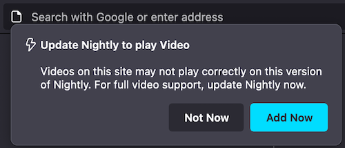

# Contextual Feature Recommendation

## What are CFRs?
The most commonly used CFR as a Messaging Surface is the doorhanger, which anchors to one of the UI elements such as the application menu, the identity panel and so on.
CFRs like any other messaging screen has specific triggers. You can learn more about triggers [here](https://firefox-source-docs.mozilla.org/toolkit/components/messaging-system/docs/TriggerActionSchemas/index.html),

[More examples of templates supported with CFR ](https://experimenter.info/messaging/desktop-messaging-surfaces/#doorhanger)

### Example of Doorhanger


## Testing CFRs

### Via the dev tools:
1. Go to `about:config`, set pref `browser.newtabpage.activity-stream.asrouter.devtoolsEnabled` to `true`
2. Open a new tab and go to `about:newtab#devtools` in the url bar
3. In devtools Messages section, select and show messages from `cfr` as provider
4. You should see example JSON messages with `"template": "cfr_doorhanger"` or `"template": "milestone_message"`. Clicking `Show` next to CFR message should show respective message UI
5. You can directly modify the message in the text area with your changes or by pasting your custom message JSON. Clicking `Modify` shows your new updated CFR message.
6. Ensure that all required properties are covered according to the [Doorhanger Schema](https://searchfox.org/mozilla-central/source/browser/components/newtab/content-src/asrouter/templates/CFR/templates/ExtensionDoorhanger.schema.json)
7. Clicking `Share`, copies link to clipboard that can be pasted in the url bar to preview doorhanger UI in browser and can be shared to get feedback from your team.
- **Note:** Some messages will not be shown when testing multiple CFRs due to overlap, ensure you close the previous message before testing another

- **Note:** The `"anchor_id"` prop is the ID of the element the CFR will attach to (example below: `tracking-protection-icon-box`). Setting prop skip_address_bar_notifier to true will show the doorhanger straight away skipping url bar notifier (See [Bug 1831198](https://bugzilla.mozilla.org/show_bug.cgi?id=1831198)).

### Via Experiments:
You can test CFR messaging surface by creating an experiment or landing message in tree. [Messaging Journey](https://experimenter.info/messaging/desktop-messaging-journey) captures creating and testing experiments via Nimbus.

### Example JSON for CFR
```
{
  "id": "Test_CFR",
  "groups": [
    "cfr"
  ],
  "template": "cfr_doorhanger",
  "content": {
    "persistent_doorhanger": true,
    "anchor_id": "tracking-protection-icon-container",
    "layout": "icon_and_message",
    "icon": "chrome://activity-stream/content/data/content/assets/glyph-webextension-16.svg",
    "icon_dark_theme": "chrome://activity-stream/content/data/content/assets/glyph-webextension-16.svg",
    "icon_class": "cfr-doorhanger-small-icon",
    "heading_text": "Update Nightly to play Video",
    "text": "Videos on this site may not play correctly on this version of Nightly. For full video support, update Nightly now.",
    "buttons": {
      "primary": {
        "label": {
          "string_id": "cfr-doorhanger-extension-ok-button"
        },
        "action": {
          "type": "OPEN_PREFERENCES_PAGE",
          "data": {
            "category": "sync",
            "entrypoint": "cfr-test"
          }
        }
      },
      "secondary": [
        {
          "label": {
            "string_id": "cfr-doorhanger-extension-cancel-button"
          },
          "action": {
            "type": "CANCEL"
          }
        }
      ]
    },
    "skip_address_bar_notifier": true
  },
  "frequency": {
    "lifetime": 1
  },
  "trigger": {
    "id": "nthTabClosed"
  },
  "targeting": "firefoxVersion >= 115"
}
```
