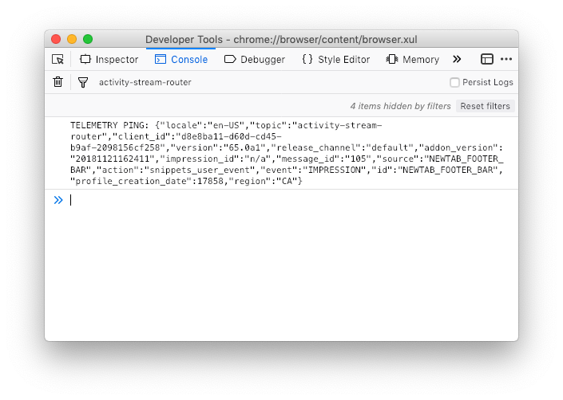

# Using ASRouter Devtools

## How to enable ASRouter devtools
- In `about:config`, set `browser.newtabpage.activity-stream.asrouter.devtoolsEnabled` to `true`
- Visit `about:newtab#asrouter` to see the devtools.

## Overview of ASRouter devtools


## How to enable/disable a provider

To enable a provider such as `snippets`, Look at the list of "Message Providers" at the top of the page. Make sure the checkbox is checked next to the provider you want to enable.

To disable it, uncheck the checkbox. You should see a red label indicating the provider is now disabled.

## How to see all messages from a provider

(Only available in Firefox 65+)

In order to see all active messages for a current provider such as `snippets`, use the drop down selector under the "Messages" section. Select the name of the provider you are interested in.

The messages on the page should now be filtered to include only the provider you selected.

## How to test telemetry pings

To test telemetry pings, complete the the following steps:

- In about:config, set:
  - `browser.newtabpage.activity-stream.telemetry` to `true`
  - `browser.ping-centre.log` to `true`
- Open the Browser Toolbox devtools (Tools > Developer > Browser Toolbox) and switch to the console tab. Add a filter for for `activity-stream-router` to only display relevant pings:



You should now see pings show up as you view/interact with ASR messages/templates.

## Snippets debugging

### How to view preview URLs

Follow these steps to view preview URLs (e.g. `about:newtab?endpoint=https://gist.githubusercontent.com/piatra/d193ca7e0f513cc19fc6a1d396c214f7/raw/8bcaf9548212e4c613577e839198cc14e7317630/newsletter_snippet.json&theme=dark`)

You can preview in the two different themes (light and dark) by adding `&theme=dark` or `&theme=light` at the end of the url.

#### IMPORTANT NOTES
- Links to URLs starting with `about:newtab` cannot be clicked on directly. They must be copy and pasted into the address bar.
- Previews should only be tested in `Firefox 64` and later.
- The endpoint must be HTTPS, the host must be whitelisted (see testing instructions below)
- Errors are surfaced in the `Console` tab of the `Browser Toolbox`

#### Testing instructions
- If your endpoint URL has a host name of `snippets-admin.mozilla.org`, you can paste the URL into the address bar view it without any further steps.
- If your endpoint URL  starts with some other host name, it must be **whitelisted**. Open the Browser Toolbox devtools (Tools > Developer > Browser Toolbox) and paste the following code (where `gist.githubusercontent.com` is the hostname of your endpoint URL):
```js
Services.prefs.setStringPref(
  "browser.newtab.activity-stream.asrouter.whitelistHosts",
  "[\"gist.githubusercontent.com\"]"
);
```
- Restart the browser
- You should now be able to paste the URL into the address bar and view it.
