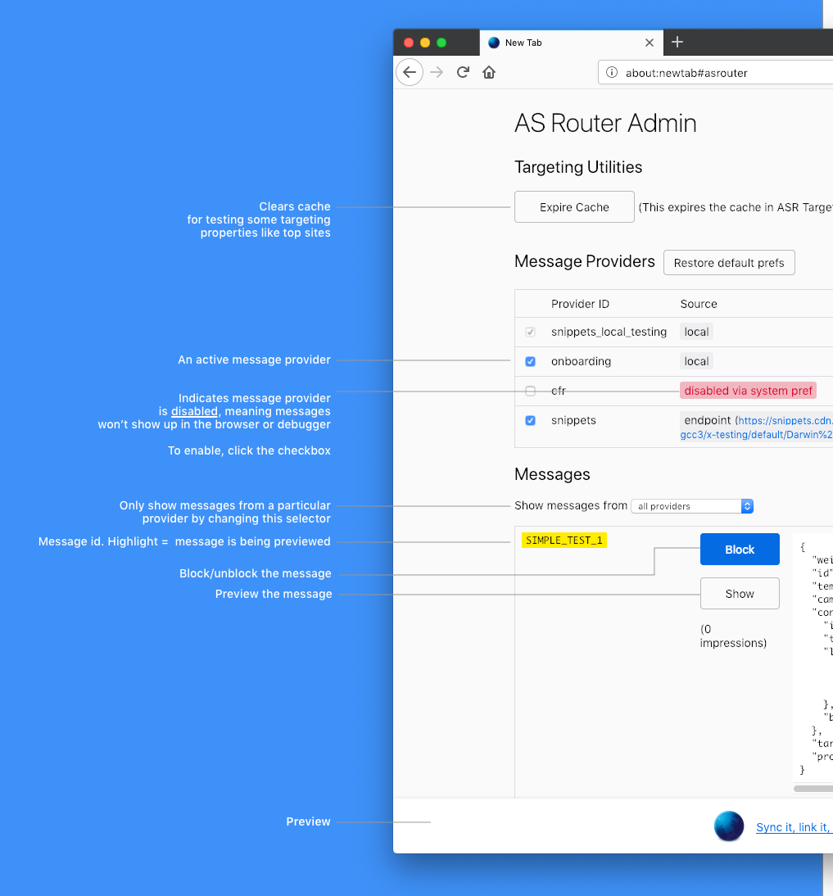

# Using ASRouter Devtools

## How to enable ASRouter devtools
- In `about:config`, set `browser.newtabpage.activity-stream.asrouter.devtoolsEnabled` to `true`
- Visit `about:asrouter` to see the devtools.

## Overview of ASRouter devtools

## How to enable/disable a provider

To enable a provider such as `cfr`, Look at the list of "Message Providers" at the top of the page. Make sure the checkbox is checked next to the provider you want to enable.

To disable it, uncheck the checkbox. You should see a red label indicating the provider is now disabled.

## How to see all messages from a provider

In order to see all active messages for a current provider such as `cfr`, use the drop down selector under the "Messages" section. Select the name of the provider you are interested in.

The messages on the page should now be filtered to include only the provider you selected.

## How to test data collection

All of Messaging System, including ASRouter, is instrumented in Glean.
To test this instrumentation, please consult [this guide](/toolkit/components/glean/user/instrumentation_tests.md), and:

- In about:config, set:
  - `browser.newtabpage.activity-stream.telemetry` to `true`
- To view additional debug logs for messaging system or about:welcome, set:
  - `messaging-system.log` to `debug`
  - `browser.aboutwelcome.log` to `debug`
