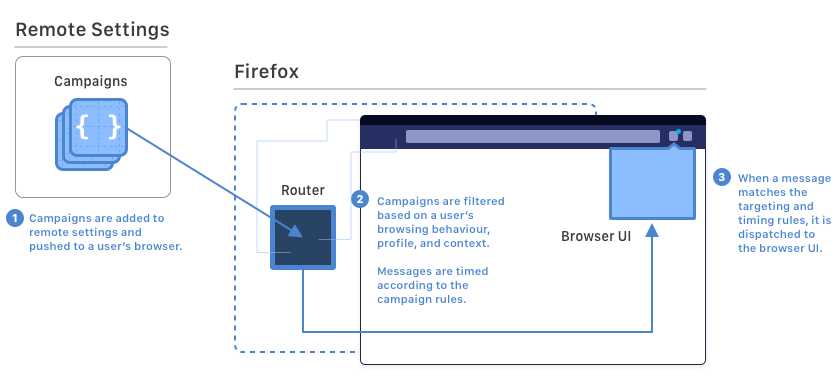

================
Messaging System
================

Vision
------
Firefox must be an opinionated user agent that keeps folks safe, informed and
effective while browsing the Web. In order to have an opinion, Firefox must
have a voice.

That voice will **respect the user’s attention** while surfacing contextually
relevant and timely information tailored to their individual needs and choices.

What does Messaging System support?
-----------------------------------
There are several key windows of opportunity, such as the first-run activation
phase or coordinated feature releases, where Firefox engages with users.

The Firefox Messaging System supports this engagement by targeting messages
exactly to the users who need to see them and enables the development of new
user messages that can be easily tested and deployed. It offers standard
mechanisms to measure user engagement and to perform user messaging experiments
with reduced effort across engineering teams and a faster delivery cycle from
ideation to analysis of results.

This translates to **users seeing fewer and more relevant in-product
messages**, while supporting fast delivery, experimentation, and protection of
our users time and attention.

Messaging System Overview
-------------------------
At the core of the Firefox Messaging System is the Messaging System Router
(called ASRouter for historical reasons). The router is a generalized Firefox
component and set of conventions that provides:

* Flexible and configurable routing of local or remote Messages to UI
  Templates. This allows new message campaigns to be started and controlled
  on or off-trains
* Traffic Cop message sequencing and intermediation to prevent multiple
  messages being concurrently shown
* Programmable message targeting language to show the right message to the
  right user at the right time
* A template library of reusable Message and Notification UIs
* Full compatibility with Normandy pref-flip experiments
* Generalized and privacy conscious event telemetry
* Flexible Frequency Capping to mitigate user message fatigue
* Localized off train Messages
* Powerful development/debugging/QA tools on about:newtab#devtools

Message Routing
---------------

The Firefox Messaging System implements a separation-of-concerns pattern for
Messages, UI Templates, and Timing/Targeting mechanisms. This allows us to
maintain a high standard of security and quality while still allowing for
maximum flexibility around content creation.

UI Templates
------------
We have built a library of reusable Notification and Message interfaces which
land in the Firefox codebase and ride the trains. These templates have a
defined schema according to the available design components (e.g. titles, text,
icons) and access to a set of enhanced user actions such as triggering URLs,
launching menus, or installing addons, which can be attached to interactive
elements (such as buttons).

Current templates include\:

.. In theory, we ought to be able to use the :glob: directive here to
.. automatically generate the list below. For unknown reasons, however,
.. `mach doc` _sometimes_ gets confused and refuses to find patterns like
.. `*.md`.
.. toctree::
  :maxdepth: 1

  moments-page
  contextual-feature-recommendation
  about-welcome
  infobars
  spotlight
  private-browsing

Detailed Docs
-------------

* Read more about `trigger listeners and user action schemas`__.

.. __: /toolkit/components/messaging-system/docs

.. In theory, we ought to be able to use the :glob: directive here to
.. automatically generate the list below. For unknown reasons, however,
.. `mach doc` _sometimes_ gets confused and refuses to find patterns like
.. `*.md`.
.. toctree::
  :maxdepth: 2

  simple-cfr-template
  debugging-docs
  first-run
  targeting-attributes
  targeting-guide
  telemetry
