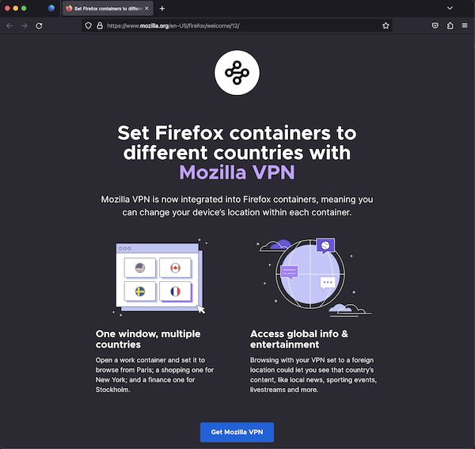

# Moments Page

## What are Moments pages?
Moments Page is a web page URL that’s loaded for existing Firefox Desktop users on subsequent startup for user profiles meeting the targeting specified in moments message config.

Moments Pages are different from WNP (What’s New Page) that shows up when users update to a new major version based on configurations built into the executable for that channel/build. Moments are shown outside of an upgrade on regular restarts and are remotely configurable via Messaging System.

The constraint of synchronous start-up behavior prevents waiting for Remote Settings to make a targeting decision resulting in “Moments” shown on subsequent start-ups.

### Startup pref lifecycle
The process of selecting/blocking/showing is as follows:
1. At the start of any `“update”` cycle (i.e. on a regular interval, and preferably when remote settings updates):
2. Check the override pref `browser.startup.homepage_override.once`; if a message ID is set, unblock that message since it has not yet been shown. Clear the override pref.
3. Run messages through targeting and select a message.
4. [Set the message with expiration data](https://searchfox.org/mozilla-central/rev/3b707c8fd7e978eebf24279ee51ccf07895cfbcb/browser/components/newtab/lib/MomentsPageHub.jsm#87) in the pref.
5. Block the message that was chosen immediately.


When the message is shown at startup:
1. Clear the override pref.


### Example of a Moments page


## Testing Moments Page

### Via the dev tools:
1. In the search tab go to `about:config`, set `browser.newtabpage.activity-stream.asrouter.devtoolsEnabled` to `true`
2. Open a new tab, in the search tab go to `about:newtab#devtools`
3. In devtools, select and show messages from `panel_local_testing` as provider
4. You should see example JSON messages with  `"template": "update_action"`. You can directly modify the message in the text area with your changes or by pasting your custom message JSON. For testing, please keep `id` property in config same as respective message modified.
5. Clicking `Modify` updates the override pref `browser.startup.homepage_override.once` and configures the Messaging System to open moments url in message config on next browser restart.
6. Ensure that all required properties are covered according to the [Moments Schema](https://searchfox.org/mozilla-central/source/browser/components/newtab/content-src/asrouter/templates/OnboardingMessage/UpdateAction.schema.json)
7. Restart firefox and your moments page should pop up on re-run

### Via Experiments:
You can test the moments page by creating an experiment. [Messaging Journey](https://experimenter.info/messaging/desktop-messaging-journey) captures creating experiments via Nimbus.

### Example JSON for Moments page
```
{
  "groups": [
    "moments-pages"
  ],
  "content": {
    "action": {
      "id": "moments-wnp",
      "data": {
        "url": "https://www.mozilla.org/firefox/welcome/12",
        "expireDelta": 172800000
      }
    }
  },
  "trigger": {
    "id": "momentsUpdate"
  },
  "template": "update_action",
  "targeting": "true",
  "id": "WNP_THANK_YOU"
}
```
