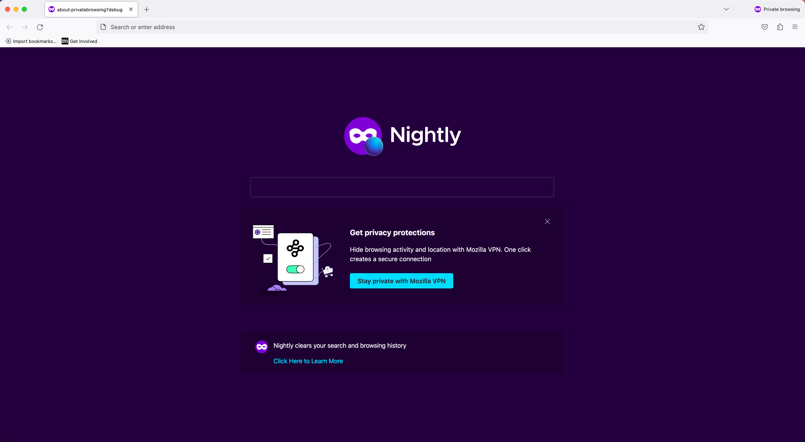

# PrivateBrowsing

## What is PrivateBrowsing?
Messages shown inside `about:privatebrowsing` (incognito) content page. This messaging surface allows experimentation on content shown (promotion and info section) when new private window or tab is opened.

### Example of a PrivateBrowsing window


## Testing PrivateBrowsing

### Via the dev tools:
1. In the search tab go to `about:config`, set `browser.newtabpage.activity-stream.asrouter.devtoolsEnabled` to `true`
2. Open a new tab, in the search tab go to `about:newtab#devtools`
3. On the left navigation, click on `Private Browsing`
4. This shows all example messages developed for `about:privatebrowsing` messaging surface
5. You can directly modify the message in the text area with your changes or by pasting your custom message JSON. Ensure that all required properties are covered according to the [Private Browsing Schema](https://searchfox.org/mozilla-central/source/browser/components/newtab/content-src/asrouter/templates/PBNewtab/NewtabPromoMessage.schema.json)
6. To view message in private browsing window, click the circle to select respective message. Then hit the blue `Open a Private Browsing Window` at the top of the screen. This opens new private window with promotion and info section updated with custom message.


7. To reset the chosen PrivateBrowsing window and choose another, click `Reset Message State` at the top of the screen

### Via Experiments:
You can test any `privatebrowsing` custom message UI by creating an experiment. [Messaging Journey](https://experimenter.info/messaging/desktop-messaging-journey) captures creating experiments via Nimbus.

### Example of messaging in privatebrowsing window
```
{
  "id": "TEST_PBM_PROMO",
  "template": "pb_newtab",
  "content": {
    "promoEnabled": true,
    "promoType": "VPN",
    "infoEnabled": true,
    "infoBody": "Nightly clears your search and browsing history",
    "infoLinkText": "Click Here to Learn More",
    "infoTitleEnabled": false,
    "promoLinkType": "button",
    "promoLinkText": "fluent:about-private-browsing-prominent-cta",
    "promoSectionStyle": "below-search",
    "promoHeader": "Get privacy protections",
    "promoTitle": "Hide browsing activity and location with Mozilla VPN. One click creates a secure connection",
    "promoTitleEnabled": true,
    "promoImageLarge": "chrome://browser/content/assets/moz-vpn.svg",
    "promoButton": {
      "action": {
        "type": "OPEN_URL",
        "data": {
          "args": "https://vpn.mozilla.org/"
        }
      }
    }
  },
  "targeting": "firefoxVersion >= 89",
  "frequency": {
    "lifetime": 3
  }
}
```
