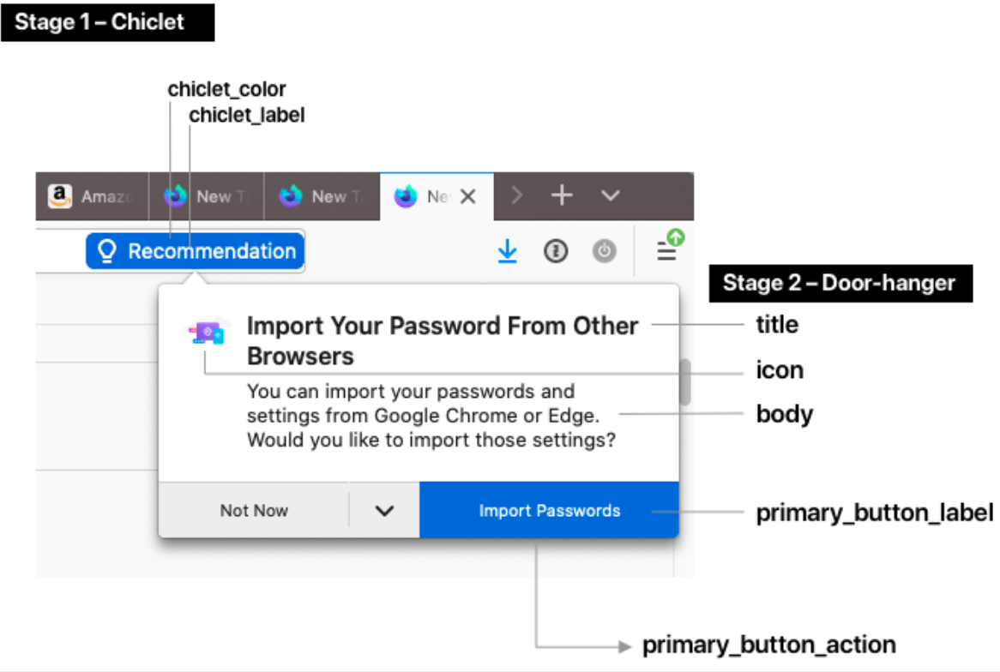

Simple CFR Template
--------------------

The “Simple CFR Template” is a two-stage UI (a chiclet notification and a door-hanger)
that shows up on a configurable `trigger condition`__, such as when the user visits a
particular web page.

.. __: /toolkit/components/messaging-system/docs/TriggerActionSchemas

Warning! Before reading, you should consider whether a `Messaging Experiment is relevant for your needs`__.

.. __: https://docs.google.com/document/d/1S45a_nFn8QRM8gvsxCM6HHROrIQlQQl6fUlJ2j63PGI/edit

Doorhanger Configuration
=========================

Stage 1 – Chiclet
++++++++++++++++++

* **chiclet_label**: The text that shows up in the chiclet. 20 characters max.
* **chiclet_color**: The background color of the chiclet as a HEX code.

Stage 2 – Door-hanger
++++++++++++++++++++++

* **title**: Title text at the top of the door hanger.
* **body**: A longer paragraph of text.
* **icon**: An image (please provide a URL or the image file up to 96x96px).
* **primary_button_label**: The label of the button.
* **primary_button_action**: The special action triggered by clicking on the button. Choose any of the available `button actions`__. Common examples include opening a section of about:preferences, or opening a URL.

.. __: /toolkit/components/messaging-system/docs/SpecialMessageActionSchemas
