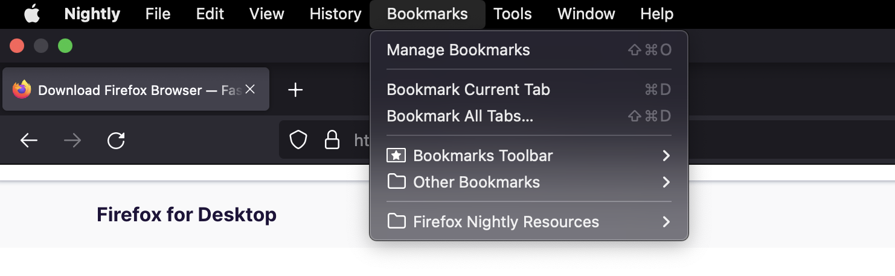
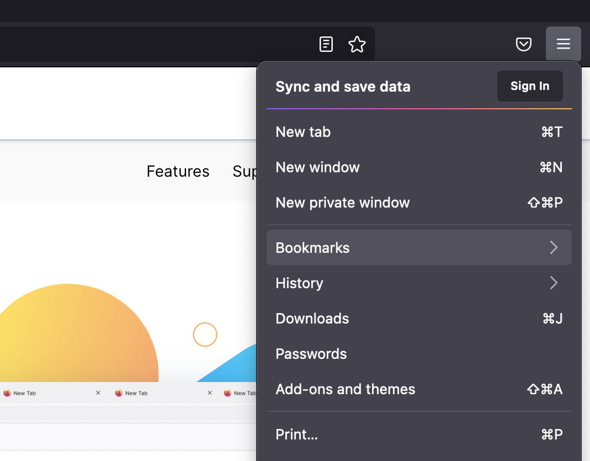
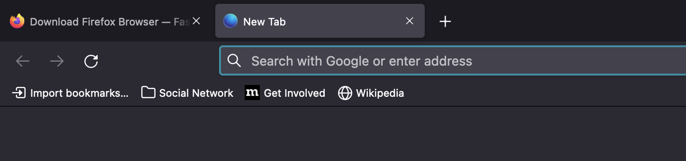
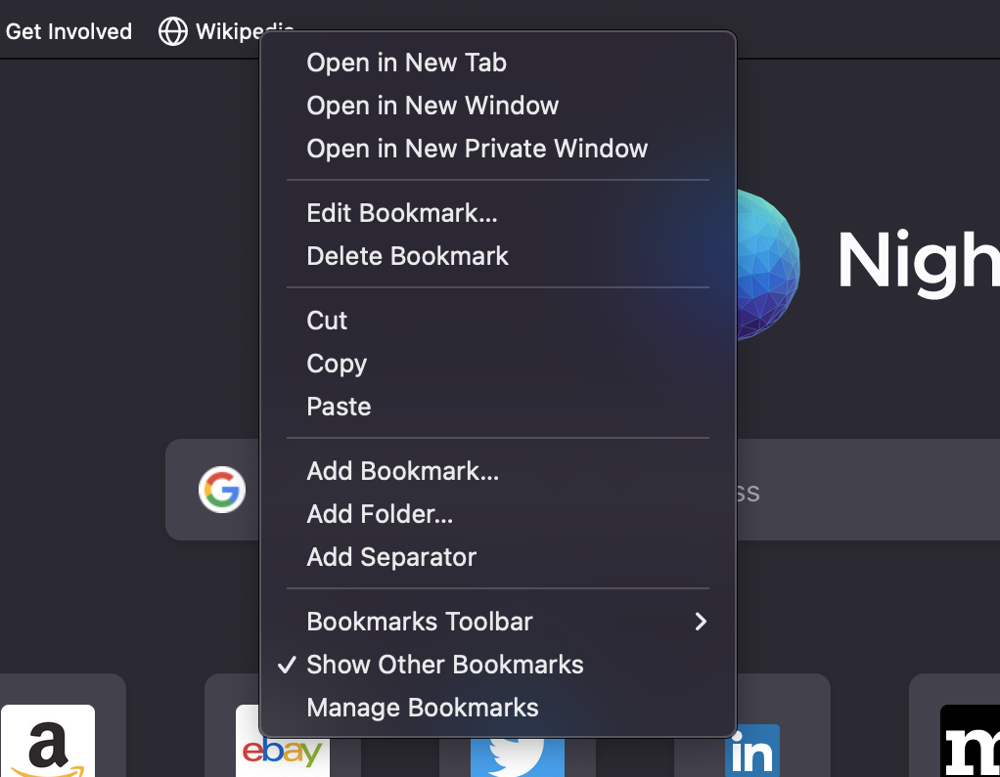
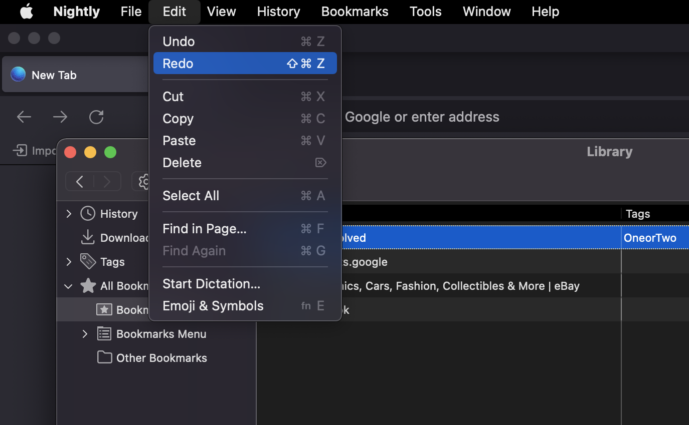

Nontechnical Overview
=====================

This document provides a high level, nontechnical overview of Firefox’s Places component (Bookmarks and History).

More information regarding Bookmarks - `Bookmarks in Firefox`_

.. _Bookmarks in Firefox: https://support.mozilla.org/en-US/kb/bookmarks-firefox

There are multiple ways to access and manipulate Bookmarks, such as:

.. contents::
   :depth: 2

Firefox menu bar
----------------

To access bookmarks click on Bookmarks link in Firefox menu bar on the top of your screen.
If the Firefox Menu bar is missing, it is usually because Firefox is in full screen mode or it is not the selected application.

In this case you can:
  * Turn off full screen mode
  * Select the Firefox application

   Firefox menu bar - Bookmarks Menu

Main application button
-----------------------

   Firefox - Bookmarks Main Application

Bookmarks Toolbar
-----------------

   Firefox - Bookmarks Toolbar

On the top of your Firefox screen just under the search bar - Bookmarks are on the left side.

Firefox's toolbar provides easy access to common features:
  * Click the menu button , click `More Tools` and choose `Customize Toolbar`.

    - **To turn on the Title bar:** Put a check mark next to `Title Bar` in the lower left.
    - **To turn on the Bookmarks toolbar:** Click the Toolbars dropdown menu at the bottom of the screen and select Bookmarks Toolbar.

  * Click the `Done` button.

Firefox sidebar
---------------

Firefox comes with a convenient Sidebar button which lets you access your bookmarks, history and synced tabs in one click. For using it, you have to:

1. `Add the sidebar button to your controls`_.

2. Toggle sidebar button on and off for preferable options (for ex., add bookmarks).

.. _Add the sidebar button to your controls: https://support.mozilla.org/en-US/kb/use-firefox-sidebar-access-bookmarks-history-synced

The Library window
------------------
1. Click the `hamburger Menu` icon in the upper-right corner of your screen.
2. In the middle of the drop-down menu select `Library`.
3. In the `Library` menu select `Bookmarks`.
4. Press `Show All Bookmark` button.

Keyboard shortcuts
------------------

  * Show / Manage Bookmarks (Library Window) - :kbd:`Shift` + :kbd:`Ctrl` / :kbd:`Cmd` + :kbd:`O`
  * Add / Edit Bookmark - :kbd:`Ctrl` / :kbd:`Cmd` + :kbd:`D`
  * Bookmark all tabs into 1 bookmark folder - :kbd:`Shift` + :kbd:`Ctrl` / :kbd:`Cmd` + :kbd:`D`
  * Delete bookmark / Bookmarks / Bookmarks folder - :kbd:`Delete`
  * Show / Hide the Bookmarks toolbar - :kbd:`Shift` + :kbd:`Ctrl` / :kbd:`Cmd` + :kbd:`B`
  * Focus Next Bookmark/Folder whose name (or sorted property) starts with a given character or character sequence - Type the character or quickly type the character sequence - in Bookmarks Library, Bookmarks Toolbar, Bookmarks Menu, Bookmarks Sidebar

Firefox Context Menu
--------------------

Single // Multiple bookmarks on selection will allow you to perform different manipulations, such as:

  * Open (Open / Open in New Tab / Open in New Window / Open in New Private Window)
  * Delete
  * Edit (Cut / Copy / Paste)
  * Add (Bookmark / Folder / Separator)

   Firefox - Bookmark Menu

Undo / Redo
-----------

Undo / Redo options available In Library Window and Sidebar Panel.
You can reverse your commands (creating bookmark, deleting bookmark, copy/paste etc.)  with:

  * Keyboard combinations:

    - Undo - :kbd:`Ctrl` / :kbd:`Cmd` + :kbd:`Z`
    - Redo - :kbd:`Shift` + :kbd:`Ctrl` / :kbd:`Cmd` + :kbd:`Z`

  * Choosing option in Menu - Edit - Undo / Redo

   Firefox - Undo / Redo for bookmark

Import Bookmarks
----------------

There are various options to import bookmarks to Firefox. Some of them are:

  * `from Internet Explorer or Microsoft Edge`_
  * `from Google Chrome`_
  * `from an HTML file`_

  .. _from Internet Explorer or Microsoft Edge: https://support.mozilla.org/en-US/kb/import-bookmarks-internet-explorer-or-microsoft-edge
  .. _from Google Chrome: https://support.mozilla.org/en-US/kb/import-bookmarks-google-chrome
  .. _from an HTML file: https://support.mozilla.org/en-US/kb/import-bookmarks-html-file

Restore Bookmarks
-----------------

Firefox automatically creates backups of your bookmarks and saves the last 15 backups for safekeeping.

**To restore your bookmarks:**

#. Click on *hamburger menu* button to open the Menu panel.
#. Go to *Bookmarks* - *Manage Bookmarks*.
#. Select the backup from which you want to restore:

    #. The dated entries are automatic bookmark backups.
    #. From a manual backup ( *Choose file…* ).
#. After selecting the option and confirming your choice your bookmarks would be restored.

**For manually add backup:**

#. Click on *hamburger menu* button to open the Menu panel.
#. Go to *Bookmarks* - *Manage Bookmarks*.
#. In the *Library window*, click the  button and then select *Backup…*.
#. In the Bookmarks backup filename window that opens, choose a location to save the file, which is named ``bookmarks-date.json`` by default. The desktop is usually a good spot, but any place that is easy to remember will work.
#. Save the bookmarks json file. The Bookmarks backup filename window will close and then you can close the *Library* window.
