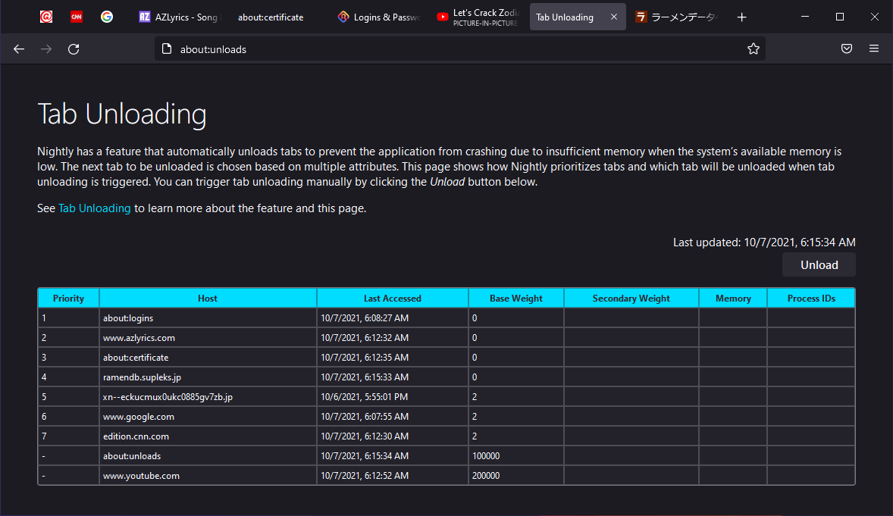
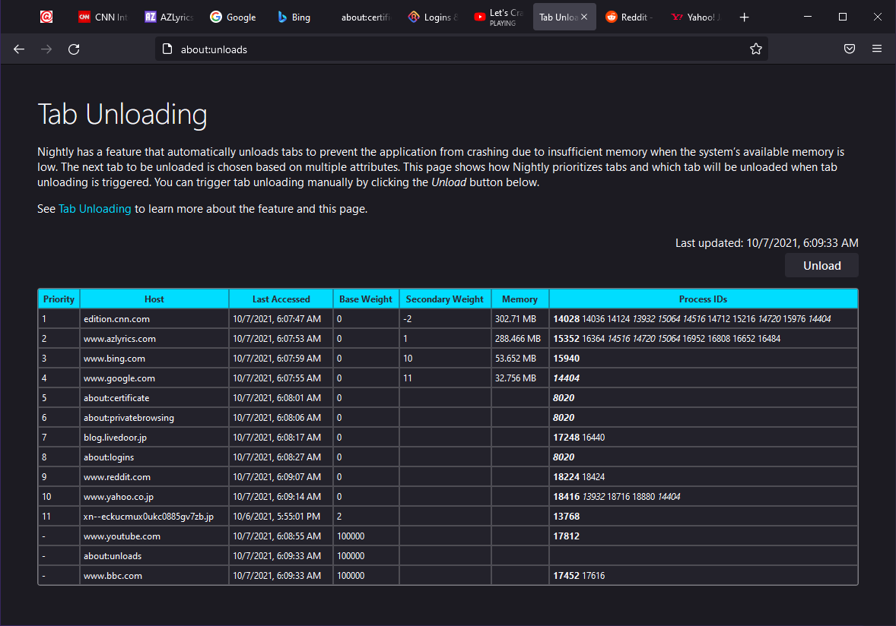

Tab Unloading
=============

Tab Unloading is a feature that automatically unloads tabs to prevent Firefox
from crashing due to insufficient memory when the system’s available memory is
low.

The feature consists of two parts: memory pressure detector and tab unloader.
When the memory pressure detector detects a low memory situation, it triggers
the tab unloader that prioritizes tabs and chooses a tab to unload, or if there
are no unloadable tabs, triggers the internal memory-pressure warning allowing
the browser’s subsystems to reduce their memory use.

There are two modes to prioritize tabs.

Firefox basically unloads tabs in least-recently-used order, excluding
tabs playing media, using Picture-in-Picture, or using WebRTC.  Pinned
tabs are deprioritized and are less likely to be unloaded.

When there are more tabs opened, in most cases when there are more than
eleven tabs, Firefox does extra calculations identifying processes hosting
tabs and estimates memory usage of each tab, and then unloads tabs with
larger memory and more processes that will be terminated by tab unloading.

You may disable the feature by setting the preference
``browser.tabs.unloadOnLowMemory`` to ``false``.

about:unloads
-------------

The about:unloads page shows how Firefox prioritizes tabs and which tab will
be unloaded when the tab unloader is triggered.  You can trigger tab unloading
manually by clicking the **Unload** button in the page.

The page contains a table where existing tabs are displayed in the same order
used by Firefox to choose the next tab to unload.  When you click the button,
a tab shown in the first row, which has the lowest value in the **Priority**,
is unloaded.  If the value of **Priority** is a hyphen (-), the corresponding
tab is not unloadable.

In the first of the two modes mentioned above, Firefox calculates **Last Accessed**
and **Base Weight** for each tab and orders tabs by those values, not calculating
the other attributes such as **Secondary Weight** to save CPU power.  Below is
an example of this case.

In the second mode, Firefox identifies processes hosting each tab and shows
their process IDs in the **Process IDs** column.  Process IDs are displayed in
**bold** when they are hosting the tab’s top frame, and in *italic* when the
process is shared between different tabs.

After identifying the processes of all tabs, Firefox estimates memory usage of
tabs and calculates the secondary weight for tabs that are not recently accessed.
For recently accessed tabs, Firefox does not calculate the **Secondary Weight**
and **Memory**, leaving those columns empty.

