Nontechnical Overview
=====================

This document provides a high level, nontechnical overview of Firefox's address
bar, with a focus on the different types of results it shows and how it chooses
them.

.. toctree::
   :caption: Table of Contents

   nontechnical-overview

Terminology
-----------

This document uses a small number of terms of art that would be helpful to
understand up front.

Input
  The text box component of the address bar. In contrast, we use "address bar"
  to refer to the whole system comprising the input, the view, and the logic
  that determines the results that are shown in the view based on the text in
  the input.

Result
  An individual item that is shown in the view. There are many different types
  of results, including bookmarks, history, open tabs, and search suggestions.

View
  The panel that opens below the input when the input is focused. It contains
  the results.

Maximum Result Count
--------------------

The view shows a maximum of 10 results by default. This number is controlled by
a hidden preference, ``browser.urlbar.maxRichResults``.

Search Strings
--------------

If the user has not modified the text in the input or the text in the input is
empty, we say that the user's **search string** is empty, or in other words,
there is no search string. In contrast, when the user has modified the text in
the input and the text is non-empty, then the search string is that non-empty
text.

   Empty search string: The input text has not been modified

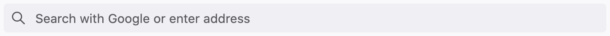

   Empty search string: The input text is empty (and the input is showing its
   placeholder text)

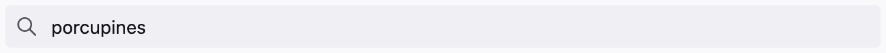

   Non-empty search string: The input text has been modified and is non-empty

The distinction between empty and non-empty search strings is helpful to
understand for the following sections.

Top Sites
---------

When the search string is empty and the user focuses the input, the view opens
and shows the user's top sites. They are the same top sites that appear on the
new-tab page except their number is capped to the maximum number of address bar
results (10). If the user has fewer top sites than the maximum number of results
(as is the case in a new profile), then only that number of results is shown.

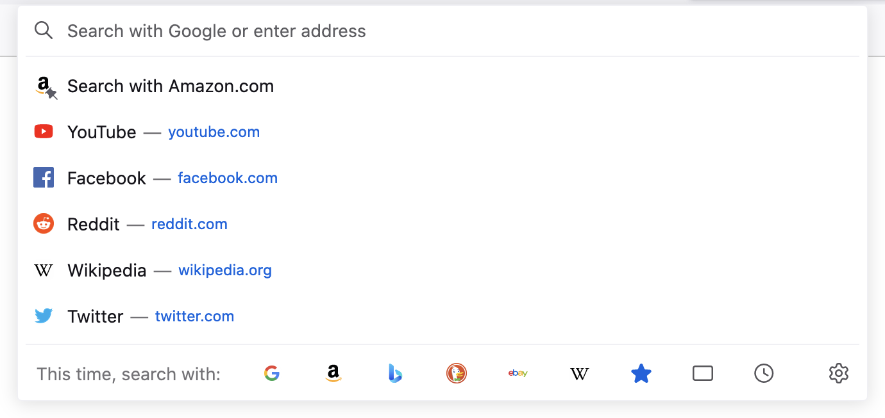

   Top sites on a new en-US profile

This behavior can be turned off by going to about:preferences#privacy and
unchecking “Shortcuts” in the “Address Bar” section. In that case, the view
closes when the search string is empty.

Searches
--------

When the search string is non-empty, the address bar performs a search and
displays the matching results in the view. Multiple separate searches of
different sources are actually performed, and the results from each source are
combined, sorted, and capped to the maximum result count to display the final
list of results. In address bar terminology, each source is called a
**provider**.

Each provider produces one or more types of results based on the search
string. The most common result types include the following (not exhaustive):

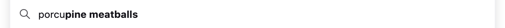

   Search suggestions from the user's default engine (magnifying glass icon)

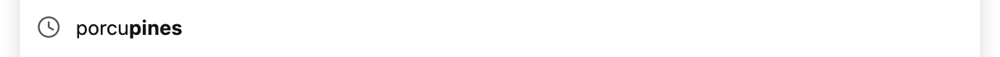

   Previous searches the user has performed from the address bar and search bar
   (clock icon)

   Bookmarks

   History

         Animals & Plants"
   :scale: 50%
   :align: center

   Open tabs (switch to tab)

         Britannica"
   :scale: 50%
   :align: center

   Remote tabs (via Sync)

How the address bar combines and sorts results from different providers is
discussed below in `Result Composition`_.

The Heuristic Result
--------------------

The first result in the view is special and is called the **heuristic**
result. As the user types each character in their search string, the heuristic
result is updated and automatically selected, and its purpose is to show the
user what will happen when they press the enter key without first selecting a
(non-heuristic) result. The heuristic result is so called because it shows
Firefox's best guess for what the user is trying to do based on their search
string.

The heuristic result is determined by running through a number of different
heuristics and picking the one that first matches the search string. The most
important heuristics in the order that Firefox runs through them are:

*Is the search string...*

1. An omnibox extension keyword? Extensions using the omnibox API can register
   keywords by which they become activated.
2. A bookmark keyword? The user can associate a keyword with each bookmark.
   Typing a bookmark keyword plus an optional search string and pressing enter
   will visit the bookmark.

   .. figure:: assets/nontechnical-overview/bookmark-keyword.png
      :alt: Image of the address bar input with text "bug 1677126" and a
            bookmark keyword heuristic result
      :scale: 50%
      :align: center

      Typing "bug" triggers a Bugzilla bookmark with the keyword "bug"

3. A domain name or URL that should be autofilled? **Autofill** is the name of
   the feature where the input completes the domain names and URLs of bookmarks
   and frequently visited sites as the user is typing them. (Firefox autofills
   “to the next slash”, meaning it first autofills domain names and then partial
   paths.)

   .. figure:: assets/nontechnical-overview/autofill.png
      :alt: Image of the address bar input with text "mozilla.org/" with
            "illa.org/" selected and an autofill heuristic result
      :scale: 50%
      :align: center

      After typing "moz", the rest of mozilla.org is automatically completed

4. A valid URL? If so, visit the URL. (This includes fixing common typos like
   “mozilla..org” and “mozilla.ogr”. Valid URLs are based on the `Public Suffix
   List`_. The user can also specify an allow-list using hidden preferences to
   support domains like localhost.)

   .. figure:: assets/nontechnical-overview/visit.png
      :alt: Image of the address bar input with text "porcupine-fancy.org" and a
            visit heuristic result
      :scale: 50%
      :align: center

      Typing a URL that isn't bookmarked or in history

   .. _Public Suffix List: https://publicsuffix.org/

5. Ultimately fall back to performing a search using the default engine. (The
   user can opt out of this fallback by setting the hidden preference
   ``keyword.enabled`` to false. In that case, Firefox stops at the previous
   step and attempts to visit the user's search string as if it were a URL.)

   .. figure:: assets/nontechnical-overview/search-heuristic.png
      :alt: Image of the address bar input with text "porcupines" and a search
            heuristic result
      :scale: 50%
      :align: center

      Typing a string that will perform a search using the default engine

Result Composition
------------------

For a given search string, the address bar performs multiple separate searches
of different providers and then combines their results to display the final
list. The way in which results are combined and sorted is called **result
composition**. Result composition is based on the concept of result groups, one
group after another, with different types of results in each group.

The default result composition is described next, starting with the first
result.

1. Heuristic Result
~~~~~~~~~~~~~~~~~~~

The first result is always the heuristic result.

2. Extension Omnibox Results
~~~~~~~~~~~~~~~~~~~~~~~~~~~~

The next group of results is those provided by extensions using the omnibox
API. Most users never encounter these results because they are provided only by
extensions that use this feature, and even then the user must type certain
extension-defined keywords to trigger them. There are at most 6 results in this
group.

3. Search Suggestions
~~~~~~~~~~~~~~~~~~~~~

The next group is search suggestions. Typically this group contains 6 results,
but the exact number depends on certain factors described later in `Result
Composition Nuances`_. There are actually three types of search suggestions:

* Previous searches the user has performed from the address bar and search bar
  (denoted with a clock icon):

  .. image:: assets/nontechnical-overview/form-history.png
     :alt: Image of a previous search result with text "porcupines"
     :scale: 50%
     :align: center

  This is the only type of search suggestion that is generated by Firefox alone,
  without the help of a search engine. When the user performs a search using an
  engine from the address bar or search bar (and only the address bar and search
  bar), Firefox stores the search string, and then when the user starts to type
  it again, Firefox includes it as a result to make it easy to perform past
  searches. (Firefox does not store search strings used within web pages like
  google.com.)

* Suggestions from the user's default engine (denoted with a magnifying glass
  icon):

  .. image:: assets/nontechnical-overview/search-suggestion.png
     :alt: Image of a search suggestion result with text "porcupine meatballs"
     :scale: 50%
     :align: center

  These are fetched from the engine if the engine provides the necessary access
  point. The ordering and total number of these suggestions is determined by the
  engine.

* Google-specific "tail" suggestions, which look like "... foo" and are provided
  for long and/or specific queries to help the user narrow their search:

  .. image:: assets/nontechnical-overview/tail-suggestions.png
     :alt: Image of a tail suggestion results with text "porcupine abc def" in
           the input and two suggestions with text "... definition " and
           "... defense"
     :scale: 50%
     :align: center

  These are fetched from Google when Google is the user's default engine. The
  ordering and total number of these suggestions is determined by Google.

The search suggestions group typically contains two previous searches followed
by four engine suggestions, but the exact numbers depend on the number of
matching previous searches and engine suggestions. Previous searches are limited
in number so that they don’t dominate this group, allowing remote suggestions to
provide content discovery benefits. Tail suggestions are shown only when there
are no other suggestions.

The user can opt out of showing search suggestions in the address bar by
visiting about:preferences#search and unchecking "Provide search suggestions" or
"Show search suggestions in address bar results".

4. General Results
~~~~~~~~~~~~~~~~~~

The final group of results is a general group that includes the following types:

* Bookmarks
* History
* Open tabs (switch to tab)
* Remote tabs (via Sync)
* Sponsored and Firefox Suggest results (part of the Firefox Suggest feature)

This general group is labeled "Firefox Suggest" in the Firefox Suggest feature.

Typically this group contains 3 results, but as with search suggestions, the
exact number depends on certain factors (see `Result Composition Nuances`_).

Most results within this group are first matched against the search string on
their titles and URLs and then sorted by a metric called **frecency**, a
combination of how frequently and how recently a page is visited. The top three
results are shown regardless of their specific types.

This is the only group that is sorted by frecency.

A few important complexities of this group are discussed in the next
subsections. The final subsection describes frecency in more detail.

Adaptive History
................

The first few bookmark and history results in the general group may come from
**adaptive history**, a system that associates specific user search strings with
URLs. (It's also known as **input history**.) When the user types a search
string and picks a result, Firefox stores a database record that associates the
string with the result's URL. When the user types the string or a part of it
again, Firefox will try to show the URL they picked last time. This allows
Firefox to adapt to a user's habit of visiting certain pages via specific search
strings.

This mechanism is mostly independent of frecency. URLs in the adaptive history
database have their own sorting score based on how many times they have been
used in the past. The score decays daily so that infrequently used search
strings and URLs aren't retained forever. (If two adaptive history results have
the same score, they are secondarily sorted by frecency.)

Within the general group, the number of adaptive history results is not limited,
but typically there aren't many of them for a given search string.

Open and Remote Tabs
....................

Unlike bookmarks and history, open and remote tabs don't have a "natural"
frecency, meaning a frecency that's updated in response to user actions as
described below in Frecency_. Tabs that match the search string are assigned
constant frecencies so they can participate in the sorting within the general
group. Open tabs are assigned a frecency of 1000, and remote tabs are assigned a
frecency of 1001. Picking appropriate frecencies is a bit of an art, but Firefox
has used these values for some time.

Sponsored and Firefox Suggest Results
.....................................

Sponsored and Firefox Suggest results are an exception within this group. They
are matched on predetermined keywords, and when present, they always appear last
in the general group. Frecency isn't involved at all.

Frecency
........

Frecency is a complex topic on its own, but in summary, each URL stored in
Firefox's internal history database has a numeric score, the frecency,
associated with it. Larger numbers mean higher frecencies, and URLs with higher
frecencies are more likely to be surfaced to the user via the address bar. Each
time the user visits a URL, Firefox increases its frecency by a certain "boost"
amount that depends on how the visit is performed -- whether the user picked it
in the address bar, clicked its link on a page, clicked it in the history
sidebar, etc. In order to prevent frecencies from growing unbounded and to
penalize URLs that haven't been visited in a while, Firefox decays the
frecencies of all URLs over time.

For details on frecency, see `The Frecency Algorithm`_.

.. _The Frecency Algorithm: https://docs.google.com/document/d/10LRRXVGWWWcjEZIZ2YlEmuKkQqh2RaTclStFHNnPqQ8/edit#heading=h.588hanspexub

Preferences that Affect Result Composition
~~~~~~~~~~~~~~~~~~~~~~~~~~~~~~~~~~~~~~~~~~

There are a number of options in about:preferences that affect result
composition.

The user can opt out of showing search suggestions in the address bar by
unchecking "Provide search suggestions" or "Show search suggestions in address
bar results" in about:preferences#search. (The first checkbox applies to both
the address bar and search bar, so it acts as a global toggle.)

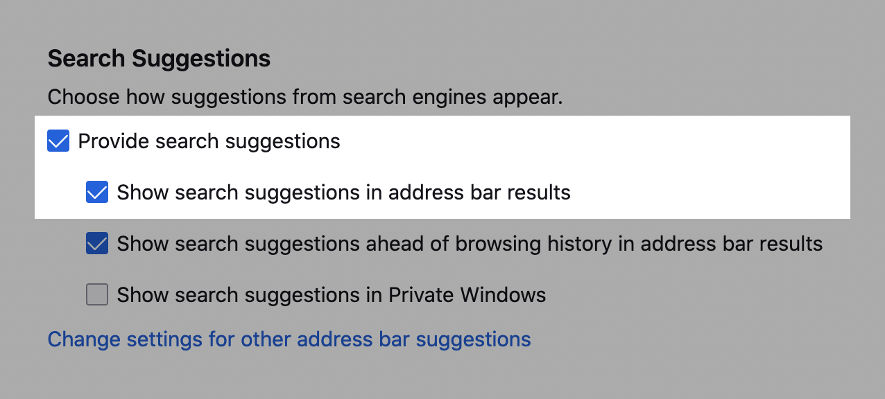
         suggestions
   :scale: 50%
   :align: center

   Preferences allowing the user to opt out of search suggestions

By default, the search suggestions group is shown before the general results
group, but unchecking "Show search suggestions ahead of browsing history in
address bar results" in about:preferences#search does the opposite. In that
case, typically the general results group will contain at most 6 results and the
search suggestions group will contain at most 3. In other words, regardless of
which group comes first, typically the first will contain 6 results and the
second will contain 3.

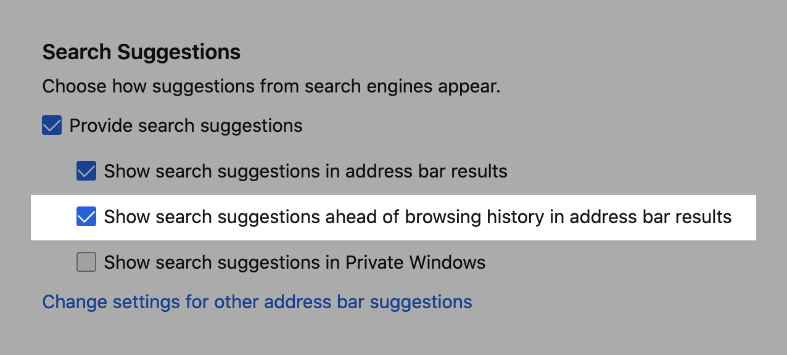
         search suggestions are shown before general results
   :scale: 50%
   :align: center

   Preference allowing the user to choose which group is shown first

The “Address Bar” section in about:preferences#privacy has several checkboxes
that allow for finer control over the types of results that appear in the view.
The top sites feature can be turned off by unchecking “Shortcuts” in this
section.

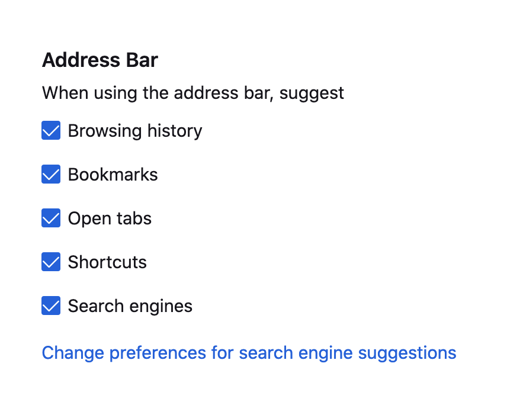
         results are shown
   :scale: 50%
   :align: center

   Preferences allowing the user to choose which results are shown

Result Composition Nuances
--------------------------

Among the search suggestions and general results groups, the group that's shown
first typically contains 6 results and the other group contains 3 results. The
exact number in each group depends on several factors:

* The total maximum result count (controlled by the
  ``browser.urlbar.maxRichResults`` hidden preference).

  The total number of results in the two groups scales up and down to
  accommodate this number so that the view is always full of results.

* The number of extension results.

  The extension results group comes before both groups, so if there are any
  extension results, there are fewer available slots for search suggestions and
  general results.

* The number of matching results.

  The search string may match only one or two search suggestions or general
  results, for example.

* The number of results in the other group.

  The first group will try to contain 6 results and the second will try to
  contain 3, but if either one is unable to fill up, then the other group will
  be allowed to grow to make up the difference.

Other Result Types
------------------

The most common result types are discussed above. This section walks through the
other types.

An important trait these types have in common is that they do not belong to any
group. Most of them appear at specific positions within the view.

Search Interventions
~~~~~~~~~~~~~~~~~~~~

Search interventions help the user perform a task based on their search string.
There are three kinds of interventions, and each is triggered by typing a
certain set of phrases_ in the input. They always appear as the second result,
after the heuristic result.

The three kinds of interventions are:

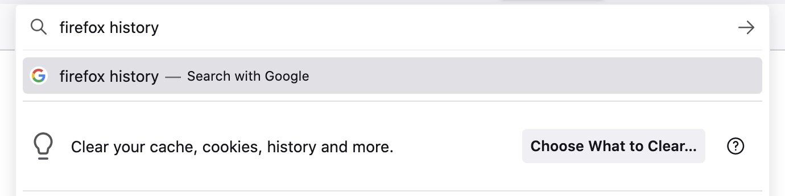
         cookies, history and more"
   :scale: 50%
   :align: center

   Clear history, cache, and other data search intervention

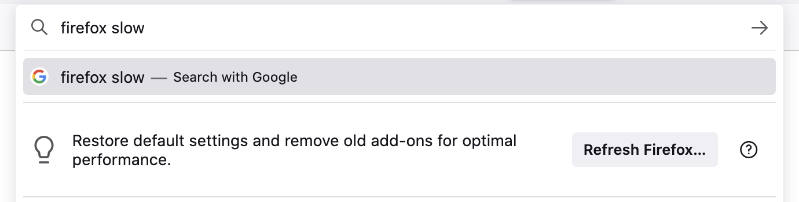
         settings and remove old add-ons for optimal performance"
   :scale: 50%
   :align: center

   Refresh Firefox search intervention

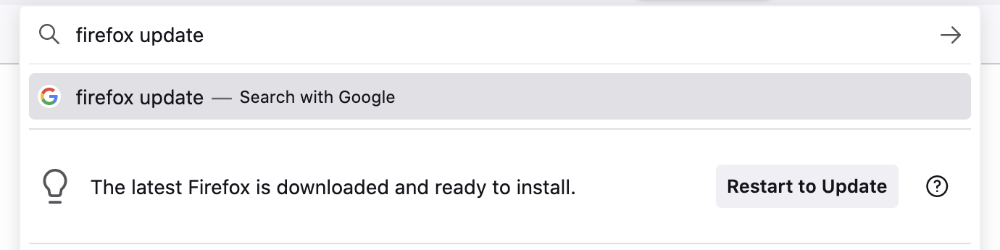
         is downloaded and ready to install"
   :scale: 50%
   :align: center

   Update Firefox search intervention

Currently this feature is limited to English-speaking locales, but work is
ongoing to build a more sophisticated intent-matching platform to support other
locales, more complex search strings, and more kinds of interventions.

.. _phrases: https://searchfox.org/mozilla-central/rev/c4d682be93f090e99d5f4049ceb7b6b6c03d0632/browser/components/urlbar/UrlbarProviderInterventions.jsm#64

Search Tips
~~~~~~~~~~~

Search tips inform the user they can perform searches directly from the
address bar. There are two kinds of search tips:

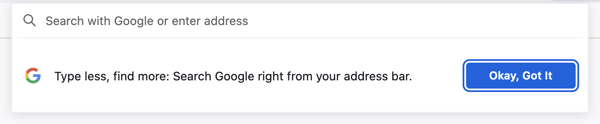
         Search Google right from your address bar"
   :scale: 50%
   :align: center

   Onboarding search tip: Appears on the new-tab page

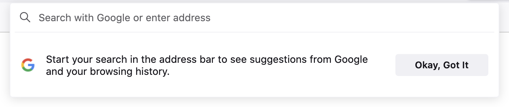
         address bar to see suggestions from Google and your browsing history"
   :scale: 50%
   :align: center

   Redirect search tip: Appears on the home page of the user's default engine
   (only for Google, Bing, and DuckDuckGo)

In each case, the view automatically opens and shows the tip even if the user is
not interacting with the address bar. Each tip is shown at most four times, and
the user can stop them from appearing altogether by interacting with the address
bar or clicking the "Okay, Got It" button.

Tab to Search
~~~~~~~~~~~~~

Tab to search allows the user to press the tab key to enter `search mode`_ while
typing the domain name of a search engine. There are two kinds of tab-to-search
results, and they always appear as the second result:

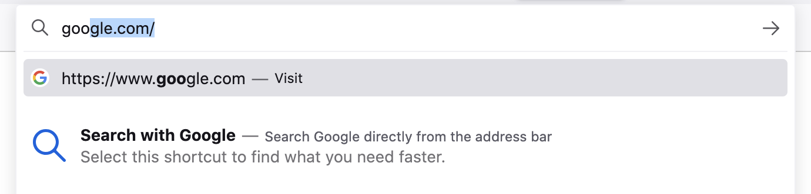

   Onboarding tab to search

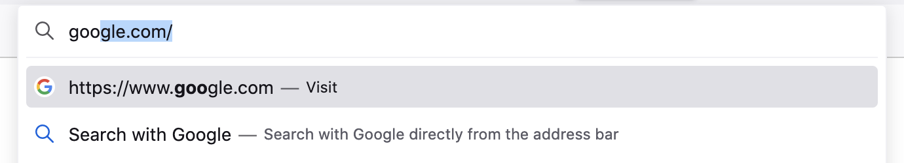

   Regular tab to search

The onboarding type is shown until the user has interacted with it three times
over a period of at least 15 minutes, and after that the regular type is shown.

Search Engine Offers
~~~~~~~~~~~~~~~~~~~~

Typing a single “@” shows a list of search engines. Selecting an engine enters
`search mode`_.

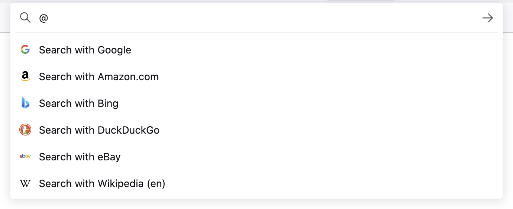

   Search engine offers after typing “@”

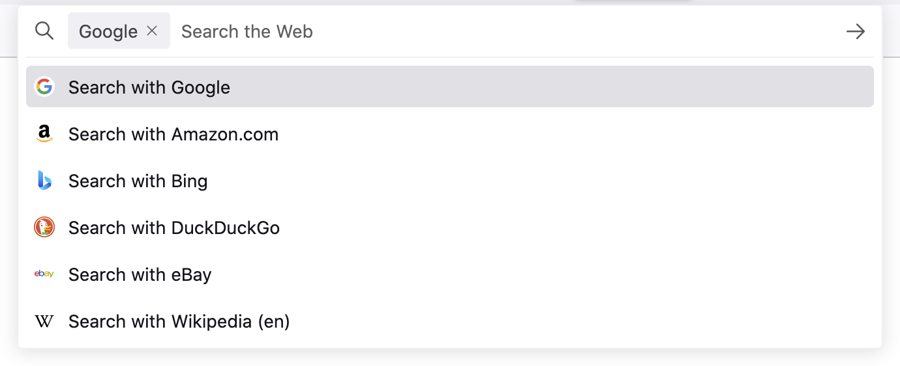

   After pressing the down arrow key to select Google

Search Mode
-----------

**Search mode** is a feature that transforms the address bar into a search-only
access point for a particular engine. During search mode, search suggestions are
the only results shown in the view, and for that reason its result composition
differs from the usual composition.

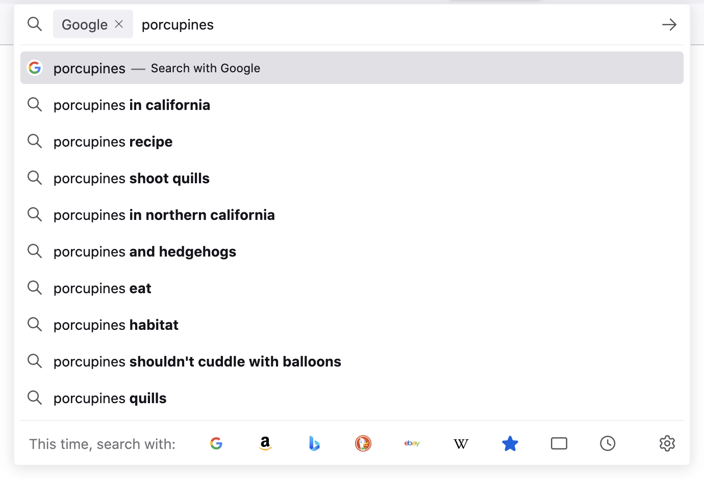

   Search mode with Google as the selected engine

Firefox shows suggestions in search mode even when the user has otherwise opted
out of them. Our rationale is that by entering search mode, the user has taken
an action that overrides their usual opt out. This allows the user to opt out
generally but opt back in at specific times.

Search mode is an effective replacement for the legacy search bar and may
provide a good path forward for deprecating it.

The user can enter search mode in many ways:

* Picking a search shortcut button at the bottom of the view
* Typing an engine's keyword (which can be set in about:preferences#search, and
  built-in engines have default keywords)
* Typing a single "?" followed by a space (to enter search mode with the default
  engine)
* Typing a single "@" to list all engines and then picking one
* If the search bar is not also shown, pressing Ctrl+K (to enter search mode
  with the default engine)

To exit search mode, the user can backspace over the engine chiclet or click its
close button.
