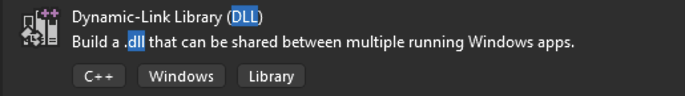
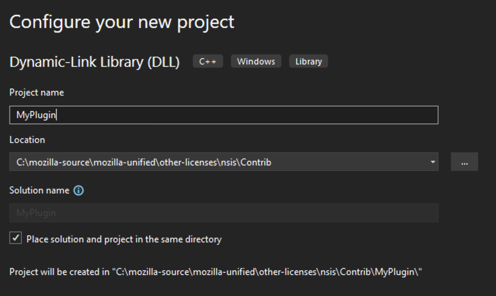
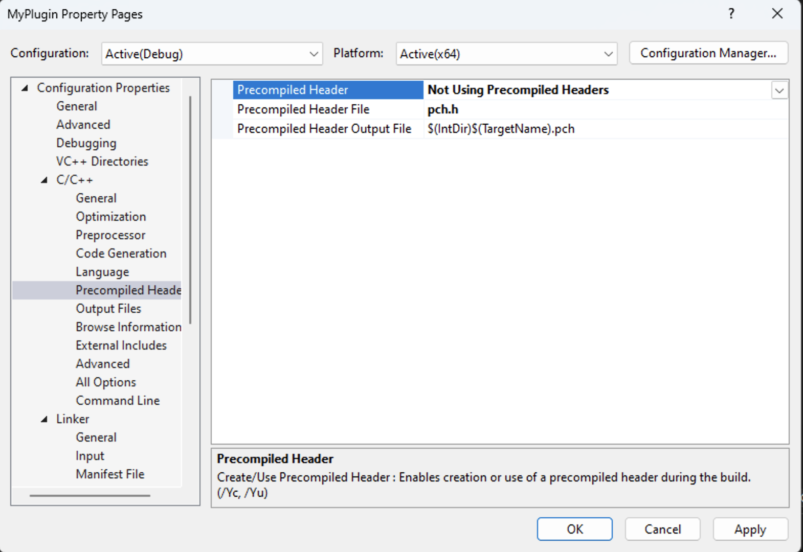

=====================
Building NSIS Plugins
=====================

.. note::

  This guide assumes that you have a Firefox build environment set up as well as a recent version of Visual Studio. The steps here use Visual Studio 2022.

Instructions
------------

1. Make sure you are configured to build DLLs. Follow this `guide <https://learn.microsoft.com/en-us/cpp/build/walkthrough-creating-and-using-a-dynamic-link-library-cpp>`_.
2. NSIS plugins are not integrated with the build system pending `bug 1771192 <https://bugzilla.mozilla.org/show_bug.cgi?id=1771192>`_. You will need to build them manually by creating a new Visual Studio project in the ``$SRCDIR/other-licenses/nsis/Contrib/`` directory with the following settings.

3. Once the project has been created, right click on it in the sidebar and go to ``Configuration Properties -> C/C++ -> Precompiled Header`` and set ``Precompiled Header`` to "Not Using Precompiled Headers".

4. For easier testing set the output directory in ``Configuration Properties -> General`` to ``$SRCDIR/other-licenses/nsis/Plugins``.

5. Delete any files generated when you created the Visual Studio project such as ``pch.h`` or ``framework.h`` and any related include statements.

6. Download the source code for `NSIS version 3.07 <https://sourceforge.net/projects/nsis/files/NSIS%203/3.07/>`_. (current at the time of writing although possibly subject to change) and extract the source files. Navigate to ``Contrib/ExDLL`` and copy ``pluginapi.h``, ``pluginapi.c`` and ``nsis_tchar.h`` to where header files for your Visual Studio project live. Add them to your project.

7. You can use the following template to get started with your own plugin:

.. code:: cpp

  /* This Source Code Form is subject to the terms of the Mozilla Public
  * License, v. 2.0. If a copy of the MPL was not distributed with this
  * file, you can obtain one at http://mozilla.org/MPL/2.0/. */

  // Put a brief description of your NSIS plugin here.

  // Put your include statements here.
  #include <sysheader>
  #include "pluginapi.h" // This is taken from the NSIS plugin page
  #include "myheader.h"

  // A struct used for reading the stack passed in to the function
  struct stack_t {
    stack_t* next;
    TCHAR text[MAX_PATH];
  };

  /**
  *
  *
  * Put any additional functions you write here.
  *
  *
  */

  // I use popstringn and pushstringn from the NSIS pluginapi.h file.

  // This is the function I want to call from within NSIS
  extern "C" void __declspec(dllexport)
  MyNSISFunction(HWND, int string_size, TCHAR* variables, stack_t** stacktop, void*) {
    wchar_t getArg[MAX_PATH+1];
    EXDLL_INIT();
    bool rv = false;
    int popRet = popstringn(getArg, MAX_PATH+1);
    if (popRet == 0) {
      rv = FunctionThatTakesAnArgument(getArg);
    }
    pushstring(rv ? L"1" : L"0");
  }

  BOOL APIENTRY
  DllMain(HMODULE, DWORD, LPVOID) {
    return TRUE;
  }

8. Modify ``$SRCDIR/toolkit/mozapps/installer/windows/nsis/makensis.mk`` as follows:

.. code:: text

  CUSTOM_NSIS_PLUGINS = \
      ... \
      MyPlugin.dll \
      ... \
      $(NULL)

9. **NSIS only works with 32-bit plugins so ensure your Visual Studio build configuration is set to x86.** Compile your new plugin. ``exp`` and ``lib`` files will also be generated but they can safely be deleted.

10. The plugin can now be called from within NSIS as follows:

.. code:: text

  MyPlugin::MyNSISFunc "$myNSISarg"

.. note::

  - You may need to run ``./mach clobber`` for your DLL to be recognized.
  - You can compile your plugin in debug mode and step through it with a debugger by attaching to the installer/uninstall process.
  - If libraries are needed, files in the ``$SRCDIR/mfbt/`` and ``$SRCDIR/toolkit/`` directories are usually okay although there may be exceptions.
  - The best way to access headers is usually to simply copy them into the project given how disconnected this is from the rest of the build system.
