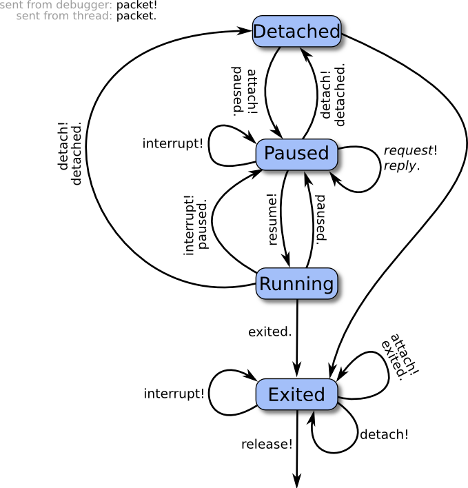

# Remote Debugging Protocol

The Mozilla debugging protocol allows a debugger to connect to a browser, discover what sorts of things are present to debug or inspect, select JavaScript threads to watch, and observe and modify their execution. The protocol provides a unified view of JavaScript, DOM nodes, CSS rules, and the other technologies used in client-side web applications. The protocol ought to be sufficiently general to be extended for use with other sorts of clients (profilers, say) and servers (mail readers; random XULrunner applications).

All communication between debugger (client) and browser (server) is in the form of JSON objects. This makes the protocol directly readable by humans, capable of graceful evolution, and easy to implement using stock libraries. In particular, it should be easy to create mock implementations for testing and experimentation.

The protocol operates at the JavaScript level, not at the C++ or machine level, and assumes that the JavaScript implementation itself is healthy and responsive. The JavaScript program being executed may well have gone wrong, but the JavaScript implementation's internal state must not be corrupt. Bugs in the implementation may cause the debugger to fail; bugs in the interpreted program must not.

## General Conventions

### Actors

An **actor** is something on the server that can exchange JSON packets with the client. Every packet from the client specifies the actor to which it is directed, and every packet from the server indicates which actor sent it.

Each server has a root actor, with which the client first interacts. The root actor can explain what sort of thing the server represents (browser; mail reader; etc.), and enumerate things available to debug: tabs, chrome, and so on. Each of these, in turn, is represented by an actor to which requests can be addressed. Both artifacts of the program being debugged, like JavaScript objects and stack frames, and artifacts of the debugging machinery, like breakpoints and watchpoints, are actors with whom packets can be exchanged.

For example, a debugger might connect to a browser, ask the root actor to list the browser's tabs, and present this list to the developer. If the developer chooses some tabs to debug, then the debugger can send `attach` requests to the actors representing those tabs, to begin debugging.

Actor names are JSON strings, containing no spaces or colons. The name of the root actor is `"root"`.

To allow the server to reuse actor names and the resources they require, actors have limited lifetimes. All actors in a server form a tree, whose root is the root actor. Closing communications with an actor automatically closes communications with its descendants. For example, the actors representing a thread's stack frames are children of the actor representing the thread itself, so that when a debugger detaches from a thread, which closes the thread's actor, the frames' actors are automatically closed. This arrangement allows the protocol to mention actors liberally, without making the client responsible for explicitly closing every actor that has ever been mentioned.

When we say that some actor *A* is a child of some actor *B*, we mean that *A* is a direct child of *B*, not a grandchild, great-grandchild, or the like. Similarly, **parent** means "direct parent". We use the terms **ancestor** and **descendent** to refer to those looser relationships.

The root actor has no parent, and lives as long as the underlying connection to the client does; when that connection is closed, all actors are closed.

Note that the actor hierarchy does not, in general, correspond to any particular hierarchy appearing in the debuggee. For example, although web workers are arranged in a hierarchy, the actors representing web worker threads are all children of the root actor: one might want to detach from a parent worker while continuing to debug one of its children, so it doesn't make sense to close communications with a child worker simply because one has closed communications with its parent.

*(We are stealing the "actor" terminology from Mozilla's IPDL, to mean, roughly, "things participating in the protocol". However, IPDL does much more with the idea than we do: it treats both client and server as collections of actors, and uses that detail to statically verify properties of the protocol. In contrast, the debugging protocol simply wants a consistent way to indicate the entities to which packets are directed.)*

### Packets

The protocol is carried by a reliable, bi-directional byte stream; data sent in both directions consists of JSON objects, called packets. A packet is a top-level JSON object, not contained inside any other value.

Every packet sent from the client has the form:

```
{ "to":actor, "type":type, ... }
```

where `actor` is the name of the actor to whom the packet is directed and `type` is a string specifying what sort of packet it is. Additional properties may be present, depending on `type`.

Every packet sent from the server has the form:

```
{ "from":actor, ... }
```

where `actor` is the name of the actor that sent it. The packet may have additional properties, depending on the situation.

If a packet is directed to an actor that no longer exists, the server sends a packet to the client of the following form:

```
{ "from":actor, "error":"noSuchActor" }
```

where `actor` is the name of the non-existent actor. (It is strange to receive messages from actors that do not exist, but the client evidently believes that actor exists, and this reply allows the client to pair up the error report with the source of the problem.)

Clients should silently ignore packet properties they do not recognize. We expect that, as the protocol evolves, we will specify new properties that can appear in existing packets, and experimental implementations will do the same.

### Common Patterns of Actor Communication

Each type of actor specifies which packets it can receive, which it might send, and when it can do each. Although in principle these interaction rules could be complex, in practice most actors follow one of two simple patterns:

* **Request/Reply**: Each packet sent to the actor ("request") elicits a single packet in response ("reply").
* **Request/Reply/Notify**: Like Request/Reply, but the actor may send packets that are not in response to any specific request ("notification"), perhaps announcing events that occur spontaneously in the debuggee.

These patterns are described in more detail below.

Some actors require more complicated rules. For example, the set of packets accepted by a [Thread-like actor](#interacting-with-thread-like-actors) depends on which one of four states it occupies. The actor may spontaneously transition from one state to another, and not all state transitions produce notification packets. Actors like this require careful specification.

#### The Request/Reply Pattern

In this specification, if we call a packet a **request**, then it is a packet sent by the client, which always elicits a single packet from the actor in return, the **reply**. These terms indicate a simple pattern of communication: the actor processes packets in the order they are received, and the client can trust that the *i*'th reply corresponds to the *i*'th request.

An [error reply packet](#error-packets) from a request/reply actor constitutes a reply.

Note that it is correct for a client to send several requests to a request/reply actor without waiting for a reply to each request before sending the next; requests can be pipelined. However, as the pending requests consume memory, the client should ensure that only a bounded number of requests are outstanding at any one time.

#### The Request/Reply/Notify Pattern

Some actors follow the request/reply pattern, but may also send the client ***notification*** packets, not in reply to any particular request. For example, if the client sends the root actor a `["listTabs"](#listing-browser-tabs)` request, then the root actor sends a reply. However, since the client has now expressed an interest in the list of open tabs, the root actor may subsequently send the client a `"tabListChanged"` notification packet, indicating that the client should re-fetch the list of tabs if it is interested in the latest state.

There should be a small upper bound on the number of notification packets any actor may send between packets received from the client, to ensure that the actor does not flood the client. In the example above, the root actor sends at most one `"tabListChanged"` notification after each `"listTabs"` request.

#### Error Packets

Any actor can reply to a packet it is unable to process with an **error reply** of the form:

```
{ "from":actor, "error":name, "message":message }
```

where *name* is a JSON string naming what went wrong, and *message* is an English error message. Error *names* are specified by the protocol; the client can use the name to identify which error condition arose. The *message* may vary from implementation to implementation, and should only be displayed to the user as a last resort, as the server lacks enough information about the user interface context to provide appropriate messages.

If an actor receives a packet whose type it does not recognize, it sends an error reply of the form:

```
{ "from":actor, "error":"unrecognizedPacketType", "message":message }
```

where *message* provides details to help debugger developers understand what went wrong: what kind of actor actor is; the packet received; and so on.

If an actor receives a packet which is missing needed parameters (say, an `"autocomplete"` packet with no `"text"` parameter), it sends an error reply of the form:

```
{ "from":actor, "error":"missingParameter", "message":message }
```

where *message* provides details to help debugger developers fix the problem.

If an actor receives a packet with a parameter whose value is inappropriate for the operation, it sends an error reply of the form:

```
{ "from":actor, "error":"badParameterType", "message":message }
```

where *message* provides details to help debugger developers fix the problem. (Some packets' descriptions specify more specific errors for particular circumstances.)

### Grips

A grip is a JSON value that refers to a specific JavaScript value in the debuggee. Grips appear anywhere an arbitrary value from the debuggee needs to be conveyed to the client: stack frames, object property lists, lexical environments, `paused` packets, and so on.

For mutable values like objects and arrays, grips do not merely convey the value's current state to the client. They also act as references to the original value, by including an actor to which the client can send messages to modify the value in the debuggee.

A grip has one of the following forms:

```
value
```

where value is a string, a number, or a boolean value. For these types of values, the grip is simply the JSON form of the value.

```
{ "type":"null" }
```

This represents the JavaScript `null` value. (The protocol does not represent JavaScript `null` simply by the JSON `null`, for the convenience of clients implemented in JavaScript: this representation allows such clients to use `typeof(grip) == "object"` to decide whether the grip is simple or not.)

```
{ "type":"undefined" }
```

This represents the JavaScript `undefined` value. (`undefined` has no direct representation in JSON.)

```
{ "type":"Infinity" }
```

This represents the JavaScript `Infinity` value. (`Infinity` has no direct representation in JSON.)

```
{ "type":"-Infinity" }
```

This represents the JavaScript `-Infinity` value. (`-Infinity` has no direct representation in JSON.)

```
{ "type":"NaN" }
```

This represents the JavaScript `NaN` value. (`NaN` has no direct representation in JSON.)

```
{ "type":"-0" }
```

This represents the JavaScript `-0` value. (`-0` stringifies to JSON as 0.)

```
{ "type":"object", "class":className, "actor":actor }
```

This represents a JavaScript object whose class is `className`. (Arrays and functions are treated as objects for the sake of forming grips.) Actor can be consulted for the object's contents, as explained below.

If the class is "Function", the grip may have additional properties:

```
{ "type":"object", "class":"Function", "actor":actor,
  "name":name, "displayName":displayName,
  "userDisplayName":userDisplayName,
  "url":url, "line":line, "column":column }
```

These additional properties are:

***Name***

The function's name (as given in the source code, following the `function` keyword), as a string. If the function is anonymous, the `name` property is omitted.

***displayName***

A name the system has inferred for the function (say, `"Foo.method"`). If the function has a given name (appearing in the grip as the `"name"` property), or if the system was unable to infer a suitable name for it, the `displayName` property is omitted.

***userDisplayName***

If the function object has a `"displayName"` value property whose value is a string, this is that property's value. (Many JavaScript development tools consult such properties, to give developers a way to provide their own meaningful names for functions.)

***url***

The URL of the function's source location (see [Source Locations](#source-locations));

***line***

The line number of the function's source location (see [Source Locations](#source-locations));

***column***

The column number of the function's source location (see [Source Locations](#source-locations));

```
{ "type":"longString", "initial":initial, "length":length, "actor":actor }
```

This represents a very long string, where "very long" is defined at the server's discretion. `Initial` is some initial portion of the string, `length` is the string's full length, and actor can be consulted for the rest of the string, as explained below.

For example, the following table shows some JavaScript expressions and the grips that would represent them in the protocol:

|                   JavaScript Expression                  |                                              Grip                                             |
|:--------------------------------------------------------:|:---------------------------------------------------------------------------------------------:|
| 42                                                       | 42                                                                                            |
| true                                                     | true                                                                                          |
| "nasu"                                                   | "nasu"                                                                                        |
| (void 0)                                                 | `{ "type":"undefined" }`                                                                      |
| ({x:1})                                                  | `{ "type":"object", "class":"Object", "actor":"24" }`                                         |
| "Arms and the man I sing, who, *[much, much more text]*" | `{ "type":"longString", "initial":"Arms and the man I sing", "length":606647, "actor":"25" }` |

Garbage collection will never free objects visible to the client via the protocol. Thus, actors representing JavaScript objects are effectively garbage collection roots.

#### Objects

While a thread is paused, the client can send requests to the actors appearing in object grips to examine the objects they represent in more detail.

##### Property Descriptors

Protocol requests that describe objects' properties to the client often use **descriptors**, JSON values modeled after ECMAScript 5's property descriptors, to describe individual properties.

A descriptor has the form:

```
{ "enumerable":<enumerable>, "configurable":<configurable>, ... }
```

where *enumerable* and *configurable* are boolean values indicating whether the property is enumerable and configurable, and additional properties are present depending on what sort of property it is.

A descriptor for a data property has the form:

```
{ "enumerable":<enumerable>, "configurable":<configurable>,
  "value":<value>, "writeable":<writeable> }
```

where *value* is a grip on the property's value, and *writeable* is a boolean value indicating whether the property is writeable.

A descriptor for an accessor property has the form:

```
{ "enumerable":<enumerable>, "configurable":<configurable>,
  "get":<getter>, "set":<setter> }
```

where *getter* and *setter* are grips on the property's getter and setter functions. These may be `{ "type":"undefined" }` if the property lacks the given accessor function.

A **safe getter value descriptor** provides a value that an inherited accessor returned when applied to an instance. (See [Finding An Object's Prototype And Properties](#finding-an-objects-prototype-and-properties) for an explanation of why and when such descriptors are used.) Such a descriptor has the form:

```
{ "getterValue": <value>, "getterPrototypeLevel": <level>,
  "enumerable":<enumerable>, "writable":<writable> }
```

where *value* is a grip on the value the getter returned, *level* is the number of steps up the object's prototype chain one must take to find the object on which the getter appears as an own property. If the getter appears directly on the object, *level* is zero. The *writable* property is true if the inherited accessor has a setter, and false otherwise.

For example, if the JavaScript program being debugged evaluates the expression:

```
({x:10, y:"kaiju", get a() { return 42; }})
```

then a grip on this value would have the form:

```
{ "type":"object", "class":"Object", "actor":<actor> }
```

and sending a ["prototypeAndProperties"](#finding-an-objects-prototype-and-properties) request to *actor* would produce the following reply:

```
{ "from":<actor>, "prototype":{ "type":"object", "class":"Object", "actor":<objprotoActor> },
  "ownProperties":{ "x":{ "enumerable":true, "configurable":true, "writeable":true, "value":10 },
                    "y":{ "enumerable":true, "configurable":true, "writeable":true, "value":"kaiju" },
                    "a":{ "enumerable":true, "configurable":true,
                          "get":{ "type":"object", "class":"Function", "actor":<getterActor> },
                          "set":{ "type":"undefined" }
                        }
                   }
}
```


Sending a ["prototypeAndProperties"](#finding-an-objects-prototype-and-properties) request to an object actor referring to a DOM mouse event might produce the following reply:

```
{ "from":<mouseEventActor>, "prototype":{ "type":"object", "class":"MouseEvent", "actor":<mouseEventProtoActor> },
  "ownProperties":{ }
  "safeGetterValues":{ "screenX": { "getterValue": 1000, "getterPrototypeLevel": 1,
                                    "enumerable": true, "writable": false },
                       "screenY": { "getterValue": 1000, "getterPrototypeLevel": 1,
                                    "enumerable": true, "writable": false },
                       "clientX": { "getterValue": 800,  "getterPrototypeLevel": 1,
                                    "enumerable": true, "writable": false },
                       "clientY": { "getterValue": 800,  "getterPrototypeLevel": 1,
                                    "enumerable": true, "writable": false },
                       ...
                     }
}
```

##### Finding An Object's Prototype And Properties

To examine an object's prototype and properties, a client can send the object's grip's actor a request of the form:

```
{ "to":<gripActor>, "type":"prototypeAndProperties" }
```

to which the grip actor replies:

```
{ "from":<gripActor>, "prototype":<prototype>, "ownProperties":<ownProperties> }
```

where *prototype* is a grip on the object's prototype (possibly `{ "type":"null" }`), and *ownProperties* has the form:

```
{ name:<descriptor>, ... }
```

with a *name*:<descriptor> pair for each of the object's own properties.

The web makes extensive use of inherited accessor properties; for example, the `clientX` and `clientY`> properties of a mouse click event are actually accessor properties which the event object inherits from its prototype chain. It can be very valuable to display such properties' values directly on the object (taking care to distinguish them from true "own" properties), if the server can determine that the getters can be called without side effects.

To this end, when possible, the server may provide safe getter value descriptors for an object, as described in [Property Descriptors](#property-descriptors) above, reporting the values that getter functions found on the object's prototype chain return when applied to that object. If the server chooses to provide any, the reply includes a `"safeGetterValues"` property of the form:

```
{ name:<descriptor>, ... }
```

with a *name*:<descriptor> pair for each safe getter the object inherits from its prototype chain, or that appears directly on the object. Each *descriptor* here is a safe getter value descriptor.

*TODO: What about objects with many properties?*

##### Finding an Object's Prototype


To find an object's prototype, a client can send the object's grip's actor a request of the form:

```
{ "to":<gripActor>, "type":"prototype" }
```

to which the grip actor replies:

```
{ "from":<gripActor>, "prototype":<prototype> }
```

where *prototype* is a grip on the object's prototype (possibly `{ "type":"null" }`).


##### Listing an Object's Own Properties' Names

To list an object's own properties' names, a client can send the object's grip's actor a request of the form:

```
{ "to":<gripActor>, "type":"ownPropertyNames" }
```

to which the grip actor replies:

```
{ "from":<gripActor>, "ownPropertyNames":[ <name>, ... ] }
```

where each *name* is a string naming an own property of the object.

##### Finding Descriptors For Single Properties

To obtain a descriptor for a particular property of an object, a client can send the object's grip's actor a request of the form:

```
{ "to":<gripActor>, "type":"property", "name":<name> }
```

to which the grip actor replies:

```
{ "from":<gripActor>, "descriptor":<descriptor> }
```

where *descriptor* is a descriptor for the own property of the object named *name*, or `null` if the object has no such own property.

A property descriptor has the form:

```
{ "configurable":<configurable>, "enumerable":<enumerable>, ... }
```

where *configurable* and *enumerable* are boolean values. *Configurable* is true if the property can be deleted or have its attributes changed. *Enumerable* is true if the property will be enumerated by a `for-in` enumeration.

Descriptors for value properties have the form:

```
{ "configurable":<configurable>, "enumerable":<enumerable>,
    "writable":<writable>, "value":<value> }
```

where *writable* is `true` if the property's value can be written to; *value* is a grip on the property's value; and *configurable* and *enumerable* are as described above.

Descriptors for accessor properties have the form:

```
{ "configurable":<configurable>, "enumerable":<enumerable>,
    "get":<get>, "set":<set> }
```

where *get* and *set* are grips on the property's getter and setter functions; either or both are omitted if the property lacks the given accessor function. *Configurable* and *enumerable* are as described above.

*TODO: assign to value property*

*TODO: special stuff for arrays*

*TODO: special stuff for functions*

*TODO: find function's source position*

*TODO: get function's named arguments, in order*

*TODO: descriptors for Harmony proxies*

##### Functions

If an object's class as given in the grip is `"Function"`, then the grip's actor responds to the messages given here.

```
{ "to":<functionGripActor>, "type":"parameterNames" }
```

This requests the names of the parameters of the function represented by *functionGripActor*. The reply has the form:

```
{ "from":<functionGripActor>, "parameterNames":[ <parameter>, ... ] }
```

where each *parameter* is the name of a formal parameter to the function as a string. If the function takes destructuring arguments, then *parameter* is a structure of JSON array and object forms matching the form of the destructuring arguments.

```
{ "to":<functionGripActor>, "type":"scope" }
```

Return the lexical environment over which the function has closed. The reply has the form:

```
{ "from":<functionGripActor>, "scope":<environment> }
```

where *environment* is a [lexical environment](#lexical-environments). Note that the server only returns environments of functions in a context being debugged; if the function's global scope is not the browsing context to which we are attached, the function grip actor sends an error reply of the form:

```
{ "from":<functionGripActor>, "error":"notDebuggee", "message":<message> }
```

where *message* is text explaining the problem.

```
{ "to":<functionGripActor>, "type":"decompile", "pretty":<pretty> }
```

Return JavaScript source code for a function equivalent to the one represented by *functionGripActor*. If the optional `pretty` parameter is present and *pretty* is `true`, then produce indented source code with line breaks. The reply has the form:

```
{ "from":<functionGripActor>, "decompiledCode":<code> }
```

where *code* is a string.

If *functionGripActor*'s referent is not a function, or is a function proxy, the actor responds to these requests with an error reply of the form:

```
{ "from":<functionGripActor>, "error":"objectNotFunction", message:<message> }
```

where *message* is a string containing any additional information that would be helpful to debugger developers.

#### Long Strings

The client can find the full contents of a long string by sending a request to the long string grip actor of the form:

```
{ "to":<gripActor>, "type":"substring", "start":<start>, "end":<end> }
```

where *start* and *end* are integers. This requests the substring starting at the *start*'th character, and ending before the *end*'th character. The actor replies as follows:

```
{ "from":<gripActor>, "substring":<string> }
```

where *string* is the requested portion of the string the actor represents. Values for *start* less than zero are treated as zero; values greater than the length of the string are treated as the length of the string. Values for *end* are treated similarly. If *end* is less than *start*, the two values are swapped. (This is meant to be the same behavior as JavaScript's `String.prototype.substring`.)

As with any other actor, the client may only send messages to a long string grip actor while it is alive: for [pause-lifetime grips](#grip-lifetimes), until the debuggee is resumed; or for [thread-lifetime grips](#grip-lifetimes), until the thread is detached from or exits. However, unlike object grip actors, the client may communicate with a long string grip actor at any time the actor is alive, regardless of whether the debuggee is paused. (Since strings are immutable values in JavaScript, the responses from a long string grip actor cannot depend on the actions of the debuggee.)

#### Grip Lifetimes

Most grips are **pause-lifetime** grips: they last only while the JavaScript thread is paused, and become invalid as soon as the debugger allows the thread to resume execution. (The actors in pause-lifetime grips are children of an actor that is closed when the thread resumes, or is detached from.) This arrangement allows the protocol to use grips freely in responses without requiring the client to remember and close them all.

However, in some cases the client may wish to retain a reference to an object or long string while the debuggee runs. For example, a panel displaying objects selected by the user must update its view of the objects each time the debuggee pauses. To carry this out, the client can promote a pause-lifetime grip to a **thread-lifetime** grip, which lasts until the thread is detached from or exits. Actors in thread-lifetime grips are children of the thread actor. When the client no longer needs a thread-lifetime grip, it can explicitly release it.

Both pause-lifetime and thread-lifetime grips are garbage collection roots.

To promote a pause-lifetime grip to a thread-lifetime grip, the client sends a packet of the form:

```
{ "to":<gripActor>, "type":"threadGrip" }
```

where *gripActor* is the actor from the existing pause-lifetime grip. The grip actor will reply:

```
{ "from":<gripActor>, "threadGrip":<threadGrip> }
```

where *threadGrip* is a new grip on the same object, but whose actor is parented by the thread actor, not the pause actor.

The client can release a thread-lifetime grip by sending the grip actor a request of the form:

```
{ "to":<gripActor>, "type":"release" }
```

The grip actor will reply, simply:

```
{ "from":<gripActor> }
```

This closes the grip actor. The `"release"` packet may only be sent to thread-lifetime grip actors; if a pause-lifetime grip actor receives a `"release"` packet, it sends an error reply of the form:

```
{ "from":<gripActor>, "error":"notReleasable", "message":<message> }
```

where each *gripActor* is the name of a child of *thread* that should be freed. The thread actor will reply, simply:

```
{ "from":<thread> }
```

Regardless of the lifetime of a grip, the client may only send messages to object grip actors while the thread to which they belong is paused; the client's interaction with mutable values cannot take place concurrently with the thread.

### Completion Values

Some packets describe the way a stack frame's execution completed using a **completion value**, which takes one of the following forms:

```
{ "return":<grip> }
```

This indicates that the frame completed normally, returning the value given by *grip*.

```
{ "throw":<grip> }
```

This indicates that the frame threw an exception; *grip* is the exception value thrown.

```
{ "terminated":true }
```

This indicates that the frame's execution was terminated, as by a "slow script" dialog box or running out of memory.

### Source Locations

Many packets refer to particular locations in source code: breakpoint requests specify where the breakpoint should be set; stack frames show the current point of execution; and so on.

Descriptions of source code locations (written as *location* in packet descriptions) can take one of the following forms:

```
{ "url":<url>, "line":<line>, "column":<column> }
```

This refers to line *line*, column *column* of the source code loaded from *url*. Line and column numbers start with 1. If *column* or *line* are omitted, they default to 1.

```
{ "eval":<location>, "id":<id>, "line":<line>, "column":<column> }
```

This refers to line *line*, column *column* of the source code passed to the call to eval at *location*. To distinguish the different texts passed to eval, each is assigned a unique integer, *id*.

```
{ "function":<location>, "id":<id>, "line":<line>, "column":<column> }
```

This refers to line *line*, column *column* of the source code passed to the call to the `Function` constructor at *location*. To distinguish the different texts passed to the `Function` constructor, each is assigned a unique integer, *id*.

As indicated, locations can be nested. A location like this one:

```
{ "eval":{ "eval":{ "url":"file:///home/example/sample.js", "line":20 }
           "id":300, "line":30 }
  "id":400, "line":40 }
```

refers to line 40 of the code passed to the call to eval occurring on line 30 of the code passed to the call to eval on line 20 of `file:///home/example/sample.js`.

## The Root Actor

When the connection to the server is opened, the root actor opens the conversation with the following packet:

```
{ "from":"root", "applicationType":<appType>, "traits":<traits>, ...}
```

The root actor's name is always `"root"`. *appType* is a string indicating what sort of program the server represents. There may be more properties present, depending on *appType*.

*traits* is an object describing protocol variants this server supports that are not convenient for the client to detect otherwise. The property names present indicate what traits the server has; the properties' values depend on their names. If *traits* would have no properties, the `"traits"` property of the packet may be omitted altogether. This version of the protocol defines no traits, so if the `"traits"` property is present at all, its value must be an object with no properties, `{}`.

For web browsers, the introductory packet should have the following form:

```
{ "from":"root", "applicationType":"browser", "traits":<traits> }
```

### Listing Browser Tabs

To get a list of the tabs currently present in a browser, a client sends the root actor a request of the form:

```
{ "to":"root", "type":"listTabs" }
```

The root actor replies:

```
{ "from":"root", "tabs":[<tab>, ...], "selected":<selected> }
```

where each *tab* describes a single open tab, and *selected* is the index in the array of tabs of the currently selected tab. This form may have other properties describing other global actors; for one example, see [Chrome Debugging](#chrome-debugging).

Each *tab* has the form:

```
{ "actor":<targetActor>, "title":<title>, "url":<URL> }
```

where *targetActor* is the name of an actor representing the tab, and *title* and *URL* are the title and URL of the web page currently visible in that tab. This form may have other properties describing other tab-specific actors.

To attach to a *targetActor*, a client sends a message of the form:

```
{ "to":<targetActor>, "type":"attach" }
```

The target actor replies:

```
{ "from":<targetActor>, "threadActor":<tabThreadActor> }
```

where *tabThreadActor* is the name of a thread-like actor representing the tab's current content. If the user navigates the tab, *tabThreadActor* switches to the new content; we do not create a separate thread-like actor each page the tab visits.

If the user closes the tab before the client attaches to it, *targetActor* replies:

```
{ "from":<targetActor>, "error":"exited" }
```

When the client is no longer interested in interacting with the tab, the client can request:

```
{ "to":<targetActor>, "type":"detach" }
```

The *targetActor* replies:

```
{ "from":<targetActor>, "type":"detached" }
```

If the client was not already attached to *targetActor*, *targetActor* sends an error reply of the form:

```
{ "from":<targetActor>, "error":"wrongState" }
```

While the client is attached, *targetActor* sends notifications to the client whenever the user navigates the tab to a new page. When navigation begins, *targetActor* sends a packet of the form:

```
{ "from":<targetActor>, "type":"tabNavigated", "state":"start",
  "url":<newURL> }
```

This indicates that the tab has begun navigating to *newURL*; JavaScript execution in the tab's prior page is suspended. When navigation is complete, *targetActor* sends a packet of the form:

```
{ "from":<targetActor>, "type":"tabNavigated", "state":"stop",
  "url":<newURL>, "title":<newTitle> }
```

where *newURL* and *newTitle* are the URL and title of the page the tab is now showing. The *tabThreadActor* given in the response to the original `"attach"` packet is now debugging the new page's code.

### Chrome Debugging

If the server supports debugging chrome code, the root actor's reply to a `"listTabs"` request includes a property named `"chromeDebugger"`, whose value is the name of a thread-like actor to which the client can attach to debug chrome code.

## Interacting with Thread-Like Actors

Actors representing independent threads of JavaScript execution, like browsing contexts and web workers, are collectively known as "threads". Interactions with actors representing threads follow a more complicated communication pattern.

A thread is always in one of the following states:

* **Detached**: the thread is running freely, and not presently interacting with the debugger. Detached threads run, encounter errors, and exit without exchanging any sort of messages with the debugger. A debugger can attach to a thread, putting it in the **Paused** state. Or, a detached thread may exit on its own, entering the **Exited** state.

* **Running**: the thread is running under the debugger's observation, executing JavaScript code or possibly blocked waiting for input. It will report exceptions, breakpoint hits, watchpoint hits, and other interesting events to the client, and enter the **Paused** state. The debugger can also interrupt a running thread; this elicits a response and puts the thread in the **Paused** state. A running thread may also exit, entering the **Exited** state.

* **Paused**: the thread has reported a pause to the client and is awaiting further instructions. In this state, a thread can accept requests and send replies. If the client asks the thread to continue or step, it returns to the **Running** state. If the client detaches from the thread, it returns to the **Detached** state.

* **Exited**: the thread has ceased execution, and will disappear. The resources of the underlying thread may have been freed; this state merely indicates that the actor's name is not yet available for reuse. When the actor receives a "release" packet, the name may be reused.



These interactions are meant to have certain properties:

* At no point may either client or server send an unbounded number of packets without receiving a packet from its counterpart. This avoids deadlock without requiring either side to buffer an arbitrary number of packets per actor.
* In states where a transition can be initiated by either the debugger or the thread, it is always clear to the debugger which state the thread actually entered, and for what reason.<br>For example, if the debugger interrupts a running thread, it cannot be sure whether the thread stopped because of the interruption, paused of its own accord (to report a watchpoint hit, say), or exited. However, the next packet the debugger receives will either be "paused", or "exited", resolving the ambiguity.<br>Similarly, when the debugger attaches to a thread, it cannot be sure whether it has succeeded in attaching to the thread, or whether the thread exited before the "attach" packet arrived. However, in either case the debugger can expect a disambiguating response: if the attach succeeded, it receives an "attached" packet; and in the second case, it receives an "exit" packet.<br>To support this property, the thread ignores certain debugger packets in some states (the "interrupt" packet in the **Paused** and **Exited** states, for example). These cases all handle situations where the ignored packet was preempted by some thread action.

Note that the rules here apply to the client's interactions with each thread actor separately. A client may send an "interrupt" to one thread actor while awaiting a reply to a request sent to a different thread actor.

*TODO: What about user selecting nodes in displayed content? Should those be eventy things the client can receive in the "paused" state? What does that mean for the "request"/"reply" pattern?*

### Attaching To a Thread

To attach to a thread, the client sends a packet of the form:

```
{ "to":<thread>, "type":"attach" }
```

Here, *thread* is the actor representing the thread, perhaps a browsing context from a "listContexts" reply. This packet causes the thread to pause its execution, if it does not exit of its own accord first. The thread responds in one of two ways:

```
{ "from":<thread>, "type":"paused", "why":{ "type":"attached" }, ... }
```

The thread is now in the **Paused** state, because the client has attached to it. The actor name *thread* remains valid until the client detaches from the thread or acknowledges a thread exit. This is an ordinary `"paused"` packet, whose form and additional properties are as described in [Thread Pauses](#thread-pauses), below.

```
{ "from":<thread>, "type":"exited" }
```

This indicates that the thread exited on its own before receiving the "attach" packet. The thread is now in the **Exited** state. The client should follow by sending a "release" packet; see [Exiting Threads](#exiting-threads), below.

If the client sends an `"attach"` packet to a thread that is not in the **Detached** or **Exited** state, the actor sends an error reply of the form:

```
{ "from":<thread>, "error":"wrongState", "message":<message> }
```

where *message* details which state the thread was in instead (to make debugging debuggers easier). In this case, the thread's state is unaffected.

### Detaching From a Thread

To detach from a thread, the client sends a packet of the form:

```
{ "to":<thread>, "type":"detach" }
```

The thread responds in one of three ways:

```
{ "from":<thread>, "type":"detached" }
```

This indicates that the client has detached from the thread. The thread is now in the **Detached** state: it can run freely, and no longer reports events to the client. Communications with *thread* are closed, and the actor name is available for reuse. If the thread had been in the **Paused** state, the pause actor is closed (because the pause actor is a child of *thread*).

```
{ "from":<thread>, "type":"paused", ... }
{ "from":<thread>, "type":"detached" }
```

This series of packets indicates that the thread paused of its own accord (for the reason given by the additional properties of the "paused" packet), and only then received the "detach" packet. As above, this indicates that the thread is in the **Detached** state, the just-created pause actor is closed, and the actor name is available for reuse.

```
{ "from":<thread>, "type":"exited" }
```

This indicates that the thread exited on its own before receiving the "detach" packet. The client should follow by sending a "release" packet; see [Exiting Threads](#exiting-threads), below.

Detaching from a thread causes all breakpoints, watchpoints, and other debugging-related state to be forgotten.

If the client sends a `"detach"` packet to a thread that is not in the **Running**, **Paused**, or **Exited** state, the actor sends an error reply of the form:

```
{ "from":<thread>, "error":"wrongState", "message":<message> }
```

where *message* details which state the thread was in instead (to make debugging debuggers easier). In this case, the thread's state is unaffected.

### Running Threads

Once the client has attached to a thread, it is in the **Running** state. In this state, four things can happen:

* The thread can hit a breakpoint or watchpoint, or encounter some other condition of interest to the client.
* The thread can exit.
* The client can detach from the thread.
* The client can interrupt the running thread.

Note that a client action can occur simultaneously with a thread action. The protocol is designed to avoid ambiguities when both client and thread act simultaneously.

### Thread Pauses

If the thread pauses to report an interesting event to the client, it sends a packet of the form:

```
{ "from":<thread>, "type":"paused", "actor":<pauseActor>, "why":<reason>,
  "currentFrame":<frame>, "poppedFrames":[<poppedFrame>...] }
```

This indicates that the thread has entered the **Paused** state, and explains where and why.

*PauseActor* is a "pause actor", representing this specific pause of the thread; it lives until the thread next leaves the **Paused** state. The pause actor parents actors referring to values and other entities uncovered during this pause; when the thread resumes, those actors are automatically closed. This relieves the client from the responsibility to explicitly close every actor mentioned during the pause.

Since actors in value grips are parented by the pause actor, this means that those grips become invalid when the thread resumes, or is detached from; it is not possible to take a grip from one pause and use it in the next. To create a grip that remains valid between pauses, see [Grip Lifetimes](#grip-lifetimes).

The *currentFrame* value describes the top frame on the JavaScript stack; see [Listing Stack Frames](#listing-stack-frames), below.

The `"poppedFrames"` property is an array of frame actor names, listing the actors for all frames that were live as of the last pause, but have since been popped. If no frames have been popped, or if this is the first pause for this thread, then this property's value is the empty array.

The *reason* value describes why the thread paused. It has one of the following forms:

```
{ "type":"attached" }
```

The thread paused because the client attached to it.

```
{ "type":"interrupted" }
```

The thread stopped because it received an "interrupt" packet from the client.

```
{ "type":"resumeLimit" }
```

The client resumed the thread with a `"resume"` packet that included a `resumeLimit` property, and the thread paused because the given *limit* was met. Execution remains in the frame the thread was resumed in, and that frame is not about to be popped.

```
{ "type":"resumeLimit", "frameFinished":<completion> }
```

The client resumed the thread with a `"resume"` packet that included a `resumeLimit` property, and the thread paused because the frame is about to be popped. *Completion* is a [completion value](#completion-values) describing how the frame's execution ended. The frame being popped is still the top frame on the stack, but subsequent `"resume"` operations will run in the calling frame.

```
{ "type":"debuggerStatement" }
```

The thread stopped because it executed a JavaScript "debugger" statement.

```
{ "type":"breakpoint", "actors":[<breakpointActor>...] }
```

The thread stopped at the breakpoints represented by the given actors.

```
{ "type":"watchpoint", "actors":[<watchpointActor>...] }
```

The thread stopped at the watchpoints represented by the given actors.

*TODO: This should provide more details about the watchpoint in the packet, instead of incurring another round-trip before we can display anything helpful.*

```
{ "type":"clientEvaluated", "frameFinished":<completion> }
```

The expression given in the client's prior `clientEvaluate` command has completed execution; *completion* is a [completion value](#completion-values) describing how it completed. The frame created for the `clientEvaluate` resumption has been popped from the stack. See [Evaluating Source-Language Expressions](#evaluating-source-language-expressions) for details.

### Resuming a Thread

If a thread is in the **Paused** state, the client can resume it by sending a packet of the following form:

```
{ "to":<thread>, "type":"resume" }
```

This puts the thread in the **Running** state. The thread will pause again for breakpoint hits, watchpoint hits, throw watches, frame pop watches, and other standing pause requests.

To step a thread's execution, the client can send a packet of the form:

```
{ "to":<thread>, "type":"resume", "resumeLimit":<limit> }
```

*Limit* must have one of the following forms:

```
{ "type":"next" }
```

The thread should pause:

* just before the current frame is popped, whether by throwing an exception or returning a value; or
* when control in the current frame reaches a different statement than the one it is currently at.

Note that execution in frames younger than the current frame never meets these conditions, so a `"next"` limit steps over calls, generator-iterator invocations, and so on.

```
{ "type":"step" }
```

The thread should pause:

* just before the current frame is popped, whether by throwing an exception or returning a value; or
* just after a new frame is pushed; or
* when control in the current frame reaches a different statement than the one it is currently at.

This is the same as `"next"`, except that it steps into calls.

To resume the thread but have it stop when the current frame is about to be popped, the client can send a packet of the form:

```
{ "to":<thread>, "type":"resume", "resumeLimit":{ "type":"finish" } }
```

Here, the thread should pause just before the current frame is popped, whether by throwing an exception, returning a value, or being terminated.

When a thread pauses because a limit was reached, the "paused" packet's *reason* will have a type of `"resumeLimit"`.

A resume limit applies only to the current resumption; once the thread pauses, whether because the limit was reached or some other event occurred&mdash;a breakpoint hit, for example&mdash;the resume limit is no longer in effect.

If no `"resumeLimit"` property appears in the `"resume"` packet, then the thread should run until some standing pause condition is met (a breakpoint is hit; a watchpoint triggers; or the like).

To force the current frame to end execution immediately, the client can send a packet of the form:

```
{ "to":<thread>, "type":"resume", "forceCompletion":<completion> }
```

where *completion* is a [completion value](#completion-values) indicating whether the frame should return a value, throw an exception, or be terminated. Execution resumes in the current frame's caller, in the manner appropriate for *completion*.

To request that execution pause when an exception is thrown, the client may send a request of the form:

```
{ "to":<thread>, "type":"resume", "pauseOnExceptions": true }
```

If `pauseOnExceptions` has the value `false` or is omitted, execution will continue in the face of thrown exceptions. When a thread pauses because an exception was thrown, the "paused" packet's *reason* will have the following form:

```
{ "type":"exception", "exception":<exception> }
```

where *exception* is a grip on the exception object.

To request that execution pause on a DOM event, the client may send a request of the form:

If a `"forceCompletion"` property is present in a `"resume"` packet, along with `"resumeLimit"`, or `"pauseOnExceptions"`, the thread will respond with an error:

```
{ "from":<thread>, "error":"badParameterType", "message":<message> }
```

A `"resume"` packet closes the pause actor the client provided in the "paused" packet that began the pause.

If the client sends a `"resume"` packet to a thread that is not in the **Paused** state, the actor sends an error reply of the form:

```
{ "from":<thread>, "error":"wrongState", "message":<message> }
```

where *message* details which state the thread was in instead (to make debugging debuggers easier). In this case, the thread's state is unaffected.

### Interrupting a Thread

If a thread is in the **Running** state, the client can cause it to pause where it is by sending a packet of the following form:

```
{ "to":<thread>, "type":"interrupt" }
```

The thread responds in one of two ways:

```
{ "from":<thread>, "type":"paused", "why":<reason>, ... }
```

This indicates that the thread stopped, and is now in the **Paused** state. If *reason* is `{ "type":"interrupted" }`, then the thread paused due to the client's *interrupt* packet. Otherwise, the thread paused of its own accord before receiving the *interrupt* packet, and will ignore the *interrupt* packet when it receives it. In either case, this is an ordinary `"paused"` packet, whose form and additional properties are as described in [Thread Pauses](#thread-pauses), above.

```
{ "from":<thread>, "type":"exited" }
```

This indicates that the thread exited before receiving the client's *interrupt* packet, and is now in the **Exited** state. See [Exiting Threads](#exiting-threads), below.

If the client sends an `"interrupt"` packet to a thread that is not in the **Running**, **Paused**, or **Exited** state, the actor sends an error reply of the form:

```
{ "from":<thread>, "error":"wrongState", "message":<message> }
```

where *message* details which state the thread was in instead (to make debugging debuggers easier). In this case, the thread's state is unaffected.

### Exiting Threads

When a thread in the **Running** state exits, it sends a packet of the following form:

```
{ "from":<thread>, "type":"exited" }
```

At this point, the thread can no longer be manipulated by the client, and most of the thread's resources may be freed; however, the thread actor name must remain alive, to handle stray `interrupt` and `detach` packets. To allow the last trace of the thread to be freed, the client should send a packet of the following form:

```
{ "to":<thread>, "type":"release" }
```

This acknowledges the exit and allows the thread actor name, *thread*, to be reused for other actors.

## Inspecting Paused Threads

When a thread is in the **Paused** state, the debugger can make requests to inspect its stack, lexical environment, and values.

Only those packets explicitly defined to do so can cause the thread to resume execution. JavaScript features like getters, setters, and proxies, which could normally lead inspection operations like enumerating properties and examining their values to run arbitrary JavaScript code, are disabled while the thread is paused. If a given protocol request is not defined to let the thread run, but carrying out the requested operation would normally cause it to do so&mdash;say, fetching the value of a getter property&mdash;the actor sends an error reply of the form:

```
{ "from":<actor>, "error":"threadWouldRun", "message":<message>, "cause":<cause> }
```

where *message* is text that could be displayed to users explaining why the operation could not be carried out. *Cause* is one of the following strings:

| *cause* value |                                  meaning                                 |
|:-------------:|:------------------------------------------------------------------------:|
| "proxy"       | Carrying out the operation would cause a proxy handler to run.           |
| "getter"      | Carrying out the operation would cause an object property getter to run. |
| "setter"      | Carrying out the operation would cause an object property setter to run. |

(Taken together, the `"threadWouldRun"` error name and the *cause* value should allow the debugger to present an appropriately localized error message.)

### Loading Script Sources

To get a snapshot of all sources currently loaded by the thread actor, the client can send the following packet:

```
{ to: <threadActorID>, type: "sources" }
```

The response packet has the form:

```
{ from: <threadActorID>, sources: [<sourceForm1>, <sourceForm2>, ..., <sourceFormN>] }
```

Where each *sourceForm* has the following form:

```
{ actor: <sourceActorID>,
  url: <sourceURL>,
  isBlackBoxed: <isBlackBoxed> }
```

* *sourceActorID* is the source actor's id
* *sourceURL* is the URL of the source represented by the source actor
* *isBlackBoxed* is a boolean specifying whether the source actor's 'black-boxed' flag is set. See [Black Boxing Sources](#black-boxing-sources).

Each source actor exists throughout the thread's whole lifetime.

To get the contents of a source, send the corresponding source actor the following packet:

```
{ to: <sourceActorID>, type: "source" }
```

And the source actor replies with a packet of the following form:

```
{ from: <sourceActorID>, source: <contentsOfSource> }
```

where *contentsOfSource* is a grip representing the string of source code: either a JSON string, or a long string grip. (See [Grips](#grips) for a description of long string grips.)

#### Black-Boxing Sources

When debugging a web application that uses large off-the-shelf JavaScript libraries, it may help the developer focus on their own code to treat such libraries as "black boxes", whose internal details are omitted or simplified in the user interface. For example, the user interface could display a sub-chain of stack frames within a black-boxed library as a single element; breakpoints set in a black-boxed library could be disabled; and so on.

Each source actor has a 'black-boxed' flag, and understands requests to set and clear the flag. When a source actor is black-boxed, the debugger does not pause when it hits breakpoints or `debugger` statements inside that source. If pausing on exceptions is enabled and an exception is thrown inside a black-boxed source, the debugger does not pause until the stack has unwound to a frame in a source that is not black-boxed.

Thread actors still list black-boxed source actors in `"sources"` replies; and include stack frames running black-boxed code in `"frames"` requests. However, each *sourceForm* includes an `"isBlackBoxed"` property, giving the client all the information it needs to implement the black-boxing behavior in the user interface.

To set a source actor's 'black-boxed' flag:

```
{ "to": <sourceActor>, "type": "blackbox" }
```

The *sourceActor* responds with a blank response on success:

```
{ "from": <sourceActor> }
```

Or an error response on failure:

```
{ "from": <sourceActor>, "error": <reason> }
```

To clear a source actor's 'black-boxed' flag:

```
{ "to": <sourceActor>, "type": "unblackbox" }
```

And once again, the *sourceActor* responds with a blank response on success:

```
{ "from": <sourceActor> }
```

Or an error response on failure:

```
{ "from": <sourceActor>, "error": <reason> }
```

### Listing Stack Frames

To inspect the thread's JavaScript stack, the client can send the following request:

```
{ "to":<thread>, "type":"frames", "start":<start>, "count":<count> }
```

The `start` and `count` properties are optional. If present, *start* gives the number of the youngest stack frame the reply should describe, where the youngest frame on the stack is frame number zero; if absent, *start* is taken to be zero. If present, *count* specifies the maximum number of frames the reply should describe; if absent, it is taken to be infinity. (Clients should probably avoid sending `frames` requests with no *count*, to avoid being flooded by frames from unbounded recursion.)

The thread replies as follows:

```
{ "from":<thread>, "frames":[<frame> ...] }
```

where each *frame* has the form:

```
{ "actor": <actor>,
  "depth": <depth>,
  "type": <type>,
  "this": <this>,
  ... }
```

where:

* *actor* is the name of an actor representing this frame;
* *depth* is the number of this frame, starting with zero for the youngest frame on the stack;
* *type* is a string indicating what sort of frame this is; and
* *this* is a grip on the value of `this` for this call.

The frame may have other properties, depending on *type*.

All actors mentioned in the frame or grips appearing in the frame (*actor*, *callee*, *environment*, and so on) are parented by the thread actor.

#### Global Code Frames

A frame for global code has the form:

```
{ "actor":<actor>,
  "depth":<depth>,
  "type":"global",
  "this":<this>,
  "where":<location>,
  "source":<source>,
  "environment":<environment> }
```

where:

* *location* is the source location of the current point of execution in the global code (see [Source Locations](#source-locations));
* *environment* is a value representing the lexical environment of the current point of execution (see [Lexical Environments](#lexical-environments));
* *source* is a source form as described in [Loading Script Sources](#loading-script-sources)

and other properties are as above.

#### Function Call Frames

A frame for an ordinary JavaScript function call has the form:

```
{ "actor":<actor>, "depth":<depth>, "type":"call", "this":<this>,
  "where":<location>, "environment":<environment>,
  "callee":<callee>, "arguments":<arguments> }
```

where:

* *callee* is a grip on the function value being called;
* *arguments* is an array of grips on the actual values passed to the function;

and other properties are as above.

If the callee is a host function, or a function scoped to some global other than the one to which we are attached, the `"where"` and `"environment"` properties are absent.

The argument list may be incomplete or inaccurate, for various reasons. If the program has assigned to its formal parameters, the original values passed may have been lost, and compiler optimizations may drop some argument values.

#### Eval Frames

A frame for a call to `eval` has the form:

```
{ "actor":<actor>, "depth":<depth>, "type":"eval", "this":<this>,
  "where":<location>, "environment":<environment> }
```

where the properties are as defined above.

#### Client Evaluation Frames

When the client evaluates an expression with an `clientEvaluate` packet, the evaluation appears on the stack as a special kind of frame, of the form:

```
{ "actor":<actor>, "depth":<depth>, "type":"clientEvaluate", "this":<this>,
  "where":<location>, "environment":<environment> }
```

where the properties are as defined above. In this case, *where* will be a location inside the expression provided by the debugger.

### Popping Stack Frames

The client can remove frames from the stack by sending a request of the form:

```
{ "to":<frameActor>, "type":"pop", "completionValue":<completion> }
```

where *frameActor* is the actor representing the stack frame to pop, and *completion* is a [completion value](#completion-values) describing how the frame should appear to have finished execution. All younger stack frames are also popped. The thread remains paused. The frame actor will reply:

```
{ "from":<frameActor>, "watches":[<watchActor> ...] }
```

where each *watchActor* is the name of a frame pop watch actor that has been triggered in the process of popping the given frame. If no frame pop watches are triggered, the `watches` property may be omitted.

*TODO: specify the error to return if the frame cannot be popped --- can host (C++) function frames be popped?*

### Evaluating Source-Language Expressions

To evaluate a source-language expression in a thread, the client sends a specialized `"resume"` packet of the form:

```
{ "to":<thread>, "type":"clientEvaluate", "expression":<expr>, "frame":<frame> }
```

This resumes the thread just as an ordinary `"resume"` packet does, but, rather than continuing execution where the pause took place, has the thread begin evaluation of the source-language expression given by *expr*, a string. The evaluation takes place in a new [Client Evaluation Frame](#client-evaluation-frames), pushed on top of *thread*'s current stack, using the environment of *frame*. *Frame* must be a live actor for one of *thread*'s frames, and the given frame must be one from which we can retrieve a lexical environment; that is, it must not be the frame for a call to a non-debuggee function. When evaluation of *expr* completes, the client will report a `clientEvaluate` pause containing the expression's value.

If evaluating *expr* completes abruptly, this outcome is still reported via an `clientEvaluated` pause, so it is not necessary for the client to take explicit steps to catch exceptions thrown by the expression.

If *frame* is not the name of an actor for a frame currently on *thread*'s stack, the thread actor sends a reply of the form:

```
{ "from":<thread>, "error":"unknownFrame", "message":<message> }
```

where *message* provides any details that would be helpful to the debugger developers. In this case, the thread's state is unaffected.

If *frame* is not a frame whose environment we can access, the thread actor sends an error reply of the form:

```
{ "from":<thread>, "error":"notDebuggee", "message":<message> }
```

where *message* provides further appropriate details.

If the client sends a `"clientEvaluate"` packet to a thread that is not in the **Paused** state, the actor sends an error reply of the form:

```
{ "from":<thread>, "error":"wrongState", "message":<message> }
```

where *message* details which state the thread was in instead (to make debugging debuggers easier). In this case, the thread's state is unaffected.

*TODO: evaluate with given grips bound to given identifiers*

## Lexical Environments

A lexical environment (written as *environment* in packet descriptions) records the identifier bindings visible at a particular point in the program. An environment has one of the following forms:

```
{ "type":"object", "actor":<actor>, "object":<object>, "parent":<parentEnvironment> }
```

This represents a scope chain element whose identifier bindings reflect the properties of *object* (a grip). This could be the global object (`window` in a browser), or a DOM element (for event handler content attributes, which have the input element, form, and document on their scope chain along with the `window`).

*Actor* is the name of an actor representing this lexical environment. The requests it can answer are described below.

*ParentEnvironment* is a lexical environment describing the next enclosing environment; the `parent` property is omitted on the outermost environment.

```
{ "type":"function", "actor":<actor>, "function":<function>,
  "bindings":<bindings>, "parent":<parentEnvironment> }
```

This represents the variable environment created by a call to *function* (a grip). *Bindings* describes the bindings in scope, including the function's arguments, the `arguments` object, and local `var` and function bindings; its form is described in detail below. The other properties are as described above.

```
{ "type":"with", "actor":<actor>, "object":<object>, "parent":<parentEnvironment> }
```

This represents an environment introduced by a `with` statement whose operand is *object* (a grip). The other properties are as described above.

```
{ "type":"block", "actor":<actor>, "bindings":<bindings>, "parent":<parentEnvironment> }
```

This represents an environment introduced by a `let` block, `for-in` statement, `catch` block, or the like. The properties are as described above.

A *bindings* value has the form:

```
{ "arguments":[ { name:<descriptor> }, ... ],
  "variables":{ name:<descriptor>, ... } }
```

Each *name* is the name of a bound identifier, as a string. Each *descriptor* is a [property descriptor](#property-descriptors) for the variable, presenting the variable's value as the descriptor's `"value"` property, and the variable's mutability as the descriptor's `"writable"` property. The descriptor's `"configurable"` property reflects whether the environment supports deleting and adding variables. Each descriptor's `"enumerable"` property is `true`.

The `"arguments"` list appears only in bindings for `"function"` environments. It lists the arguments in the order they appear in the function's definition. (The same name may appear several times in the list, as permitted by JavaScript; the name's last appearance is the one in scope in the function.)

Note that language implementations may omit some environment records from a function's scope if it can determine that the function would not use them. This means that it may be impossible for a debugger to find all the variables that ought to be in scope.

To fully enumerate the bindings introduced by any lexical environment, the client can send a request of the following form to the environment's actor:

```
{ "to":<envActor>, "type":"bindings" }
```

The actor will reply as follows:

```
{ "from":<envActor>, "bindings":<bindings> }
```

Note that this request elicits a `"threadWouldRun"` error reply when *envActor* refers to an object environment whose object is a proxy.

To change the value of a variable bound in a particular lexical environment, the client can send a request to the environment's actor:

```
{ "to":<envActor>, "type":"assign", "name":<name>, "value":<value> }
```

This changes the value of the identifier whose name is *name* (a string) to that represented by *value* (a grip). The actor will reply as follows, simply:

```
{ "from":<envActor> }
```

If the named identifier is immutable, the actor will send an error reply of the form:

```
{ "from":<envActor>, "error":"immutableBinding", "message":<message> }
```

If *envActor* refers to an object environment whose object is a proxy, or whose property named *name* has a setter function, this request elicits a `"threadWouldRun"` error reply.

### Lexical Environment Examples

For example, if we have the following JavaScript code:

```
function f(x) {
  function g(y) {
    var z = "value of z";
    alert(x + y);
  }
}
```

we set a breakpoint on the line containing the call to `alert`, and then evaluate the expression:

```
f("argument to f")("argument to g")
```

then we would hit that breakpoint, eliciting a packet like the following:

```
{ "from":<thread>, "type":"paused", "actor":<pauseActor>,
  "why":{ "type":"breakpoint", "actors":[<breakpointActor>] },
  "frame":{ "actor":<frameActor>, "depth":1,
            "type":"call", "where":{ "url":"sample.js", "line":3 },
            "environment":{ "type":"function", "actor":<gFrameActor>,
                            "function":{ "type":"object", "class":"Function", "actor":<gActor> },
                            "functionName":"g",
                            "bindings":{ arguments: [ { "y": { "value":"argument to g", "configurable":"false",
                                                               "writable":true, "enumerable":true } } ] },
                            "parent":{ "type":"function", "actor":<fFrameActor>,
                                       "function":{ "type":"object", "class":"Function", "actor":<fActor> },
                                       "functionName":"f",
                                       "bindings": { arguments: [ { "x": { "value":"argument to f", "configurable":"false",
                                                                    "writable":true, "enumerable":true } } ],
                                                     variables: { "z": { "value":"value of z", "configurable":"false",
                                                                         "writable":true, "enumerable":true } } },
                                       "parent":{ "type":"object", "actor":<globalCodeActor>,
                                                  "object":{ "type":"object", "class":"Global",
                                                             "actor":<globalObjectActor> }
                                                }
                                     }
                          },
                       "callee":<gActor>, "calleeName":"g",
            "this":{ "type":"object", "class":"Function", "actor":<gActor> },
            "arguments":["argument to g"]
          }
}
```

You can see here the three nested environment forms, starting with the `environment` property of the top stack frame, reported in the pause:

* The first environment form shows the environment record created by the call to `g`, with the string `"argument to g"` passed as the value of `y`.
* Because `g` is nested within `f`, each function object generated for `g` captures the environment of a call to the enclosing function `f`.  Thus, the next thing on `g`'s scope chain is an environment form for the call to `f`, where `"argument to f"` was passed as the vale of `x`.
* Because `f` is a top-level function, the (only) function object for `f` closes over the global object. This is the "type":"object" environment shown as the parent of `f`'s environment record.
* Because the global object is at the end of the scope chain, its environment form has no `parent` property.

## Breakpoints

While a thread is paused, a client can set breakpoints in the thread's code by sending requests of the form:

```
{ "to":<thread>, "type":"setBreakpoint", "location":<location> }
```

where *location* is a [source location](#source-locations). If the thread is able to establish a breakpoint at the given location, it replies:

```
{ "from":<thread>, "actor":<actor>, "actualLocation":<actualLocation> }
```

where *actor* is an actor representing the breakpoint (a child of the thread actor), and *actualLocation* is the location at which the breakpoint was really set. If *location* and *actualLocation* are the same, then the `actualLocation` property can be omitted.

If the thread cannot find the script referred to in *location*, it sends an error reply of the form:

```
{ "from":<thread>, "error":"noScript" }
```

If *location* refers to a line and column at which the given script has no program code, and no reasonable alternative location can be chosen (say, by skipping forward), then the thread sends an error reply of the form:

```
{ "from":<thread>, "error":"noCodeAtLineColumn" }
```

To delete a breakpoint, the client can send the breakpoint's actor a message of the form:

```
{ "to":<breakpointActor>, "type":"delete" }
```

to which the breakpoint actor will reply, simply:

```
{ "from":<breakpointActor> }
```

This closes communications with *breakpointActor*.

## Event Listeners

To request a list of all the event listeners and event handlers (see [DOM Event Handlers](https://developer.mozilla.org/docs/Web/Guide/DOM/Events/Event_handlers#Definitions) for definitions of the two terms) attached to the page, the client sends a request of the form:

```
{ "to":<thread>, "type":"eventListeners" }
```

The thread replies with a response of the form:

```
{ "from":<thread>, "listeners":[ <listener>, ... ] }
```

Such requests can be sent when the thread is either paused or running. A *listener* value has the form:

```
{ "node":{ "selector":<node-selector>, "object":<node> },
  "type":<type>,
  "capturing":<capturing>,
  "allowsUntrusted":<allowsUntrusted>,
  "inSystemEventGroup":<inSystemEventGroup>,
  "isEventHandler":<isEventHandler>,
  "function":<function> }
```

The values for these properties are:

***node-selector***

A unique CSS selector of the DOM element on which the event handler is attached, or `"window"` if the handler is attached on the window.

***node***

A grip on the DOM element on which the event handler is attached.

***type***

The type of the DOM event as specified in the DOM specification (see [nsIEventListenerInfo](https://developer.mozilla.org/docs/XPCOM_Interface_Reference/nsIEventListenerInfo#Attributes)).

***capturing***

A boolean flag indicating whether the event listener is in capture mode (see [nsIEventListenerInfo](https://developer.mozilla.org/docs/XPCOM_Interface_Reference/nsIEventListenerInfo#Attributes)).

***allowsUntrusted***

A boolean flag that indicates whether the listener allows untrusted events (see [nsIEventListenerInfo](https://developer.mozilla.org/docs/XPCOM_Interface_Reference/nsIEventListenerInfo#Attributes)).

***inSystemEventGroup***

A boolean flag that indicates whether or not the event listener is in the system event group (see [nsIEventListenerInfo](https://developer.mozilla.org/docs/XPCOM_Interface_Reference/nsIEventListenerInfo#Attributes)).

***isEventHandler***

A boolean flag indicating whether this is an event handler or an event listener (see [DOM Event Handlers](https://developer.mozilla.org/docs/Web/Guide/DOM/Events/Event_handlers#Definitions) for definitions of the two terms). For HTML attribute handlers or assignments to WebIDL properties this flag would be true.

***function***

A grip on the function object.

## Stream Transport

The debugging protocol is specified in terms of packets exchanged between a client and server, where each packet is either a JSON text or a block of bytes (a "bulk data" packet). The protocol does not specify any particular mechanism for carrying packets from one party to the other. Implementations may choose whatever transport they like, as long as packets arrive reliably, undamaged, and in order.

This section describes the Mozilla Remote Debugging Protocol Stream Transport, a transport layer suitable for carrying Mozilla debugging protocol packets over a reliable, ordered byte stream, like a TCP/IP stream or a pipe. Debugger user interfaces can use it to exchange packets with debuggees in other processes (say, for debugging Firefox chrome code), or on other machines (say, for debugging Firefox OS apps running on a phone or tablet).

(The Stream Transport is not the only transport used by Mozilla. For example, when using Firefox's built-in script debugger, the client and server are in the same process, so for efficiency they use a transport that simply exchanges the JavaScript objects corresponding to the JSON texts specified by the protocol, and avoid serializing packets altogether.)

### Packets

Once the underlying byte stream is established, transport participants may immediately begin sending packets, using the forms described here. The transport requires no initial handshake or setup, and no shutdown exchange: the first bytes on the stream in each direction are those of the first packet, if any; the last bytes on the stream in each direction are the final bytes of the last packet sent, if any.

The transport defines two types of packets: JSON and bulk data.

#### JSON Packets

A JSON packet has the form:

```
length:JSON
```

where *length* is a series of decimal ASCII digits, *JSON* is a well-formed JSON text (as defined in [RFC 4627](http://www.ietf.org/rfc/rfc4627.txt)) encoded in UTF-8, and *length*, interpreted as a number, is the length of *JSON* in bytes.

#### Bulk Data Packets

A bulk data packet has the form:

```
bulk actor type length:data
```

where:

* The keyword `bulk` is encoded in ASCII, and the spaces are always exactly one ASCII space
* *actor* is a sequence of Unicode characters, encoded in UTF-8, containing no spaces or colons
* *type* is a sequence of Unicode characters, encoded in UTF-8, containing no spaces or colons
* *length* is a sequence of decimal ASCII digits
* *data* is a sequence of bytes whose length is *length* interpreted as a number

The *actor* field is the name of the actor sending or receiving the packet. (Actors are server-side entities, so if the packet was sent by the client, *actor* names the recipient; and if the packet was sent by the server, *actor* names the sender.) The protocol imposes the same syntactic restrictions on actor names that we require here.

Which actor names are valid at any given point in an exchange is established by the remote debugging protocol.

The *type* field defines the type of the packet, which may be used with the actor name to route the packet to its destination properly. The protocol provides more detail about the type, which remains in effect here.

The content of a bulk data packet is exactly the sequence of bytes appearing as *data*. Data is not UTF-8 text.

### Stream Requirements

The Stream Transport requires the underlying stream to have the following properties:

* It must be **transparent**: each transmitted byte is carried to the recipient without modification. Bytes whose values are ASCII control characters or fall outside the range of ASCII altogether must be carried unchanged; line terminators are left alone.
* It must be **reliable**: every transmitted byte makes it to the recipient, or else the connection is dropped altogether. Errors introduced by hardware, say, must be detected and corrected, or at least reported (and the connection dropped). The Stream Transport includes no checksums of its own; those are the stream's responsibility. (So, for example, a plain serial line is not suitable for use as an underlying stream.)
* It must be **ordered**: bytes are received in the same order they are transmitted, and bytes are not duplicated. (UDP packets, for example, may be duplicated or arrive out of order.)

TCP/IP streams and USB streams meet these requirements.

### Implementation Notes

#### Constant-Overhead Bulk Data

Mozilla added bulk data packets to the protocol to let devices with limited memory upload performance profiling and other large data sets more efficiently. Profiling data sets need to be as large as possible, as larger data sets can cover a longer period of time or more frequent samples. However, converting a large data set to a JavaScript object, converting that object to a JSON text, and sending the text over the connection entails making several temporary complete copies of the data; on small devices, this limits how much data the profiler can collect. Avoiding these temporary copies would allow small devices to collect and transmit larger profile data sets. Since it seemed likely that other sorts of tools would need to exchange large binary blocks efficiently as well, we wanted a solution usable by all protocol participants, rather than one tailored to the profiler's specific case.

In our implementation of this Stream Transport, when a participant wishes to transmit a bulk data packet, it provides the actor name, the type, the data's length in bytes, and a callback function. When the underlying stream is ready to send more data, the transport writes the packet's `bulk actor type length:` header, and then passes the underlying `nsIOutputStream` to the callback, which then writes the packet's data portion directly to the stream. Similarly, when a participant receives a bulk data packet, the transport parses the header, and then passes the actor name, type, and the transport's underlying `nsIInputStream` to a callback function, which consumes the data directly. Thus, while the callback functions may well use fixed-size buffers to send and receive data, the transport imposes no overhead proportional to the full size of the data.
