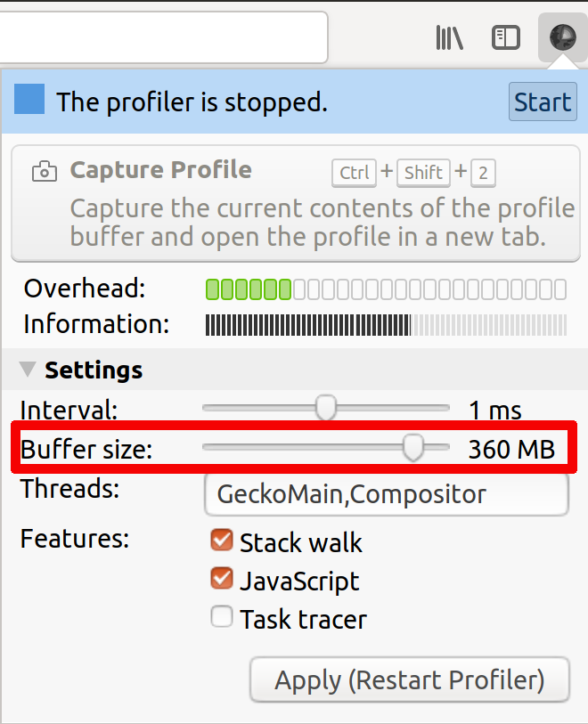
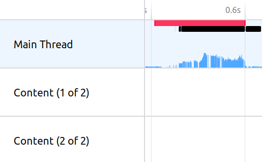
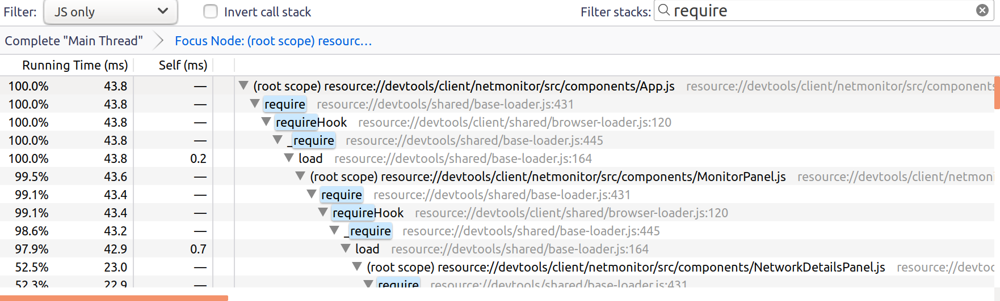
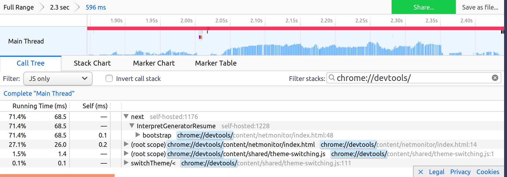
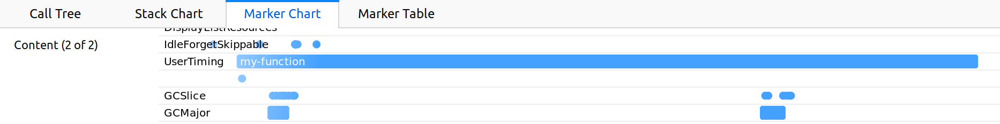
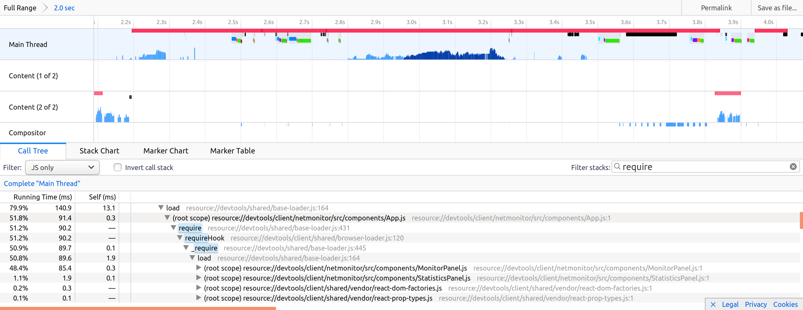
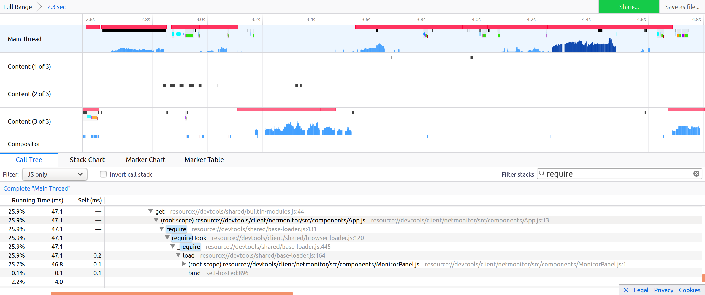
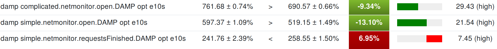

# Writing efficient code

When debugging a page, tools get to slow down the website because of the added instrumentation.
While working on Developer Tools we should strive to be the less impactful.
First, because it is painful to work with laggy UI, but also because some tools record timings.
For example, the network monitor records HTTP request timings.
If the tools are slowing down Firefox significantly, it will make these measurements be wrong.

To be efficient while working on performance, you should always focus on one precise user scenario.
It could be:
* a bug report where someone reports a precise interaction being slow,
* or you could be trying to improve overall tools performance by looking at the most common usages.
The important point here is to have some steps to reproduce, that you can redo manually in order to record a profile.
And also, it is even better if you can replay via a test script. Test script that you can save as a new performance test.

## Don't guess — profile.

The very first thing to do is to record a profile while reproducing the scenario.

Here's the Firefox documentation for [how to install the profiler and record a profile](https://developer.mozilla.org/docs/Mozilla/Performance/Reporting_a_Performance_Problem) and also [how to interpret the profiles](https://developer.mozilla.org/docs/Mozilla/Performance/Profiling_with_the_Built-in_Profiler#Understanding_Profiles)

There are some peculiarities about DevTools architecture that are worth knowing about when looking at a profile:

### Tweak profiler default settings

The default buffer size (9MB) is too small. If you don't increase it, you may easily miss data and only see last couple of seconds of your recording.
To increase the buffer size, click on the profiler add-on icon, in the Firefox toolbar, and set it to 360MB, like this:

  

The other setting worth mentioning for DevTools debugging is the `Interval`
The profiler records only samples, based on this `Interval`.
If you want to see more fine-grained stack traces, you may reduce this interval to 0.1ms,
but do that only if you really need it, as it will make Firefox much even slower when recording,
and the measured times will be even slower.

### The DevTools UI runs on the parent process

When you are debugging tool front-ends (e.g. panels), always ensure you select the `Main Thread` line.
It should have a light blue background like this:

  

Otherwise, the vast majority of DevTools backend (DebuggerServer, actors, ...) lives in content processes.
So if you are debugging them, you should select one of the `Content` lines.

### Most of the DevTools codebase is in Javascript

In the call tree, it is easier to filter by `JS`, via this menu list:
  

But note that you may have to switch back to `Combined` in order to understand why some particular Javascript method is slow.

### Handy filter strings for DevTools:

  * `require`
    Helps highlighting the cost of module loading
     
  * DevTools uses two kind of URLs:
    * `chrome://devtools/` for all panel documents. Filter with this to see the cost of all panel documents:
      
    * `resource://devtools/` for all javascript modules. Filter with this to see the cost of all modules:
      

### Record durations manually

Sometimes it is handy to focus on a very precise piece of code and record its time manually.
For example when you identified one slow running method and think you can speed it up.
It saves your from having to: record the profile, wait for the profiler to display and search for the precise method durations.

#### Print durations in your Terminal and in the Browser Console

You can use the [`Performance`](https://developer.mozilla.org/docs/Web/API/Performance) API, like this:
```
let start = window.performance.now();

// Run the code you want to measure

// Once it is done, do:
console.log("my function took", window.performance.now() - start, "ms");
```

#### Use markers

The Performance API also allows recording markers, like this:
```
window.performance.mark("my-function-start");

// Run the code you want to measure

// Once it is done, do:
window.performance.measure("my-function", "my-function-start");
```

This marker will appear in the `Marker Chart` section in [profiler.firefox.com](https://profiler.firefox.com), in the `UserTiming` lines:
  

You can double click on it to make [profiler.firefox.com](https://profiler.firefox.com) display the record during this precise moment in time,
and the call tree will only display what was executed during this measurement.

### Prototype quickly

Sometimes the best way to find what is slow is to comment blocks of code out
and uncomment them one by one until you identify the culprit. And then focus on it.

There are few things worse than spending a long time refactoring the piece of code that was not slow to begin with!

## Assess your improvement.

Once you have a patch that you think improves the performance, you have to assess whether it actually improves it.

### Record another profile

Compare the two profiles, without and with your patch.
Then see if the call tree reports a significant difference:
* A function call completely disappears in the new profile, with your fix.
  For example you were loading a big module, and you got a frame for `require("my/big/module")` call, and no longer see it.
* The same function call takes xxx ms less with your patch.

This [lazy loading of modules in netmonitor](https://bugzilla.mozilla.org/show_bug.cgi?id=1420289) is a good example.
Without this patch, App.js was loading in 91ms and was loading MonitorPanel.js and StatisticsPanel.js as dependencies:
  

With the patch, App.js loads in 47ms and only loads MonitorPanel.js:
  

It highlights that:
 * we no longer load StatisticsPanel,
 * App is faster to load.

### Run performance tests

See if any subtest reports a improvement. Ensure that the improvement makes any sense.
For example, if the test is 50% faster, maybe you broke the performance test.
This might happen if the test no longer waits for all the operations to finish executing before completing.

To push your current patch to try, execute:
```
./mach try -b o -p linux64 -u none -t damp --rebuild-talos 5 --artifact
```
It will print in your Terminal a link to perfherder like this one:
[https://treeherder.mozilla.org/perf.html#/comparechooser?newProject=try&newRevision=9bef6cb13c43bbce21d40ffaea595e082a4c28db](https://treeherder.mozilla.org/perf.html#/comparechooser?newProject=try&newRevision=9bef6cb13c43bbce21d40ffaea595e082a4c28db)
Running performance tests takes time, so you should open it 30 minutes up to 2 hours later to see your results.
See [Performance tests (DAMP)](../tests/performance-tests.md) for more information about PerfHerder/try.

Let's look at how to interpret an actual real-life [set of perfherder results](https://treeherder.mozilla.org/perf.html#/comparesubtest?originalProject=mozilla-central&newProject=try&newRevision=9bef6cb13c43bbce21d40ffaea595e082a4c28db&originalSignature=edaec66500db21d37602c99daa61ac983f21a6ac&newSignature=edaec66500db21d37602c99daa61ac983f21a6ac&showOnlyImportant=1&framework=1&selectedTimeRange=172800):



These results are related to [lazy loading of modules in netmonitor](https://bugzilla.mozilla.org/show_bug.cgi?id=1420289).
It is interesting to see that this patch is a trade-off. It makes netmonitor opening significantly faster, by preventing loading many modules during its opening.
But it makes the page reload a bit slower as some modules that used to be loaded during netmonitor open, now have to be loaded during page reload.
