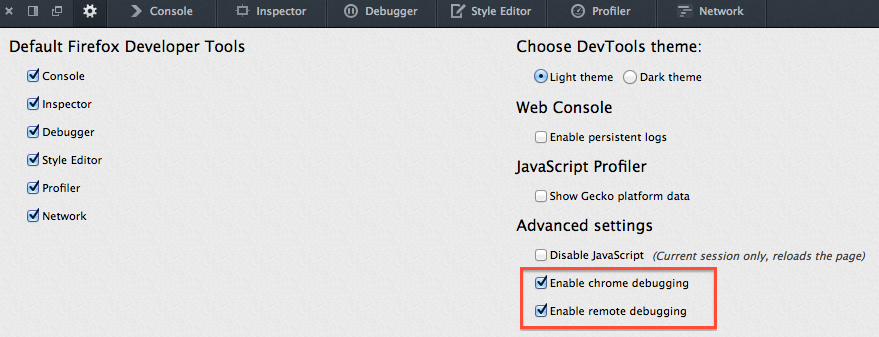

# Setting up a development profile

You can have various [Firefox profiles](https://developer.mozilla.org/en-US/Firefox/Multiple_profiles) (think of something like "user accounts"), each one with different settings, addons, appearance, etc.

This page will guide you through configuring a new profile to enable development features such as additional logging, dumping of network packets, remote debugging, etc. which will help when working in DevTools.

Many of these changes are achieved by modifying preferences in `about:config`, a special page you can access by typing in `about:config` in Firefox's URL bar. The first time, it will show you a warning page. Click through or disable the warning for the future, and then you can start searching for preferences to modify.

(If you're curious, here's more information about [about:config](https://support.mozilla.org/en-US/kb/about-config-editor-firefox))

## Default profile

The following command line expression will run Firefox using a default profile. It'll create the default profile if there isn't one already.


```
./mach run
```

## Using temporary profile

The following command line expression will run Firefox using a temporary profile which is discarded when you close the browser. It also means that any preferences we set will not persist.

```
./mach run --temp-profile
```

## Create a permanent profile

Create a permanent profile can be done as follows:

```
./mach run -P development
```

If this profile doesn't exist yet (quite likely), a window will open offering you options to create a new profile, and asking you for the name you want to use.

Create a new profile, and name it `development`. Then start Firefox by clicking on `Start Nightly`.

Next time you start Firefox with `./mach run -P development`, the new profile will be automatically used, and settings will persist between browser launches.

It's now time to [start contributing](../contributing.html)! 😃

---

## Advanced settings

The following section describes how to enable additional development features; don't worry if you don't understand what some of these are or what they're for. Feel free to skip these if you're new; you probably don't need them yet.

### Enable additional logging

You can change the value of these preferences by going to `about:config`:

| Preference name | Value | Comments |
| --------------- | --------------- | -------- |
| `browser.dom.window.dump.enabled` | `true` | Adds global `dump` function to log strings to `stdout` |
| `devtools.console.stdout.chrome` | `true` | Allows console API to write to `stdout` when used by chrome content |
| `devtools.console.stdout.content` | `true` | Allows console API to write to `stdout` when used by content |
| `devtools.debugger.log` (*) | `true` | Dump packets sent over remote debugging protocol to `stdout`.<!-- TODO: I think this is outdated and there isn't a compatible addon anymore <br /><br />The [remote protocol inspector add-on](https://github.com/firebug/rdp-inspector/wiki) might be useful too.--> |
| `devtools.dump.emit` (*) | `true` | Log event notifications from the EventEmitter class<br />(found at `devtools/shared/event-emitter.js`). |

Preferences marked with a (`*`) also require `browser.dom.window.dump.enabled` in order to work. You might not want to enable *all* of those all the time, as they can cause the output to be way too verbose, but they might be useful if you're working on a server actor, for example<!--TODO link to actors doc-->.

Restart the browser to apply configuration changes.

### Enable remote debugging and the Browser Toolbox

<!--TODO: aren't some of these preferences enabled by default now in local builds? -->

These settings allow you to use the [browser toolbox](https://developer.mozilla.org/docs/Tools/Browser_Toolbox) to inspect the DevTools themselves, set breakpoints inside of DevTools code in the *Browser* environment.

Open DevTools, and click the "Toolbox Options" gear icon in the top right (the image underneath is outdated). <!--TODO update image-->

Make sure the following two options are checked:

- Enable browser chrome and add-on debugging toolboxes
- Enable remote debugging



In `about:config`, set `devtools.debugger.prompt-connection` to `false`.

This will get rid of the prompt displayed every time you open the browser toolbox.

### Enable DevTools assertions

When assertions are enabled, assertion failures are fatal, log console warnings, and throw errors.

When assertions are not enabled, the `assert` function is a no-op.

It also enables the "debug" builds of certain third party libraries, such as React.

To enable assertions, add this to your `mozconfig` file:

```
ac_add_options --enable-debug-js-modules
```

And assert your own invariants like this:

```
const { assert } = require("devtools/shared/DevToolsUtils");
// ...
assert(1 + 1 === 2, "I really hope this is true...");
```
