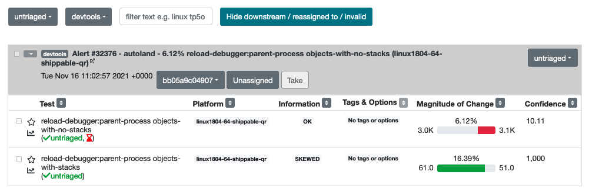
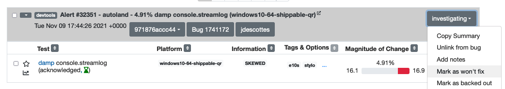
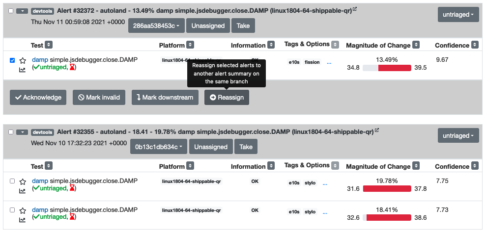
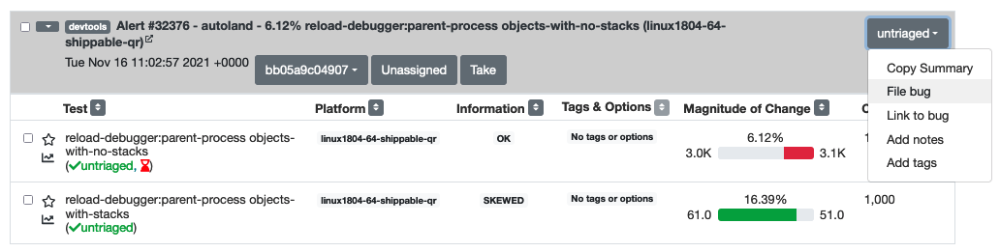
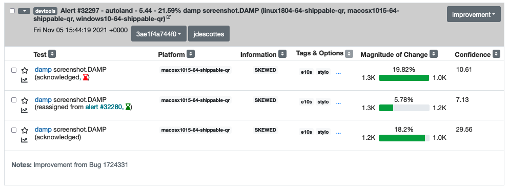
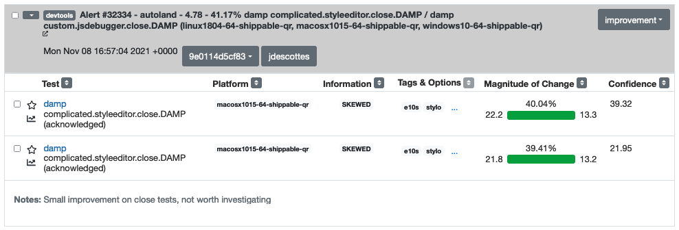

# DevTools performance sheriffing

On a weekly basis, we should review:
- [DevTools performance alerts from PerfHerder](https://treeherder.mozilla.org/perfherder/alerts?status=0&framework=12&hideDwnToInv=1&page=1)
- [DevTools performance dashboard](https://firefox-dev.tools/performance-dashboard/)

## PerfHerder alerts

### Setup

First of all keep in mind this DevTools documentation only highlights specifics of the DevTools workflow. DevTools team is triaging its own performance alerts and follows a slightly simplified workflow, but in general the whole Performance Sheriffing documentation also applies here.

Please take a look at the [Performance Sheriffing documentation](https://wiki.mozilla.org/TestEngineering/Performance/Sheriffing) and the [workflow documentation](https://wiki.mozilla.org/TestEngineering/Performance/Sheriffing/Workflow). You should also join the Performance Sheriffing room at [https://chat.mozilla.org/#/room/#perfsheriffs:mozilla.org](https://chat.mozilla.org/#/room/#perfsheriffs:mozilla.org)

The DevTools documentation will not explain how to use PerfHerder or TreeHerder, but we will try to link to the relevant documentation when possible.

In order to sheriff DevTools alerts, your Treeherder user needs to belong to the performance sheriffing group, otherwise you will be unable to update the alerts. Take a look at the [documentation to request access](https://www.google.com/url?q=https://wiki.mozilla.org/TestEngineering/Performance/Onboarding%23Sheriffing&sa=D&source=docs&ust=1634550314641000&usg=AOvVaw2aHrCFQ-wyyc-wrJgkfK4q) and you can refer to a [previous Bug](https://bugzilla.mozilla.org/show_bug.cgi?id=1723906) as an example.

### DevTools alerts

Performance tests are a special kind of test which output a set of metrics (timings, memory) which are collected over time by Perfherder. When a significant variance is detected for one of those metrics, an alert will be automatically created by the system

The list of DevTools performance tests is documented on the [DevTools Performance Tests overview](./tests/performance-tests-overview.md). From this list, most of the alerts will be either related to DAMP or to Memory Leak tests.

### Weekly sheriffing

The untriaged DevTools alerts are listed at [https://treeherder.mozilla.org/perfherder/alerts?status=0&framework=12&hideDwnToInv=1&page=1](https://treeherder.mozilla.org/perfherder/alerts?status=0&framework=12&hideDwnToInv=1&page=1). The goal of the weekly sheriffing task will be to triage all those alerts.

Triaging an alert doesn't mean solving the performance issue but simply acknowledging the alert and either:
- filing a bug
- or marking as won't fix
- or mark as improvement

As follow up, the most significant and actionable alerts should be presented to the team and you should decide next steps. It is perfectly ok to say that a performance regression is not worth investigating or fixing and close the bug as a consequence.

### Workflow suggestion

There is no right or wrong way to sheriff alerts, and a lot of this will depend on your own judgement and knowledge of the recent changes in the codebase. Nevertheless, below are some steps which can help to breakdown the task.

#### Ignore minor or invalid changes

DevTools tests can be impacted by many platform changes, which will sometimes update the baseline of a subtest of a few percents. If a change is minor (for instance less than 5%) and the pushlog does not contain any DevTools change, you may Acknowledge the test regressions and mark the alert as "Won't Fix".

We also usually avoid paying too much attention to the "close" tests, which measure the time needed to close the toolbox after using a panel (eg "complicated.styleeditor.close.DAMP"). Those tests are usually noisy and not an area where we put much effort. Unless there was a huge regression, as long as those tests run in a few dozen ms you may skip those.

#### Regroup alerts

I suggest to then try to regroup alerts which are likely to be caused by the same change. You can identify those by several criteria:
- the datetime of the alerts should be close (for instance same day, just a few hours apart)
- the area of the alerts should be similar (for instance only debugger tests are impacted, only memory tests are impacted)
- the different alerts are about different platforms

What happens very often, given how noisy the DevTools DAMP tests are, is that an alert will be generated for a different build on Linux and on Windows for instance. Based on your overall knowledge of what landed last week, you can take a look at the pushlog for similar alerts and see if you spot any DevTools change present for all similar alerts

Once you identified 2 alerts to regroup, use the Reassign feature to merge the alerts.

#### Investigate an alert

If an alert is valid and should be investigated, you should acknowledge the alert and file a bug, using the "File Bug" feature.

After the Bug was created, link the bug to the alert on Perfherder using the "Link to Bug" feature. Then we can also perform some early investigation.

1. You can look at the pushlog of the alert to see if any patch that landed seems directly related.
1. Review which platforms regressed to see if the regression impacted all platforms (windows, linux, macos). Usually a regression from a DevTools change will impact all platforms, so an alert only touching macos might indicate that the regression is rather coming from a platform change.
1. Make sense of which tests have regressed. In case several platforms have reported the same issue, it can be hard to parse the list visually. Use the "filter" input to only see tests for one platform, for instance "linux1804-64-qr". You should then be able to tell which area of our tests have regressed.

Summarize this information in the Bug filed for the alert, and add it to the weekly DevTools Tools Check-in agenda. You might also add some information in the notes of the alert.

Unless you already identified the regressing changeset, you should also start backfills starting from the job of the alert. Click on the job link from Perfherder, which should lead you to a DAMP job from autoland. Start a backfill using a Custom Action for the 10 previous autoland jobs, retriggered 5 times.

#### Note about improvements

If an alert only contains improvements, you should still check if the improvement is expected, especially if it is an important change. Otherwise it could indicate that the test is no longer testing what it should test and it should be investigated. Unless an improvement was expected, we should follow the exact same workflow as for any alert.

#### Alert notes and alert owner

This applies to all alerts you are triaging. Try to add a Note for alerts which are not associated with a Bug. The Note can just be a quick explanation saying why an alert is being ignored, or where a given improvement might come from. And assign yourself to the alert using the "Take" button.

### Perfherder tips

Again please refer to the [main documentation for Perfherder](https://wiki.mozilla.org/TestEngineering/Performance/Sheriffing/Workflow). But there are some UX issues you might run into with the DevTools workflow and worth pointing out.

#### Unable to change the state of an alert

Each alert lists several tests which might have improved or regressed. Both the alert and tests have a state, for instance "untriaged", "invalid", … The state for the alert seems partly derived from the state of the individual tests. And sometimes it can be difficult to either update the state of the tests or the state of the alert correctly.

A common issue occurs after regrouping alerts. At that point the tests which were moved to another alert get the "reassigned" state. Imagine you want to move all the tests from this alert to "acknowledged". If you select all tests using the checkbox on the left of the alert title, you will not see the button to "Acknowledge" the tests. This is because you can't move tests from the "reassigned" state to the "acknowledged" state. Instead here, you have to select only the "untriaged" tests. You can easily do that by selecting "untriaged" in the dropdown next to the checkbox. Once you only have untriaged tests selected, you should be able to change their state as expected. And an alert with only "reassigned" and "acknowledged" tests will be considered as acknowledged.

From time to time, alerts also don't seem to offer the expected action in the top right dropdown. In that case it's probably best to raise this problem on [https://chat.mozilla.org/#/room/#perfsheriffs:mozilla.org](https://chat.mozilla.org/#/room/#perfsheriffs:mozilla.org) , but you might also try resetting the tests in the alert to see if you manage to unblock the state.

#### Already triaged alert coming back

Sometimes an alert which was already triaged will be assigned a new test change (regression or improvement). This new test will most likely have a status of "untriaged", which will move back the alert in the untriaged category. If an alert seems familiar, pay attention to the date and check the status of individual tests, there might just be a few new tests added, which need to be assigned the same state as the others.

## DevTools performance dashboard

We used to rely mostly on the DevTools performance dashboard for monitoring, but alerts are now the main way we detect regressions or improvements. But the DevTools dashboard still offer a nice way to visualize DevTools performance over time, in a centralized place.

The DevTools dashboard relies on the same perfherder data as the alerts, so we should not expect to gather too much new information from this tool. The data used comes from tests running on mozilla-central, on windows platforms for DAMP and on linux for metrics or memory tests. Whereas the alerts use mostly data from autoland and check all platforms. Weekly review of this information should be done very quickly.

The homepage [https://firefox-dev.tools/performance-dashboard/](https://firefox-dev.tools/performance-dashboard/) offers links to individual pages presenting charts grouped by panel or by test domain (eg DAMP, metrics test, ...). I suggest to quickly open each link in a different tab and then scroll through to see if any significant regression pops up.
