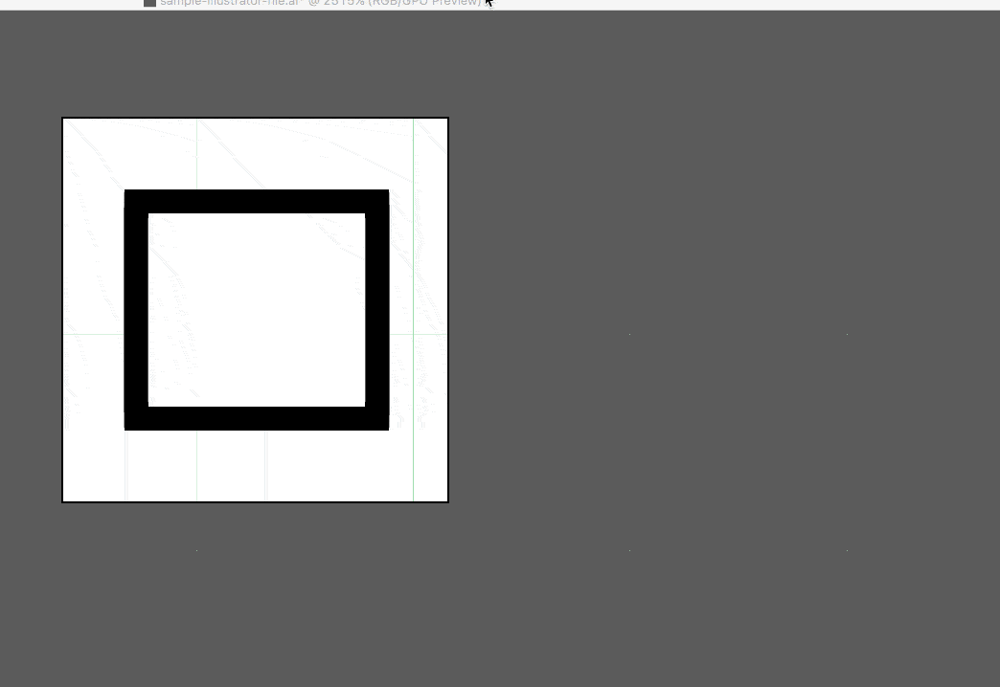
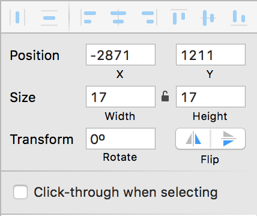

# Panel SVGs
These are the guidelines for creating devtools SVGs to make sure they're as small and neatly formatted as possible. The Mozilla Developer SVG guidelines can be found [here](https://developer.mozilla.org/en-US/docs/Mozilla/Developer_guide/SVG_Guidelines).

## Explanation of Pixel Grid
Since so many of our SVGs appear so small, designing them on the pixel grid will help them not appear fuzzy when they're sized down to 16x16 pixels. There is program-specific documentation in both the [Illustrator](#illustrator) and [Sketch](#sketch) sections.

## Panel Icon Requirements
The devtools panel icons do a couple of things in a specific way; following these guidelines will help stick your patch:

1. **Inline fill colors.** Devtools panel icons all use ```fill="#0b0b0b"``` in the ```<svg>``` tag.
2. **Inline opacities.** Devtools panel icons also inline opacities on their relevant path.

## Illustrator
For Illustrator you'll want the following document settings:

- **Document settings**: ```Units: pixels```, ```Advanced``` > check ```Align New Objects to Pixel Grid```
- **Transform Panel**: for existing artwork not on pixel grid, select shape and then within ```Transform``` > ```Advanced``` > check ```Align to Pixel Grid```

You can get a more detailed breakdown with images [here](http://medialoot.com/blog/3-valuable-pixel-perfect-illustrator-techniques/).

You can download a sample Illustrator file [here](https://www.dropbox.com/home/Mozilla_MobileUX_Share/Internal%20Assets/Templates/Firefox?preview=pixel-grid-illustrator.ai).

### Tips for Object Creation
When you're designing your icons in a graphics editor like Adobe Illustrator, there are a lot of things you can do that will bring down the size of the file and make your SVGs easier for the developers to work with. Here are some of them:

- **Expand paths**: Instead of having multiple shapes overlapping each other, expand shapes using the pathfinder.

- Simplify paths (```Object``` > ```Path``` > ```Simplify```)
- Expand objects so that strokes become objects. This has the added benefit of keeping the stroke size intact as the SVG is resized.


## Sketch
Sketch vector work is a little different but the fundamentals (keeping your SVG small, expanding all paths) is the same. Here's what we've found helps to build clean icons:

- **Build your icon at 16x16 with the Pixel Grid turned on.** You can turn the pixel grid on at ```View > Canvas > Show Pixels```

- **Make sure that all x/y coordinates are full pixels for lines/rectangles.** Sub-pixels = not on pixel grid.


- **Expand all your paths so strokes expand properly as the SVG gets resized.** You can do this at ```Layer > Paths > Vectorize Stroke```.

- **Align anything that isn't boxy to the pixel grid with item selected then ```Layer > Round to Nearest Pixel Edge```.**