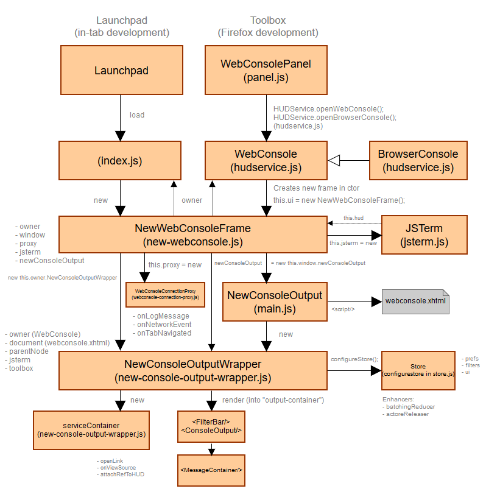

# Console Tool Architecture

The Console panel is responsible for rendering all logs coming from the current page.

## Architecture

Internal architecture of the Console panel (the client side) is described
on the following diagram.

## Entry points

There are two ways to load the Console panel. It can either run on top
of the Launchpad (inside a browser tab) or within the DevTools Toolbox.

There are different entry points for these scenarios:
* Launchpad - uses `index.js` file as the entry point
* Toolbox - uses `panel.js` file as the entry point

## Components

The Console panel UI is built on top of [React](../frontend/react.md). It defines set of React components in `components` directory

## Actions

The Console panel implements a set of actions divided into several groups.

* **Filters** Actions related to content filtering.
* **Messages** Actions related to list of messages rendered in the panel.
* **UI** Actions related to the UI state.

### State

The Console panel manages the app state via [Redux](../frontend/redux.md).

There are following reducers defining the panel state:

* `reducers/filters.js` state for panel filters. These filters can be set from within the panel's toolbar (e.g. error, info, log, css, etc.)
* `reducers/messages.js` state of all messages rendered within the panel.
* `reducers/prefs.js` Preferences associated with the Console panel (e.g. logLimit)
* `reducers/ui.js` UI related state (sometimes also called a presentation state). This state contains state of the filter bar (visible/hidden), state of the time-stamp (visible/hidden), etc.
