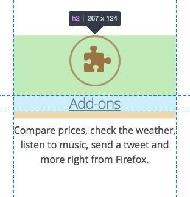

# Highlighters

This article provides technical documentation about DevTools highlighters.

By highlighter, we mean anything that DevTools displays on top of the content page, in order to highlight an element, a set of elements or shapes to users.

The most obvious form of highlighter is the box-model highlighter, whose job is to display the 4 box-model regions on top of a given element in the content page, as illustrated in the following screen capture:



But there can be a wide variety of highlighters. In particular, highlighters are a pretty good way to give detailed information about:

* the exact form of a css shape,
* how a css transform applied to an element,
* where are the color stops of a css gradient,
* which are all the elements that match a given selector,
* ...

## Using highlighters

Highlighters run on the debuggee side, not on the toolbox side. This is so that it's possible to highlight elements on a remote device for instance. This means you need to go through the [Remote Debugging Protocol](protocol.md) to use a highlighter.

### The highlighter utils

The easiest way to access the highlighters from toolbox-side DevTools code is by using the highlighter utils, which is conveniently available on the toolbox object. Here is how you can access the utils:

```js
let hUtils = toolbox.highlighterUtils;
```

Since the box-model highlighter is the most used type of highlighter (for instance it's displayed when you move your mouse over nodes in the inspector), the utils provides a set of methods to interact with it:

| Method                             | Description                                                                                                                                                                                                                   |
|------------------------------------|-------------------------------------------------------------------------------------------------------------------------------------------------------------------------------------------------------------------------------|
| `startPicker()`                    | Starts the node picker mode which will highlight every node you hover over in the page, and will change the current node selection in the inspector on click. “picker-node-hovered” and “picker-node-picked” events are sent. |
| `stopPicker()`                     | Stops the node picker mode.                                                                                                                                                                                                   |
| `highlightNodeFront(nodeFront)`    | Display the box-model highlighter on a given node. NodeFront objects are what the WalkerActor return.                                                                                                                         |
| `highlightDomValueGrip(valueGrip)` | Display the box-model highlighter on a given node, represented by a debugger object value grip.                                                                                                                               |
| `unhighlight()`                    | Hide the box-model highlighter.                                                                                                                                                                                               |

But the box-model highlighter isn't the only type of highlighter, so the highlighter utils provides the following method:

| Method                           | Description                                                                                                                                                                                                                                                                                                   |
|----------------------------------|---------------------------------------------------------------------------------------------------------------------------------------------------------------------------------------------------------------------------------------------------------------------------------------------------------------|
| `getHighlighterByType(typeName)` | Instantiate a new highlighter, given its type (as a String). At the time of writing, the available types of highlighters are: `BoxModelHighlighter`, `CssTransformHighlighter`, `SelectorHighlighter` and `RectHighlighter`. This returns a promise that resolves to the new instance of [protocol.js](https://wiki.mozilla.org/DevTools/protocol.js) actor. |

### The highlighter API

When getting a highlighter via `toolbox.highlighterUtils.getHighlighterByType(typeName)`, the right type of highlighter will be instantiated on the server-side and will be wrapped into a `CustomHighlighterActor` and that's what will be returned to the caller. This means that all types of highlighters share the same following API:

| Method                                   | Description                                                                                                                                                                                                                                                                                                                                                                                                                                                                                                                           |
|------------------------------------------|---------------------------------------------------------------------------------------------------------------------------------------------------------------------------------------------------------------------------------------------------------------------------------------------------------------------------------------------------------------------------------------------------------------------------------------------------------------------------------------------------------------------------------------|
| `show(NodeActor node[, Object options])` | Highlighters are hidden by default. Calling this method is what makes them visible. The first, mandatory, parameter should be a NodeActor. NodeActors are what the WalkerActor return. It's easy to get a NodeActor for an existing DOM node. For example `toolbox.walker.querySelector(toolbox.walker.rootNode, "css selector")` resolves to a NodeFront (the client-side version of the NodeActor) which can be used as the first parameter. The second, optional, parameter depends on the type of highlighter being used. |
| `hide()`                                 | Hides the highlighter.                                                                                                                                                                                                                                                                                                                                                                                                                                                                                                                |
| `finalize()`                             | Destroys the highlighter.                                                                                                                                                                                                                                                                                                                                                                                                                                                                                                             |

## Creating new highlighters

Before digging into how one goes about adding a new type of highlighter to the DevTools, it is worth understanding how are highlighters displayed in the page.

### Inserting content in the page

Highlighters use web technology themselves to display the required information on screen. For instance, the box-model highlighter uses SVG to draw the margin, border, padding and content regions over the highlighted node.

This means the highlighter content needs to be inserted in the page, but in a non-intrusive way. Indeed, the DevTools should never alter the page unless the alteration was done by the user (like changing the DOM using the inspector or a CSS rule via the style-editor for example). So simply appending the highlighter's markup in the content document is not an option.

Furthermore, highlighters not only need to work with Firefox Desktop, but they should work just as well on Firefox OS, Firefox for Android, and more generally anything that runs the Gecko rendering engine. Therefore appending the highlighter's markup to the browser chrome XUL structure isn't an option either.

To this end, DevTools highlighters make use of a (chrome-only) API:

```
 /**
  * Chrome document anonymous content management.
  * This is a Chrome-only API that allows inserting fixed positioned anonymous
  * content on top of the current page displayed in the document.
  * The supplied content is cloned and inserted into the document's CanvasFrame.
  * Note that this only works for HTML documents.
  */
 partial interface Document {
   /**
    * Deep-clones the provided element and inserts it into the CanvasFrame.
    * Returns an AnonymousContent instance that can be used to manipulate the
    * inserted element.
    */
   [ChromeOnly, NewObject, Throws]
   AnonymousContent insertAnonymousContent(Element aElement);

   /**
    * Removes the element inserted into the CanvasFrame given an AnonymousContent
    * instance.
    */
   [ChromeOnly, Throws]
   void removeAnonymousContent(AnonymousContent aContent);
 };
```

Using this API, it is possible for chrome-privileged JS to insert arbitrary DOM elements on top of the content page.

Technically, the DOM element is inserted into the `CanvasFrame` of the document. The `CanvasFrame` is part of the rendered frame tree and the DOM element is part of the native anonymous elements of the `CanvasFrame`.

Consider the following simple example:

```js
 let el = document.createElement("div");
 el.textContent = "My test element";
 let insertedEl = document.insertAnonymousContent(el);
```

In this example, the test DIV will be inserted in the page, and will be displayed on top of everything else, in a way that doesn't impact the current layout.

### The AnonymousContent API

In the previous example, the returned `insertedEl` object isn't a DOM node, and it certainly is not `el`. It is a new object, whose type is `AnonymousContent` ([see the WebIDL here](https://dxr.mozilla.org/mozilla-central/source/dom/webidl/AnonymousContent.webidl)).

Because of the way content is inserted into the page, it isn't wanted to give consumers a direct reference to the inserted DOM node. This is why `document.insertAnonymousContent(el)` actually **clones** `el` and returns a new object whose API lets consumers make changes to the inserted element in a way that never gives back a reference to the inserted DOM node.

### CanvasFrameAnonymousContentHelper

In order to help with the API described in the previous section, the `CanvasFrameAnonymousContentHelper` class was introduced.

Its goal is to provide a simple way for highlighters to insert their content into the page and modify it dynamically later. One of its goal is also to re-insert the highlighters' content on page navigation. Indeed, the frame tree is destroyed when the page is navigated away from since it represents the document element.

Using this helper is quite simple:

```js
let helper = new CanvasFrameAnonymousContentHelper(targetActor, this.buildMarkup.bind(this));
```

It only requires a `targetActor`, which highlighters get when they are instantiated, and a callback function that will be used to create and insert the content the first time the highlighter is shown, and every time there's a page navigation.

The returned object provides the following API:

| Method                                    | Description                                                |
|-------------------------------------------|------------------------------------------------------------|
| `getTextContentForElement(id)`            | Get the textContent of an element given its ID.            |
| `setTextContentForElement(id, text)`      | Set the textContent of an element given its ID.            |
| `setAttributeForElement(id, name, value)` | Set an attribute value of an element given its ID.         |
| `getAttributeForElement(id, name)`        | Get an attribute value of an element given its ID.         |
| `removeAttributeForElement(id, name)`     | Remove an attribute of an element given its ID.            |
| `content`                                 | This property returns the wrapped AnonymousContent object. |
| `destroy()`                               | Destroy the helper instance.                               |

  ### Creating a new highlighter class

A good way to get started is by taking a look at [existing highlighters here](https://dxr.mozilla.org/mozilla-central/source/devtools/server/actors/highlighters.js#697-727).

Here is some boilerplate code for a new highlighter class:

```js
 function MyNewHighlighter(targetActor) {
   this.doc = targetActor.window.document;
   this.markup = new CanvasFrameAnonymousContentHelper(targetActor, this._buildMarkup.bind(this));
 }

 MyNewHighlighter.prototype = {
   destroy: function() {
     this.doc = null;
     this.markup.destroy();
   },

   _buildMarkup: function() {
     let container = this.doc.createElement("div");
     container.innerHTML = '<div id="new-highlighted-" style="display:none;">';
     return container;
   },

   show: function(node, options) {
     this.markup.removeAttributeForElement("new-highlighted-el", "style");
   },

   hide: function() {
     this.markup.setAttributeForElement("new-highlighted-el", "style", "display:none;");
   }
 };
```

In most situations, the `container` returned by `_buildMarkup` will be absolutely positioned, and will need to contain elements with IDs, so that these can then later be moved, resized, hidden or shown in `show` and `hide` using the AnonymousContent API.

### The AutoRefreshHighlighter parent class

It is worth mentioning this class as it may be a useful parent class to inherit a new highlighter from in some situations.

If the new highlighter's job is to highlight an element in the DOM, then it most likely should inherit from `AutoRefreshHighlighter`.

The `AutoRefreshHighlighter` class updates itself in a loop, checking if the currently highlighted node's geometry has changed since the last iteration. This is useful to make sure the highlighter **follows** the highlighted node around, in case the layout around it changes, or in case it is an animated node.

Sub classes must implement the following methods:

| Method      | Description                                                                         |
|-------------|-------------------------------------------------------------------------------------|
| `_show()`   | Called when the highlighter should be shown.                                        |
| `_update()` | Called while the highlighter is shown and the geometry of the current node changes. |
| `_hide()`   | Called when the highlighter should be hidden.                                       |

Sub classes will have access to the following properties:

| Property            | Description                               |
|---------------------|-------------------------------------------|
| `this.currentNode`  | The node to be shown.                     |
| `this.currentQuads` | All of the node's box model region quads. |
| `this.win`          | The current window                        |
