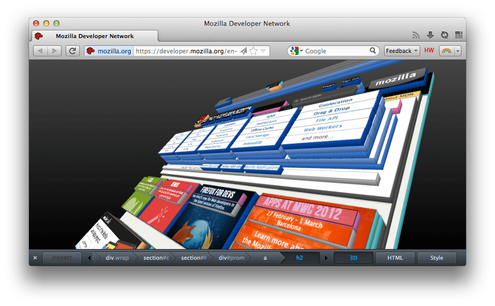

=======
3D view
=======

.. warning::

   From Firefox 47 onwards, 3D view is no longer available.

When you click on the 3D view button, the page goes into 3D view mode; in this mode, you can see your page presented in a 3D view in which nested blocks of HTML are increasingly "tall," projecting outward from the bottom of the page. This view makes it easy to visualize the nesting of your content.

By clicking and dragging the view, you can rotate and re-orient the 3D presentation of the DOM hierarchy of your page to see it from different angles, to better examine its structure. Off-screen elements become visible, so that you can see where your elements are located in relation to the visible content. You can click on elements to see their HTML in the :doc:`HTML panel <page_inspector_ui_tour_html_pane>` or the :doc:`Style panel <page_inspector_ui_tour_rules_view>`. Conversely, you can click on elements in the breadcrumb bar to change which element is selected in the 3D view.

If you do not see the 3D button in the page inspector, it is possible that your graphics driver needs to be updated. See the `blocklisted drivers page <https://wiki.mozilla.org/Blocklisting/Blocked_Graphics_Drivers>`_ for more information.

Controlling the 3D view
***********************

There are keyboard shortcuts and mouse controls available for the 3D view.

.. list-table::
  :widths: 20 20 60
  :header-rows: 1

  * - Function
    - Keyboard
    - Mouse

  * - Zoom in/out
    - :kbd:`+` / :kbd:`-`
    - Scroll wheel up/down

  * - Rotate left/right
    - :kbd:`a` / :kbd:`d`
    - Mouse left/right

  * - Rotate up/down
    - :kbd:`w` / :kbd:`s`
    - Mouse up/down

  * - Pan left/right
    - :kbd:`←` / :kbd:`→`
    - Mouse left/right

  * - Pan up/down
    - :kbd:`↑` / :kbd:`↓`
    - Mouse up/down

  * - Reset zoom level
    - :kbd:`0`
    - Resets the zoom level to the default

  * - Focus on selected node
    - :kbd:`f`
    - Makes sure the currently selected node is visible

  * - Reset view
    - :kbd:`r`
    - Resets zoom, rotation, and panning to the default

  * - Hide current node
    - :kbd:`x`
    - Makes the currently selected node invisible; this can be helpful if you need to get at a node that's obscured

Use cases for the 3D view
*************************

There are a variety of ways the 3D view is useful:

- If you have broken HTML causing layout problems, looking at the 3D view can help find where you've gone wrong. Often, layout problems are caused by improper nesting of content. This can become much more obvious when looking at the 3D view and seeing where your elements are nested wrong.
- If content isn't displaying, you may be able to figure out why; since the 3D view lets you zoom out to see elements that are rendering outside the visible area of the page, you can find stray content this way.
- You can get a look at how your page is structured to see if there may be ways to optimize your layout.
- And, of course, it looks **awesome**.

See also
********

- :doc:`Page Inspector <../page_inspector/index>`
- :ref:`HTML panel <page_inspector_ui_tour_html_pane>`
- :ref:`Style panel <page_inspector_ui_tour_rules_view>`
- :doc:`Tools <../index>`
- `New Developer Tools in Firefox 11 Aurora <https://hacks.mozilla.org/2011/12/new-developer-tools-in-firefox-11-aurora>`_ (blog post)
