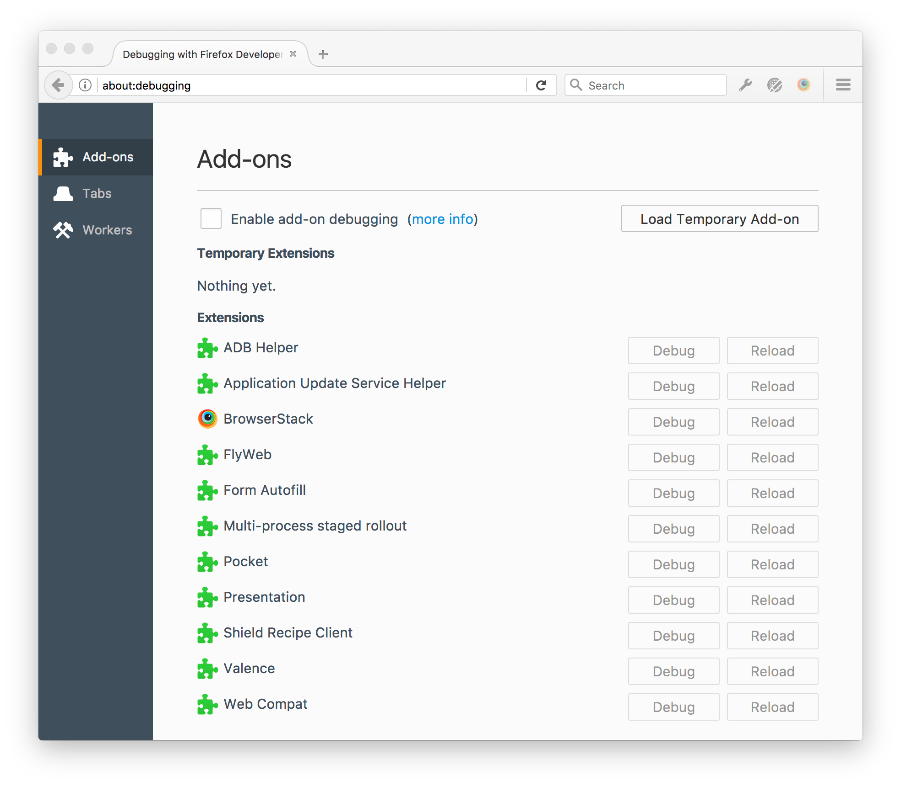
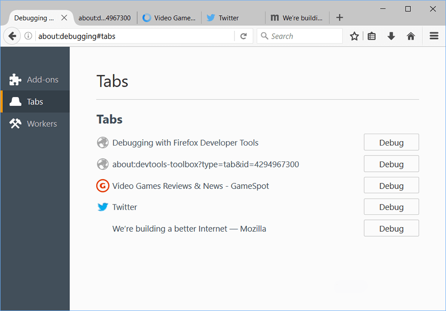
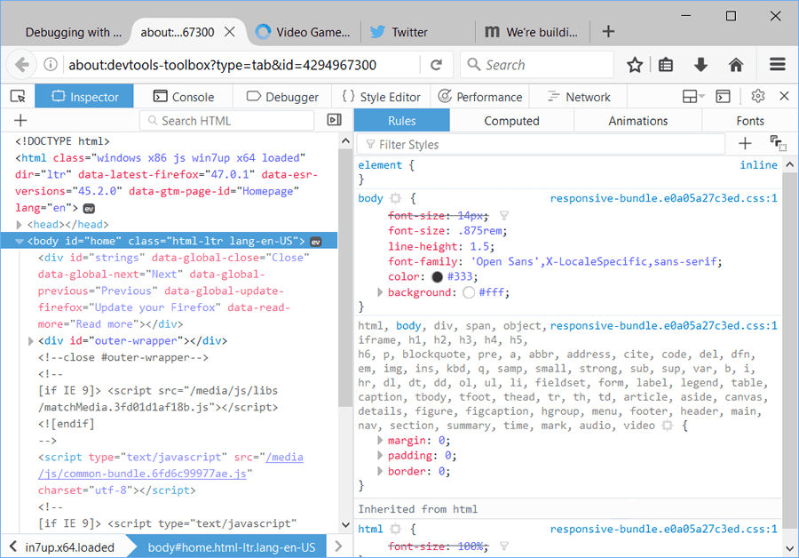
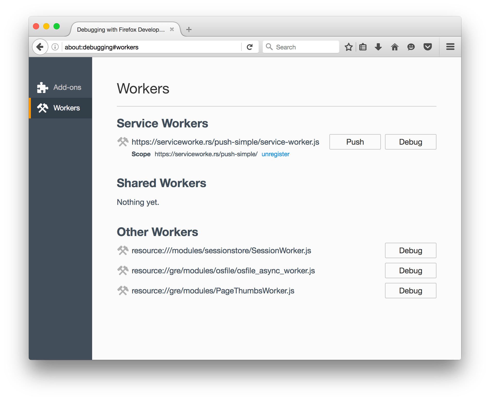
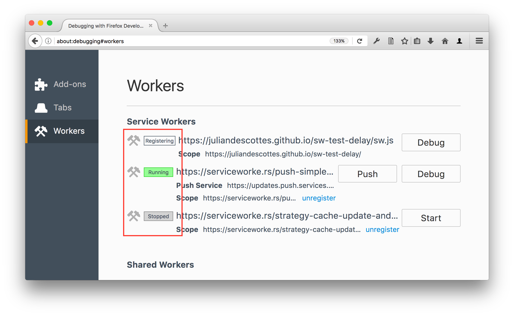
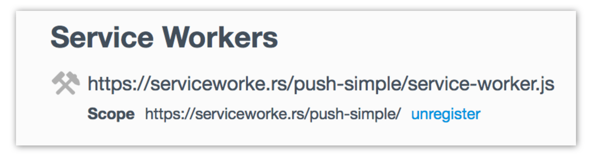
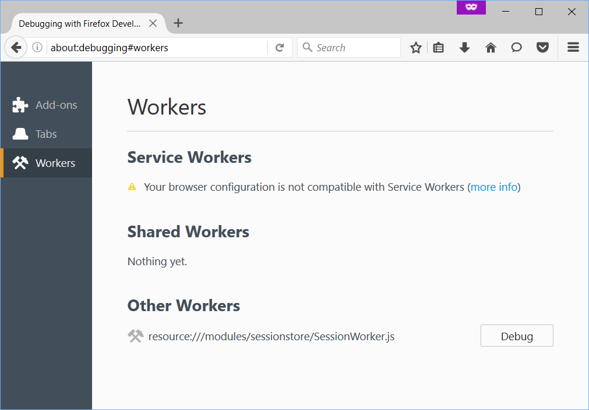

===================================
about:debugging (before Firefox 68)
===================================

The about:debugging page provides a single place from which you can attach the Firefox Developer Tools to a number of debugging targets. At the moment it supports three main sorts of targets: restartless add-ons, tabs, and workers.

Opening the about:debugging page
********************************

There are several different ways to open about:debugging:

.. |image1| image:: hamburger.png
  :width: 20

- Type "about:debugging" in the Firefox URL bar.
- In the Tools > Web Developer menu, click "Service Workers".
- Select the Web Developer menu under the Hamburger menu (|image1|), then select "Service Workers".

When about:debugging opens, on the left-hand side, you'll see a sidebar enabling you to switch between the two main views: one for add-ons and one for workers.

Whether or not system add-ons appear in the list on this page depends on the setting of the ``devtools.aboutdebugging.showSystemAddons`` preference. If you need to see system add-ons, navigate to ``about:config`` and make sure that this value is set to ``true``.

Add-ons
*******

.. note::
  The Add-ons section in about:debugging only supports restartless add-ons, including basic bootstrapped extensions, Add-on SDK add-ons, and `WebExtensions <https://developer.mozilla.org/en-US/docs/Mozilla/Add-ons/WebExtensions>`_.

This page enables you to do two things:

- Load an add-on temporarily from disk
- Connect the **Add-on Debugger** to any restartless add-ons

Connecting the Add-on Debugger
------------------------------

.. note::

  Note that at the moment, it's recommended that you use the Browser Toolbox, not the Add-on Debugger, for debugging WebExtensions. See `Debugging WebExtensions <https://extensionworkshop.com/documentation/develop/debugging/>`_ for all the details.

The Add-ons page in about:debugging lists all restartless add-ons that are currently installed (note that this list may include add-ons that came preinstalled with your Firefox). Next to each entry is a button labeled "Debug".

If the "Debug" button is disabled, check the "Enable add-on debugging" box.

If you click "Debug", you'll see a dialog asking you to accept an incoming connection. Click "OK", and the **Add-on Debugger** will start in a separate window. Note that sometimes the debugger window is hidden by the main Firefox window.

See the page on the **Add-on Debugger** for all the things you can do with this tool.

.. note::

  The "Enable add-on debugging" button works by turning on the ``devtools.chrome.enabled`` and ``devtools.debugger.remote-enabled`` preferences. Both preferences must be true to enable add-on debugging. Checking the box sets both preferences to ``true``, and unchecking it sets them both to ``false``.

You can also modify the preferences directly in about:config, or by checking "Enable browser chrome and add-on debugging toolboxes" and "Enable remote debugging" in the :ref:`Developer Tools Settings <tool-toolbox-settings>`.

Loading a temporary add-on
--------------------------

With the "Load Temporary Add-on" button you can load any sort of restartless add-on temporarily, from a directory on disk. Just click the button, navigate to the directory containing the add-on's file, and select any file in that directory. The temporary add-on will be displayed under the "Temporary Extensions" header.

You don't have to package or sign the add-on. The add-on will stay installed until you restart Firefox.

The big advantages of this method, compared with installing an add-on from an XPI, are:

- you don't have to rebuild an XPI and reinstall when you change the add-on's code
- you can load an add-on without signing it and without needing to disable signing.

Updating a temporary add-on
---------------------------

If you install the add-on in this way, what happens when you update the add-on's files?

Before Firefox 48
~~~~~~~~~~~~~~~~~

- If you change files that are loaded on demand, like `content scripts <https://developer.mozilla.org/en-US/docs/Mozilla/Add-ons/WebExtensions/Content_scripts>`__ or `popups <https://developer.mozilla.org/en-US/docs/Mozilla/Add-ons/WebExtensions/Anatomy_of_a_WebExtension#browser_actions_2>`_, then changes you make are picked up automatically, and you'll see them the next time the content script is loaded or the popup is shown.
- If you change files that stay loaded the whole time, like `background scripts <https://developer.mozilla.org/en-US/docs/Mozilla/Add-ons/WebExtensions/Anatomy_of_a_WebExtension#background_scripts>`_, then you can pick up changes you've made by disabling and then re-enabling the add-on in the about:addons page.
- If you change files that are only parsed at install time, like the `manifest.json <https://developer.mozilla.org/en-US/docs/Mozilla/Add-ons/WebExtensions/manifest.json>`_ file, you'll need to restart Firefox, then load the add-on again.

.. note::

  Note that before Firefox 48, loading the add-on again by pressing "Load Temporary Add-on" without restarting Firefox *does not work*.

Firefox 48 onwards
~~~~~~~~~~~~~~~~~~

From Firefox 48 onwards:

- as before: if you change files that are loaded on demand, like `content scripts <https://developer.mozilla.org/en-US/docs/Mozilla/Add-ons/WebExtensions/Content_scripts>`__ or `popups <https://developer.mozilla.org/en-US/docs/Mozilla/Add-ons/WebExtensions/Anatomy_of_a_WebExtension#browser_actions_2>`_, then changes you make are picked up automatically, and you'll see them the next time the content script is loaded or the popup is shown.
- there's a better way to handle the other cases: click the "Reload" button next to the "Debug" button. This does what it says:

  - reloading any persistent scripts, such as `background scripts <https://developer.mozilla.org/en-US/docs/Mozilla/Add-ons/WebExtensions/Anatomy_of_a_WebExtension#background_scripts>`_
  - parsing the manifest.json file again, so changes to `permissions <https://developer.mozilla.org/en-US/docs/Mozilla/Add-ons/WebExtensions/manifest.json/permissions>`_, `content_scripts <https://developer.mozilla.org/en-US/docs/Mozilla/Add-ons/WebExtensions/manifest.json/content_scripts>`__, `browser_action <https://developer.mozilla.org/en-US/docs/Mozilla/Add-ons/WebExtensions/manifest.json/browser_action>`_ or any other keys will take effect.

.. note::

  Note that in Firefox 49 onwards, the Reload button is only enabled for temporary add-ons. It will be disabled for all other add-ons.

Tabs
****

In Firefox 49 onwards, a Tabs page is available in ``about:debugging`` — this provides a complete list of all the debuggable tabs open in the current Firefox instance.

Each tab entry has a *Debug* button next to it — when clicked, this will open up a toolbox specific to that tab, allowing you to debug that tab's contents.

.. note::

  Note that this feature isn't that immediately useful to debugging desktop tabs — you can open up a toolbox to debug a tab easily enough already — but this will become far more useful when ``about:debugging`` starts to support remote debugging, and this page can begin to list tabs available for debugging on mobile device browsers, simulators, etc. See `bug 1212802 <https://bugzilla.mozilla.org/show_bug.cgi?id=1212802>`_ for the latest on this work.

Workers
*******

The Workers page shows your workers, categorized as follows:

- All registered `Service Workers <https://developer.mozilla.org/en-US/docs/Web/API/Service_Worker_API>`_
- All registered `Shared Workers <https://developer.mozilla.org/en-US/docs/Web/API/SharedWorker>`_
- Other workers, including **Chrome Workers** and `Dedicated Workers <https://developer.mozilla.org/en-US/docs/Web/API/Web_Workers_API/Using_web_workers#dedicated_workers>`_

You can connect the developer tools to each worker, and send push notifications to service workers.

Service worker state
--------------------

From Firefox 52, the list of service workers shows the state of the service worker in its `lifecycle <https://developers.google.com/web/fundamentals/primers/service-workers/lifecycle>`_. Three states are distinguished:

- *"Registering"*: this covers all states between the service worker's initial registration, and its assuming control of pages. That is, it subsumes the "installing", "activating", and "waiting" states.
- *"Running"*: the service worker is currently running. It's installed and activated, and is currently handling events.
- *"Stopped"*: the service worker is installed and activated, but has been terminated after being idle.

.. note::
  This section uses a simple ServiceWorker demo, hosted at https://serviceworke.rs/push-simple/.

Debugging workers
-----------------

For a service worker, if it is already running, you'll see two buttons next to it, labeled "Debug" and "Push". If it's not already running, you'll see one button, labeled "Start": click this to start the service worker.

Clicking "Debug" connects the JavaScript Debugger and Console to this worker. You can set breakpoints, step through code, watch variables, evaluate code, and so on.

Registering workers
-------------------

At first, you won't see any workers listed under *Service Workers* or *Shared Workers*. As soon as a worker is registered, the listing is updated.

.. note::
  Before Firefox 47, service workers were only shown when they were actually running.

Unregistering service workers
-----------------------------

New in Firefox 48.

Starting in Firefox 48, you'll see a link named "unregister" next to each registered service worker:

Click the link to unregister the service worker.

Sending push events to service workers
--------------------------------------

.. note::
  Sending push events in about:debugging is new in Firefox 47.

To debug push notifications, you can set a breakpoint in the `push event <https://developer.mozilla.org/en-US/docs/Web/API/PushEvent>`_ listener. However, you can also debug push notifications locally, without needing the server. Just click the "Push" button to send a push event to the service worker.

Service workers not compatible
------------------------------

In Firefox 49+, a warning message will be displayed in the Service Workers section of the Workers page if service workers are incompatible with the current browser configuration, and therefore cannot be used or debugged.

Service workers can be unavailable for several reasons:

- If you are using a Private Browsing window.
- If your History preference is set to "Never Remember History" or "Always use private browsing mode".
- If the ``dom.serviceWorkers.enable`` preference is set to false in ``about:config``.

