===============
about:debugging
===============

The ``about:debugging`` page provides a single place from which you can attach the Firefox Developer Tools to a number of debugging targets. At the moment it supports three main sorts of targets: restartless add-ons, tabs, and workers.

This is also the main entry point to remotely debug Firefox, in particular Firefox for Android.

Opening the about:debugging page
********************************

There are two ways to open ``about:debugging``:

- Type ``about:debugging`` in the Firefox URL bar.
- In the **Tools** > **Web Developer** menu, click **Remote Debugging**.

When about:debugging opens, on the left-hand side, you'll see a sidebar with two options and information about your remote debugging setup:

Setup
  Use the Setup tab to configure the connection to your remote device.
This Firefox
  Provides information about temporary extensions you have loaded for debugging, extensions that are installed in Firefox, the tabs that you currently have open, and service workers running on Firefox.

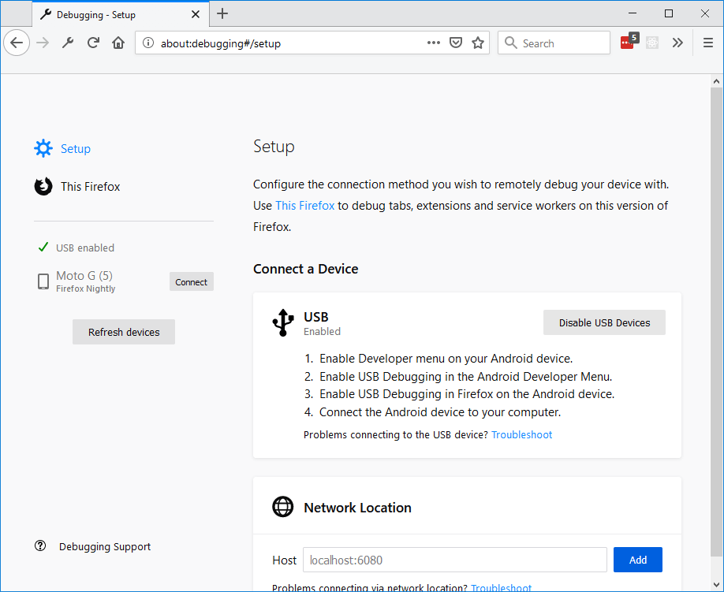

If your ``about:debugging`` page is different from the one displayed here, go to ``about:config``, find and set the option ``devtools.aboutdebugging.new-enabled`` to **true**.

Setup tab
*********

.. _about-colon-debugging-connecting-to-a-remote-device:

Connecting to a remote device
-----------------------------

Firefox supports debugging over USB with Android devices, using the about:debugging page.

Before you connect:

1. Enable Developer settings on your Android device.
2. Enable USB debugging in the Android Developer settings.
3. Enable **Remote Debugging via USB** in the Advanced Settings in Firefox on the Android device.
4. Connect the Android device to your computer using a USB cable.

If your device doesn't appear in the lefthand side of the about:debugging page, try clicking the **Refresh devices** button.

**If it still doesn't appear**, it may be because the link between your Android device and your computer is not authorized yet. First make sure you have installed `Android Debug Bridge <https://developer.android.com/studio/command-line/adb.html>`_ from Android Tools on your computer in order for it to be able to connect to your device. Next, disable every debugging setting already activated and repeat the steps described before. Your device should show a popup to authorize your computer to connect to it — accept this and then click the **Refresh devices** button again. The device should appear.

.. note::

  You do not need to install the full Android Studio SDK. Only adb is needed.

To start a debugging session, first open the page that you wish to debug and then click **Connect** next to the device name to open a connection to it. If the connection was successful, you can now click the name of the device to switch to a tab with information about the device.

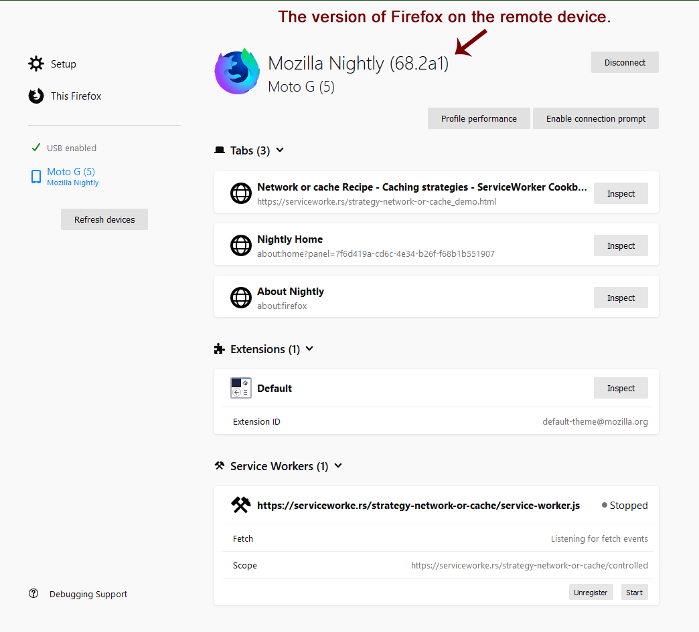

The information on this page is the same as the information on the **This Firefox** tab, but instead of displaying information for your computer, it displays the information for the remote device with the addition of a **Tabs** section with an entry for each of the tabs open on the remote device.

Note: If the version of Firefox on your remote device is more than one major version older than the version running on your computer, you may see a message like the following:

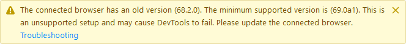

In Firefox 76 and above, the message can look like the following:

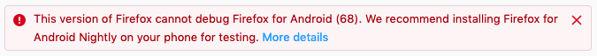

See Connection for Firefox for Android 68 for more information.

In the image above, there are three tabs open: **Network or cache Recipe**, **Nightly Home**, and **About Nightly**. To debug the contents of one of these tabs, click the **Inspect** button next to its title. When you do, the Developer Tools open in a new tab.

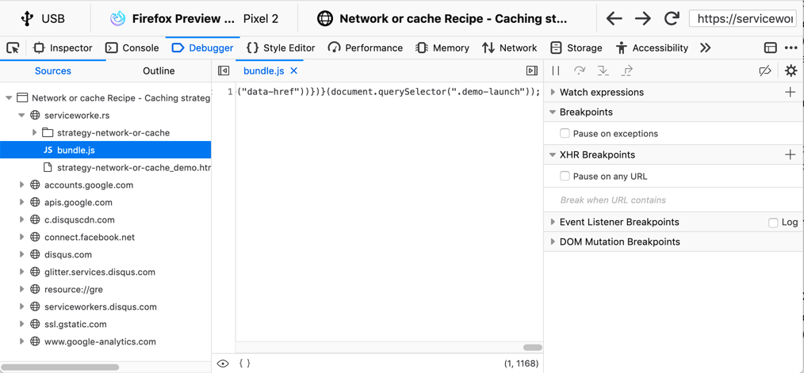

Above the usual list of tools, you can see information about the device you are connected to, including the fact that you are connected (in this example) via USB, to Firefox Preview, on a Pixel 2, as well as the title of the page that you are debugging, and the address of the page.

Starting in Firefox 78, the URL bar is editable, so that you can change the URL used by the browser on the remote device, by typing in Firefox for Desktop. You can also reload the page by clicking the **Reload** button next to the URL bar, and (starting 79), navigate backward or forward in the browsing history with the **Back** and **Forward** buttons.

Connecting over the Network
---------------------------

You can connect to a Firefox Debug server on your network, or on your debugging machine using the **Network Location** settings of the about:debugging page.

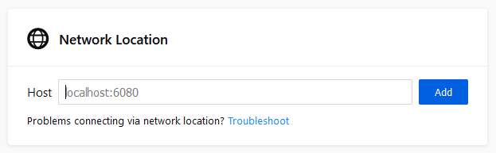

Enter the location and port on which the debugger server is running. When you do, it is added to the Network locations list along with the devices, as shown below:

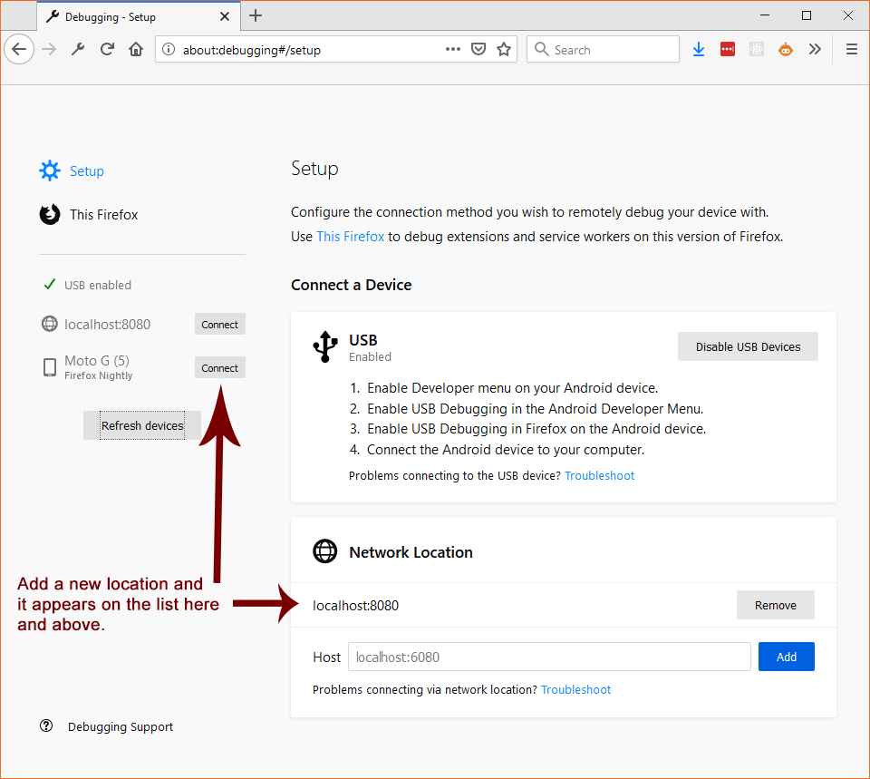

This Firefox
************

The **This Firefox** tab combines the features of Extensions, Tabs, and Workers into a single tab with the following sections:

Temporary Extensions
  Displays a list of the extensions that you have loaded using the **Load Temporary Add-on** button.
Extensions
  This section lists information about the extensions that you have installed on your system.
Service Workers, Shared Workers, and Other Workers
  There are three sections on this page that deal with Service Workers, Shared Workers, and Other Workers.

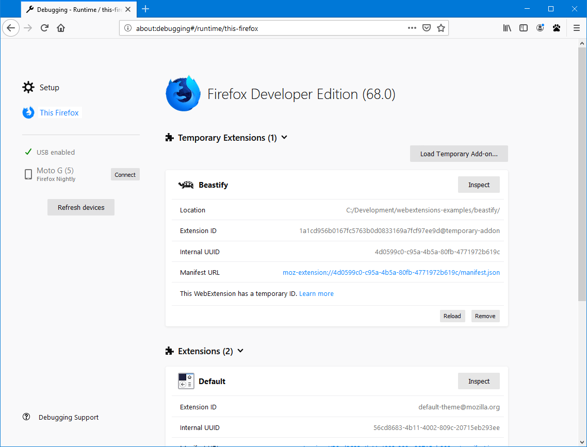

Whether internal extensions appear in the list on this page depends on the setting of the ``devtools.aboutdebugging.showHiddenAddons`` preference. If you need to see these extensions, navigate to ``about:config`` and make sure that the preference is set to ``true``.

Extensions
**********

Loading a temporary extension
-----------------------------

With the **Load Temporary Add-on** button you can temporarily load a web extension from a directory on disk. Click the button, navigate to the directory containing the add-on and select its manifest file. The temporary extension is then displayed under the **Temporary Extensions** header.

You don't have to package or sign the extension before loading it, and it stays installed until you restart Firefox.

The major advantages of this method, compared with installing an add-on from an XPI, are:

- You don't have to rebuild an XPI and reinstall when you change the add-on's code;
- You can load an add-on without signing it and without needing to disable signing.

Once you have loaded a temporary extension, you can see information about it and perform operations on it.

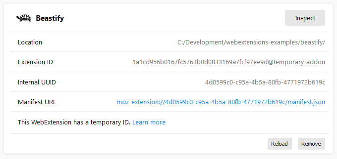

You can use the following buttons:

Inspect
  Loads the extension in the debugger.
Reload
  Reloads the temporary extension. This is handy when you have made changes to the extension.
Remove
  Unloads the temporary extension.

Other information about the extension is displayed:

Location
  The location of the extension's source code on your local system.
Extension ID
  The temporary ID assigned to the extension.
Internal UUID
  The internal UUID assigned to the extension.
Manifest URL
  If you click the link, the manifest for this extension is loaded in a new tab.

Updating a temporary extension
------------------------------

If you install an extension in this way, what happens when you update the extension?

- If you change files that are loaded on demand, like `content scripts <https://developer.mozilla.org/en-US/docs/Mozilla/Add-ons/WebExtensions/Content_scripts>`_ or `popups <https://developer.mozilla.org/en-US/docs/Mozilla/Add-ons/WebExtensions/Anatomy_of_a_WebExtension#browser_actions_2>`_, then changes you make are picked up automatically, and you'll see them the next time the content script is loaded or the popup is shown.

- For other changes, click the **Reload** button. This does what it says:

  - Reloads any persistent scripts, such as `background scripts <https://developer.mozilla.org/en-US/docs/Mozilla/Add-ons/WebExtensions/Anatomy_of_a_WebExtension#background_scripts>`_
  - Parses the ``manifest.json`` file again, so changes to `permissions <https://developer.mozilla.org/en-US/docs/Mozilla/Add-ons/WebExtensions/manifest.json/permissions>`_, `content_scripts <https://developer.mozilla.org/en-US/docs/Mozilla/Add-ons/WebExtensions/manifest.json/content_scripts>`_, `browser_action <https://developer.mozilla.org/en-US/docs/Mozilla/Add-ons/WebExtensions/manifest.json/browser_action>`_ or any other keys take effect

Installed Extensions
--------------------

The permanently installed extensions are listed in the next section, **Extensions**. For each one, you see something like the following:

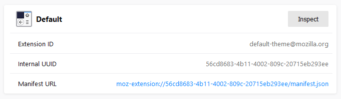

The **Inspect** button, and the **Extension ID** and **Internal UUID** fields are the same as for temporary extensions.

Just as it does with temporarily loaded extensions, the link next to **Manifest URL** opens the loaded manifest in a new tab.

.. note::

  It's recommended that you use the Browser Toolbox, not the Add-on Debugger, for debugging WebExtensions. See `Debugging WebExtensions <https://extensionworkshop.com/documentation/develop/debugging/>`_ for all the details.

The Add-ons section in about:debugging lists all web extensions that are currently installed. Next to each entry is a button labeled **Inspect**.

.. note::

  This list may include add-ons that came preinstalled with Firefox.

If you click **Inspect**, the Add-on Debugger will start in a new tab.

.. raw:: html

  <iframe width="560" height="315" src="https://www.youtube.com/embed/efCpDNuNg_c" title="YouTube video player" frameborder="0" allow="accelerometer; autoplay; clipboard-write; encrypted-media; gyroscope; picture-in-picture" allowfullscreen></iframe>
   
   

Workers
*******

The Workers section shows all the workers you've got registered on your Firefox, categorized as follows:

- All registered `Service Workers <https://developer.mozilla.org/en-US/docs/Web/API/Service_Worker_API>`_
- All registered `Shared Workers <https://developer.mozilla.org/en-US/docs/Web/API/SharedWorker>`_
- Other workers, including Chrome Workers and `Dedicated Workers <https://developer.mozilla.org/en-US/docs/Web/API/Web_Workers_API/Using_web_workers#dedicated_workers>`_

You can connect the developer tools to each worker, and send push notifications to service workers.

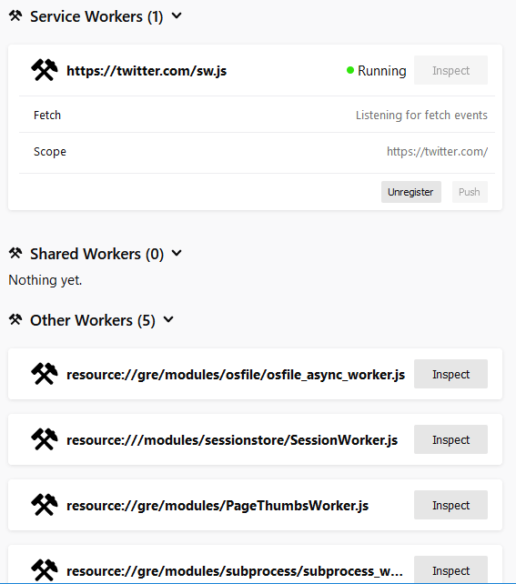

Service worker state
--------------------

The list of service workers shows the state of the service worker in its `lifecycle <https://developers.google.com/web/fundamentals/primers/service-workers/lifecycle>`_. Three states are possible:

- *Registering*: this covers all states between the service worker's initial registration, and its assuming control of pages. That is, it subsumes the *installing*, *activating*, and *waiting* states.
- *Running*: the service worker is currently running. It's installed and activated, and is currently handling events.
- *Stopped*: the service worker is installed and activated, but has been terminated after being idle.

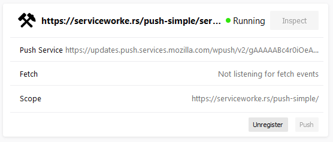

This section uses a simple ServiceWorker demo, hosted at https://serviceworke.rs/push-simple/.

.. note::

  From Firefox 79 onwards, you can access similar information on the Service Workers registered on a particular domain by going to the Firefox DevTools :doc:`Application panel <../application/index>`.

Unregistering service workers
-----------------------------

Click the **Unregister** button to unregister the service worker.

Sending push events to service workers
--------------------------------------

To debug push notifications, you can set a breakpoint in the `push event <https://developer.mozilla.org/en-US/docs/Web/API/PushEvent>`_ listener. However, you can also debug push notifications locally, without needing the server. Click the **Push** button to send a push event to the service worker.

Service workers not compatible
------------------------------

A warning message is displayed at the top of the **This Firefox** tab if service workers are incompatible with the current browser configuration, and therefore cannot be used or debugged.

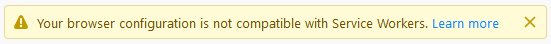

Service workers can be unavailable if the ``dom.serviceWorkers.enable`` preference is set to false in ``about:config``.

Connection to Firefox for Android 68
************************************

Releases of Firefox for Android that are based on version 68 cannot be debugged from desktop Firefox versions 69 or later, because of the difference in release versions. Until such time as Firefox for Android is updated to a newer major release, in synch with desktop Firefox, you should use one of the following Firefox for Android versions:

- `Firefox Preview <https://play.google.com/store/apps/details?id=org.mozilla.fenix>`_, if your desktop Firefox is the main release or Developer Edition
- `Firefox for Android Nightly <https://play.google.com/store/apps/details?id=org.mozilla.fenix>`_

If you prefer to test with the main release of Firefox for Android (i.e., based on release 68), you can do so with the desktop `Firefox Extended Support Release (ESR) <https://support.mozilla.org/en-US/kb/switch-to-firefox-extended-support-release-esr>`_, which is also based on version 68.

Note that ``about:debugging`` is not enabled by default in Firefox ESR. To enable it, open the `Configuration Editor <https://support.mozilla.org/en-US/kb/about-config-editor-firefox>`_ (``about:config``) and set ``devtools.aboutdebugging.new-enabled`` to **true**.

If you used a higher version of Firefox prior to installing Firefox ESR, you will be prompted to create a new user profile, in order to protect your user data. For more information, see `What happens to my profile if I downgrade to a previous version of Firefox? <https://support.mozilla.org/en-US/kb/dedicated-profiles-firefox-installation#w_what-happens-to-my-profile-if-i-downgrade-to-a-previous-version-of-firefox>`_
