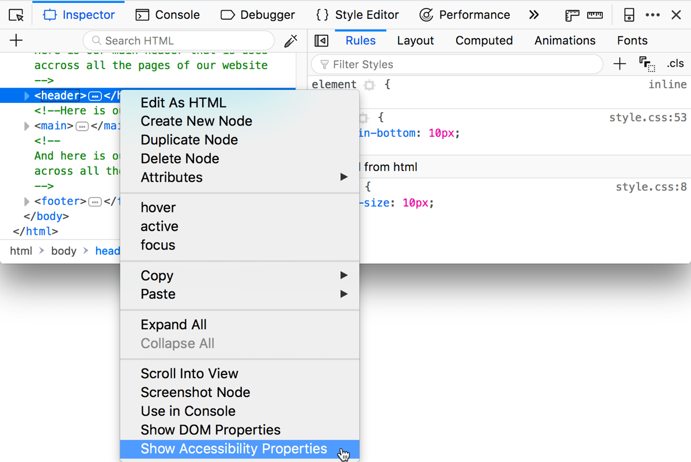
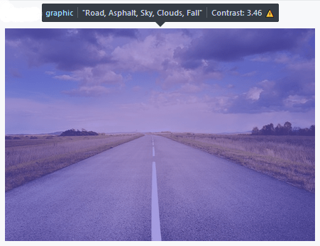
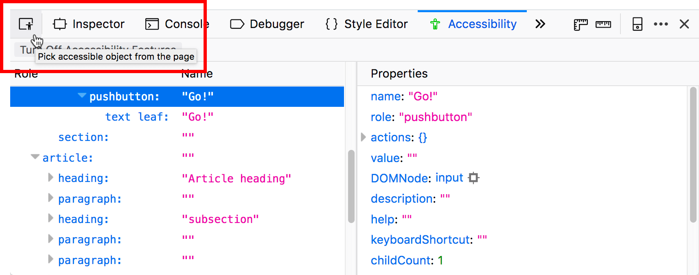

=======================
Accessibility Inspector
=======================

The Accessibility Inspector provides a means to access important information exposed to assistive technologies on the current page via the accessibility tree, allowing you to check what's missing or otherwise needs attention. This article takes you through the main features of the Accessibility Inspector and how to use it.

A (very) brief guide to accessibility
*************************************

Accessibility is the practice of making your websites usable by as many people as possible. This means trying your best to not lock anyone out of accessing information because of any disability they may have, or any other personal circumstances such as the device they are using, the speed of their network connection, or their geographic location or locale. You can find more extensive information in the `Accessibility <https://developer.mozilla.org/en-US/docs/Web/Accessibility>`_ section of MDN Web Docs.

Here we are mainly talking about exposing information to people with visual disabilities — this is done via the `accessibility APIs <https://www.smashingmagazine.com/2015/03/web-accessibility-with-accessibility-api/>`_ available inside web browsers, which expose information on what roles the different elements on your page play (e.g., are they just text, or are they buttons, links, form elements, etc.?).

Semantic DOM elements have roles assigned to them by default that hint at what their purpose is. Sometimes, however, you need to use some non-semantic markup (e.g., `div <https://developer.mozilla.org/en-US/docs/Web/HTML/Element/div>`_ s) to build a complex custom control, and the control won't have a default role that reflects its purpose. In such a situation, you can use `WAI-ARIA <https://developer.mozilla.org/en-US/docs/Learn/Accessibility/WAI-ARIA_basics>`_ role attributes to provide your own roles.

Roles and other information exposed by browser accessibility APIs are presented in a hierarchical structure called the accessibility tree. This is a bit like the DOM tree, except that it contains a more limited set of elements and slightly different information about them.

Assistive technologies like screenreaders use this information to find out what's on a web page, tell their users what's there, and enable them to interact with the page. The Accessibility Inspector also uses this information to provide valuable accessibility debugging capabilities in the DevTools.

Accessing the Accessibility Inspector
*************************************

When you first open any of the other Developer Tools, the accessibility features are turned off (unless you've already got them turned on in another browser tab, or got the Firefox accessibility engine started already, e.g., you might be a screenreader user or tester).

The accessibility inspector is automatically enabled when you do one of the following(beforeFirefox 79, it had to be explicitly enabled):

- Choose **Accessibility** in the **Tools > Browser Tools** menu.
- Select the **Accessibility** tab in the Developer Tools toolbox.
- Right-click in the main browser window, and choose **Inspect Accessibility Properties** in the context menu.
- Right-click an item in the HTML pane of the :doc:`Page Inspector <../page_inspector/index>`, and choose **Show Accessibility Properties** in the context menu.

Once activated, the accessibility engine remains running until you close the Developer Tools toolbox.

.. note::

  The accessibility engine runs in the background when the accessibility features are turned on. When enabled it may affect the metrics from other panels such as :doc:`Memory <../memory/index>` and :doc:`Performance <../performance/index>`, and have some impact onoverall browser performance.

If you don't wish to allow the accessibility features to be automatically enabled, you can use the `Configuration Editor <https://support.mozilla.org/en-US/kb/about-config-editor-firefox>`__ (also known as ``about:config``) to define the preference ``devtools.accessibility.auto-init.enabled``, and set it to ``False``.

If you don't wish to use the accessibility features at all, you can use the `Configuration Editor <https://support.mozilla.org/en-US/kb/about-config-editor-firefox>`__ to set the preference ``devtools.accessibility.enabled`` to ``False``. If you do this, the methods listed above for activating the Accessibility Inspector do nothing.

Features of the Accessibility panel
***********************************

The enabled accessibility panel looks like so:

.. image:: accessibility-inspector-tabbing_order.png
  :class: border
  :alt: Shows issue checker toolbar with "contrast" and "text label" options

On the left-hand side, there is a tree diagram representing all the items in the accessibility tree for the current page. Items with nested children have arrows that can be clicked to reveal the children, so you can move deeper into the hierarchy. Each item has two properties listed:

- *Role* — the role this item has on the page (e.g., ``pushbutton``, or ``footer``). This can be either a default role provided by the browser, or a role given to it via a WAI-ARIA ``role`` attribute.
- *Name* — the name this item has on the page. The name depends on the element; for example, the name of most text elements is their ``textContent``, whereas form elements' names are the contents of their associated `label <https://developer.mozilla.org/en-US/docs/Web/HTML/Element/label>`_.

On the right-hand side, you can see further information about the currently selected item. The listed properties are as follows:

- *name* — the item's name, as described above.
- *role* — the item's role, as described above.
- *actions* — a list of actions that can be performed on the item, for example, a pushbutton would have "Press" listed, while a link would have "Jump" listed.
- *value* — the value of the item. This can mean different things depending on the type of the item; for example, a form input (role: entry) would have a value of whatever is entered in the input, whereas a link's value would be the URL in the corresponding ``<a>`` element's ``href``.
- *DOMNode* — the type of DOM node that the item in the accessibility tree represents. You can click on the "target" icon that comes after it to select the node in the :doc:`Page Inspector <../page_inspector/index>`. Hovering over the "target" icon highlights the DOM node in the page content.

  .. image:: dom-node-target-icon.png
    :alt: DOMNode property in accessibility inspector with target icon highlighted

- *description* — any further description provided on the element, usually by the content of a title attribute.
- *keyboardShortcut* — any keyboard shortcut that is available to activate the element, as specified in an ``accessKey`` attribute. Note that this works correctly as of Firefox 62 `bug 1467381 <https://bugzilla.mozilla.org/show_bug.cgi?id="1467381>`_.
- *childCount* — the number of child items the current item has in the accessibility tree hierarchy.
- *indexInParent* — an index value indicating what number child the item is, inside its parent. If the item is the first item inside its parent, it has a value of 0. If it is the second, it has a value of 1. And so on.
- *states* — a list of the different accessibility-relevant states that can apply to the current item. For example, one of the links in one demo has states of focusable, linked, selectable text, opaque, enabled, and sensitive. For a full list of internal states, see Gecko states.
- *relations* — a list of the accessibility-relevant relationships between this item and other items. For example, in a form, an entry item could have a "labelled by" relation with a label item, which in turn has a "label for" relation to the entry item.
- *attributes* — a list of all the accessibility-relevant attributes that are applied to the item. This can include style-related attributes such as margin-left and text-indent, and other useful states for accessibility information, such as draggable and level (e.g., what heading level is it, in the case of headings). For a full list of possible attributes, see Gecko object attributes.

.. note::
  The exposed information is the same across all platforms — the inspector exposes Gecko's accessibility tree, rather than information from the platform accessibility layer.

Keyboard controls
-----------------

The *Accessibility* tab is fully keyboard-accessible:

- You can tab between *Check for Issues*, *Simulate*, *Show tabbing order*, and left and right panels.
- When one of the panels is focused, you can move the focus up and down items using the up and down arrow keys, and use the left and right arrow keys to expand and collapse expandable rows (e.g., different hierarchy levels of the accessibility tree).

Print accessibility tree to JSON
--------------------------------

You can print the contents of the accessibility tree to JSON by right-clicking on an entry in the Accessibility tab and selecting **Print to JSON:**

.. image:: accessibility-inspector-print_tree_to_json.png
  :alt: Print to JSON right-click menu in left panel
  :class: border

When you do, you will get a new tab with the selected accessibility tree loaded into the JSON viewer:

.. image:: accessibility_json.png
  :alt: Accessibility tree loaded in new tab JSON viewer
  :class: center

Once opened, you can save or copy the data as necessary. The JSON viewer can also show you the raw JSON data on a separate tab in the viewer.

Show web page tabbing order
---------------------------

People who are unable to navigate a page with the mouse or a trackpad can use the :kbd:`tab` key to toggle through focusable items on the page (i.e. buttons, links, form controls).The order that items are focused is one of the most important aspects of web accessibility, as it allows keyboard users to properly navigate a web page — if the tab order is incorrect, the page may be confusing!

Firefox 84 and later can enable a visual overlay showing the tabbing order. This provides a high-level overview of how the page will be navigated using the :kbd:`tab` key, which may highlight problems more effectively than tabbing through the elements. The overlay is toggled on/off using the**Show Tabbing Order** checkbox.

.. image:: accessibility-inspector-show_tab_order.png
  :alt: Accessibility inspector and page with checkbox Show tab order selected.
  :class: border

All focusable items have a numbered marker and the currently focused item is highlighted in a different color. In some cases the marker may be hidden by other elements, as is true for items 1 and 2 in the page below.

These become visible in the overlay when the item is the current item.

.. image:: accessibility-inspector-hidden_item_revealed.png
  :alt: Shows a hidden selection item in the tabbing order overlay when it is selected.
  :class: center

.. note::

  The overlay reflects the tab order at the time that the checkbox is selected (i.e. it is not dynamic). If a user does anything that adds items to the tab order (e.g. opens a visual element that contains more links), these new items will not be reflected in the overlay until the Accessibility Inspector is re-launched.

Check for accessibility issues
------------------------------

You can check for accessibility issues by clicking the drop-down menu next to: **Check for issues**. The available menu items include:

- **None** — Don't show the possible list of issues.
- **All Issues** — Check for all types of issues.
- **Contrast** — Check for `issues with visual contrast. <https://developer.mozilla.org/en-US/docs/Web/Accessibility/Understanding_WCAG/Perceivable/Color_contrast>`_
- **Keyboard** — Check for `issues with navigating via a keyboard. <https://developer.mozilla.org/en-US/docs/Web/Accessibility/Understanding_WCAG/Keyboard>`_
- **Text Labels** — Check for `issues with missing text labels. <https://developer.mozilla.org/en-US/docs/Web/Accessibility/Understanding_WCAG/Text_labels_and_names>`_

When you select one of the menu items, Firefox scans your document for the type of issues you selected. Depending on the size and complexity of your document, this may take a few seconds. When the scan is complete, the left side of the Accessibility Inspector panel displays only the items that have that type of issue. In the right side of the panel, the *Checks* subpanel lists the specific issue with the selected node. For each type of issue, there is a **Learn more** link to further information on *MDN Web Docs* about the issue.

.. image:: accessibility-inspector-check_for_issues.png
  :alt: Accessibility Inspector - Showing the options when you select the Check for Issues button
  :class: border

The menu items act as toggles. Select the item to view that type of issue; select the item again to clear the display of issues of that type.

Issues with a particular item are always displayed in the *Checks* subpanel as you browse the tree. The **Check for issues** menuitems are a quick way to view all and only those items that have issues.

Simulate
--------

The Accessibility Inspector offers (as of Firefox 70), a :doc:`simulator <simulation/index>` that lets you see what a web page would look like to users with various forms of *color vision deficiency* (better known as "color blindness"), as well as *contrast sensitivity loss*.

Notable related features
************************

When the accessibility features are turned on, there are a number of useful additional features available in the DevTools, which are detailed below:

Context menu options
--------------------

An extra context menu option is added, both for the general context menu on the web page when right-clicking a UI feature, and the HTML pane of the page inspector when right-clicking a DOM element:

.. image:: web-page-context-menu.png
  :alt: context menu in the browser viewport, with a highlighted option: Inspect Accessibility Properties
  :class: border

When you choose the *Inspect Accessibility Properties*/*Show Accessibility Properties* context menu options, the *Accessibility* tab is immediately opened to show the corresponding accessibility tree item and its properties.

.. note::

  Some DOM elements do not have accessibility properties — in that case, the *Inspect Accessibility Properties*/*Show Accessibility Properties* context menu item is grayed out.

Highlighting of UI items
------------------------

In the Accessibility tab, when the mouse hovers over accessibility items, you can see a semi-transparent highlight appear over the UI items they relate to, if appropriate. The role and name of the item will be shown in a small information bar along with color contrast information if appropriate. This is useful for determining how the items in the accessibility tree relate to the UI items on the actual page.

In the following example, you can see that the image has been highlighted and its role, graphic, name, "Road, Asphalt, Sky, Clouds, Fall", and the color contrast ratio, 3.46, appears in the information bar above it.

Color contrast
~~~~~~~~~~~~~~

Contrast ratio information is particularly useful when you are designing the color palette for your website because if the contrast is not sufficient, readers with visual impairments such as low vision or color blindness will be unable to read the text. See `Color contrast <https://developer.mozilla.org/en-US/docs/Web/Accessibility/Understanding_WCAG/Perceivable/Color_contrast>`_ for details about recommended contrast ratios.

For example:

The color contrast in the image above is 2.86, so potentially not enough contrast to make it easy to read. Notice the warning symbol that indicates that the contrast fails to meet the acceptable contrast ratio.

As of Firefox 65, viewing this information for some foreground text that has a complex background image (e.g. a gradient) gives you a range of color contrast values. For example:

.. image:: screen_shot_2019-01-29_at_10.21.07.png
  :alt: A screenshot of color contrast highlighter with checked sign where for text over gradient background with contrast satisfying the AAA WCAG guidelines.
  :class: center

In this example, the contrast ranges from 4.72 to 5.98. The numbers are followed by AAA and a checkmark in green, indicating that the large text has a contrast ratio of 4.5:1 or more, meeting the criteria for enhanced contrast, or Level AAA.

See `Color contrast <https://developer.mozilla.org/en-US/docs/Web/Accessibility/Understanding_WCAG/Perceivable/Color_contrast>`_ for more information on color contrast.

Accessibility picker
--------------------

Like the element picker button on the :ref:`Page Inspector <page-inspector-how-to-select-an-element-with-the-node-picker>`, the *Accessibility* tab's element picker button allows you to hover and select UI items on the current pageto highlight objects in the accessibility tree.

The accessibility tab element picker looks slightly different from the Page Inspector HTML pane picker, as shown below:

.. image:: dom-inspector-picker.png
  :alt: highlighted DOM inspector picker button, with a tooltip saying Pick an element from the page
  :class: border

When you "perform a pick", you see the accessibility object highlighted in the accessibility tree, and the picker is then deactivated. Note, however, that if you hold the :kbd:`Shift` key down when "performing a pick", you can "preview" the accessibility object in the tree (and its properties in the right-hand pane), but then continue picking as many times as you like(the picker does not get cancelled) until you release the :kbd:`Shift` key.

When the picker is activated, you can also deactivate it by pressing the picker button a second time, or pressing the :kbd:`Esc` key.

Typical use cases
*****************

The Accessibility Inspector is very useful for spotting accessibility problems at a glance. For a start, you can investigate items that don't have a proper text equivalent — images without ``alt`` text and form elements without proper labels have a ``name`` property of ``null``, for example.

It is also very handy for verifying semantics — you can use the *Inspect Accessibility Properties* context menu option to quickly see whether an item has the correct role set on it (e.g., whether a button is really a button, or a link is really a link).

.. image:: use-case-fake-button.png
  :alt: A UI element that looks like a button, with information about it shown in the accessibility inspector to reveal that it isn't a button, it is a section element. It has a name property of null
  :class: border

See also
********

- `Accessibility tutorials <https://developer.mozilla.org/en-US/docs/Learn/Accessibility>`_
- `Web accessibility overview <https://developer.mozilla.org/en-US/docs/Web/Accessibility>`_
- `Practical debugging information <https://developer.mozilla.org/en-US/docs/Learn/Tools_and_testing/Cross_browser_testing/Accessibility>`_
- `Understanding WCAG <https://developer.mozilla.org/en-US/docs/Web/Accessibility/Understanding_WCAG>`_
- `WAI-ARIA basics <https://developer.mozilla.org/en-US/docs/Learn/Accessibility/WAI-ARIA_basics>`_
- `Accessibility APIs: A Key To Web Accessibility <https://www.smashingmagazine.com/2015/03/web-accessibility-with-accessibility-api/>`_ by Léonie Watson
