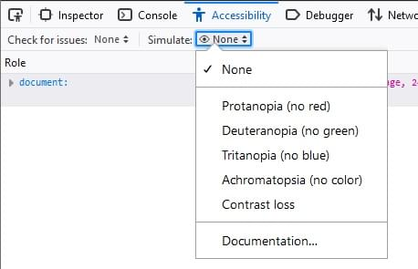
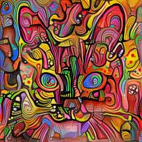
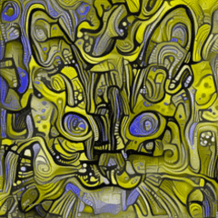
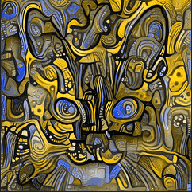
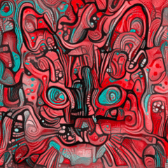
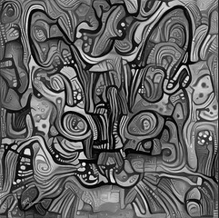
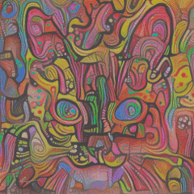

=======================
Color vision simulation
=======================

The simulator in the :doc:`Accessibility Inspector <../index>` in Firefox Developer Tools lets you see what a web page would look like to users with various forms of *color vision deficiency* (better known as "color blindness"), as well as *contrast sensitivity loss*.

"Color blindness" is a bit of a misnomer, since most people with these disorders can see colors, but do not see all of the distinctions that people with normal color vision can see; color vision deficiencies affect perception across the color spectrum, not only of specific colors like red or green. Color vision deficiencies affect about 8% of men, and 0.5% of women. The most common forms of color blindness (commonly lumped together as "red-green color blindness") affect more men than women, because they are due to a mutation in a gene in the X chromosome, which men usually have only one copy of.

Contrast sensitivity loss can be caused by cataracts, glaucoma, diabetic retinopathy, and other disorders of the retina; it can be age-related, congenital, or due to an injury.

.. note::

  This feature depends on webrender, an experimental featurethat is not enabled by default on all platforms. You can force-enablewebrender by settingthe preference ``gfx.webrender.all`` to ``true`` using the `Firefox Configuration Editor <https://support.mozilla.org/en-US/kb/about-config-editor-firefox>`_ (note that if webrender is enabled by default on your platform, the setting has no effect.

The current color simulation option may be selected from the **Simulate** menu as shown.

The following table shows a colorful image of a cat's face, and what it looks like in the each of the simulations.

.. list-table::
  :widths: 50 50
  :header-rows: 1

  * - Simulation
    - Image displayed

  * - None (Choose this to return to normal display)
    - |image1|

  * - Protanopia (no red)
    - |image2|

  * - Deuteranopia (no green)
    - |image3|

  * - Tritanopia (no blue)
    - |image4|

  * - Achromatopsia (no color)
    - |image5|

  * - Contrast loss
    - |image6|

.. note::

  The simulation transformation matrices are based on the paper: `A Physiologically-based Model for Simulation of Color Vision Deficiency <https://www.inf.ufrgs.br/~oliveira/pubs_files/CVD_Simulation/CVD_Simulation.html>`_, Gustavo M. Machado, Manuel M. OliveiraLeandro A. F. Fernandes, IEEE Transactions on Visualization and Computer Graphics, Volume 15 (2009).

.. note::
  Firefox 81 removed unnecessary simulations for *protanomaly*, *deuteranomaly*, and *tritanomaly*, and added a simulation for *achromatopsia* (no color).

See also
********

- `Types of color blindness <https://www.color-blindness.com/types-of-color-blindness/>`_
- `Color blindness simulator <https://www.color-blindness.com/coblis-color-blindness-simulator/>`_
- `Contrast sensitivity <http://www.vision-and-eye-health.com/contrast-sensitivity.html>`_
- `Color palettes for color blindness <http://mkweb.bcgsc.ca/colorblind/>`_
- `Color universal design <https://jfly.uni-koeln.de/color/>`_
- `WCAG success criterion 1.4.1: Use of color <https://www.w3.org/TR/WCAG21/#use-of-color>`_
- `WCAG success criterion 1.4.11: Non-text contrast <https://www.w3.org/TR/WCAG21/#non-text-contrast>`_
