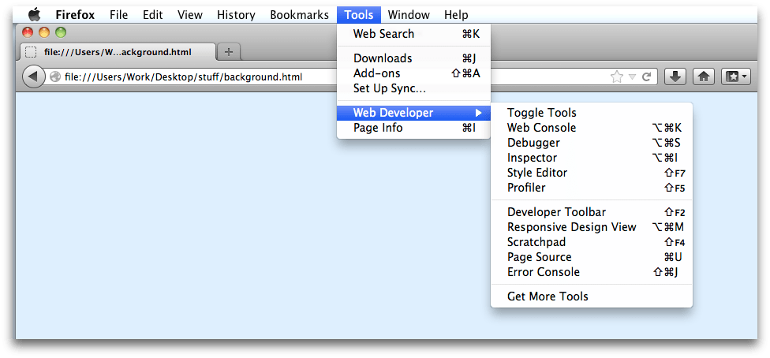
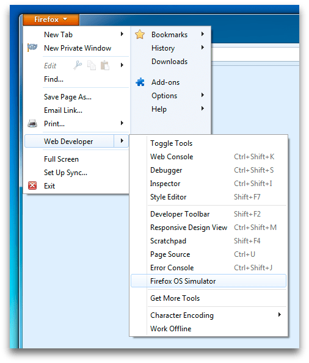

======================
The Web Developer Menu
======================

The Web Developer menu is the main way to access the developer tools that are built into Firefox. On OS X and Linux, it's under the "Tools" menu:

On Windows 7, it's under the "Firefox" menu:

You'll see that the menu is split into three sections:

- the first section lists tools that are hosted in the Toolbox, which is a dedicated window for developer tools

- the second section lists integrated tools that are not hosted in the Toolbox, as well as any tools installed as add-ons (you'll see in the Windows screenshot above that I've installed the Firefox OS Simulator)

- the third section, "Get More Tools", is a link to more web development add-ons for Firefox
