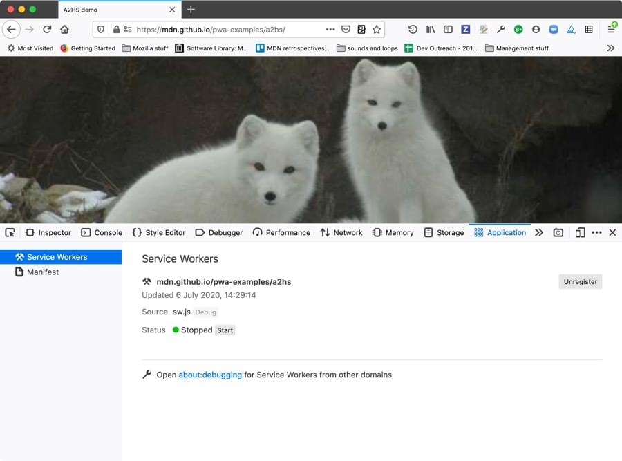

===========
Application
===========

The **Application panel** provides tools for inspecting and debugging modern web apps (also known as `Progressive Web Apps <https://developer.mozilla.org/en-US/docs/Glossary/Progressive_web_apps>`_). This includes inspection of `service workers <https://developer.mozilla.org/en-US/docs/Web/API/Service_Worker_API>`_ and `web app manifests <https://developer.mozilla.org/en-US/docs/Web/Manifest>`_.

Accessing the Application panel
*******************************

The Application panel is available on the standard DevTools tab menu under *Application*, in Firefox 79+. If you can’t see it there, you can enable it by going to the "three dot" menu and selecting *Settings* (also accessible by pressing F1), then checking the *Application* checkbox under *Default Developer Tools*.

Finding an example
******************

If you want to test this functionality and you don't have a handy PWA available, you can grab one of our simple examples to use:

- Add to homescreen demo: Shows pictures of foxes (`source code <https://github.com/mdn/pwa-examples/tree/master/a2hs>`__ | `live version <https://mdn.github.io/pwa-examples/a2hs/>`__)

- Js13kpwa demo: Show information on entries to the JS13K annual competition (`source code <https://github.com/mdn/pwa-examples/tree/master/js13kpwa>`__ | `live version <https://mdn.github.io/pwa-examples/js13kpwa/>`__)

How to
******

- :doc:`Debug service workers <service_workers/index>`
- :doc:`Inspect web app manifests <manifests/index>`
