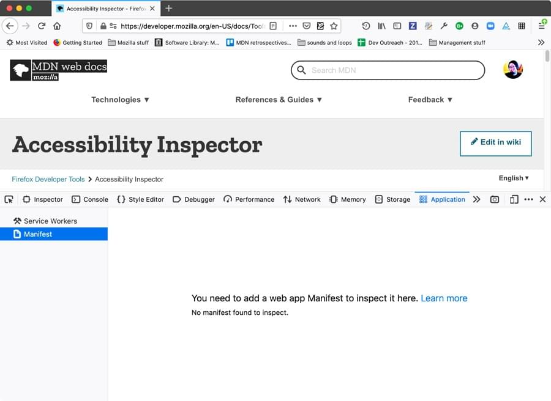
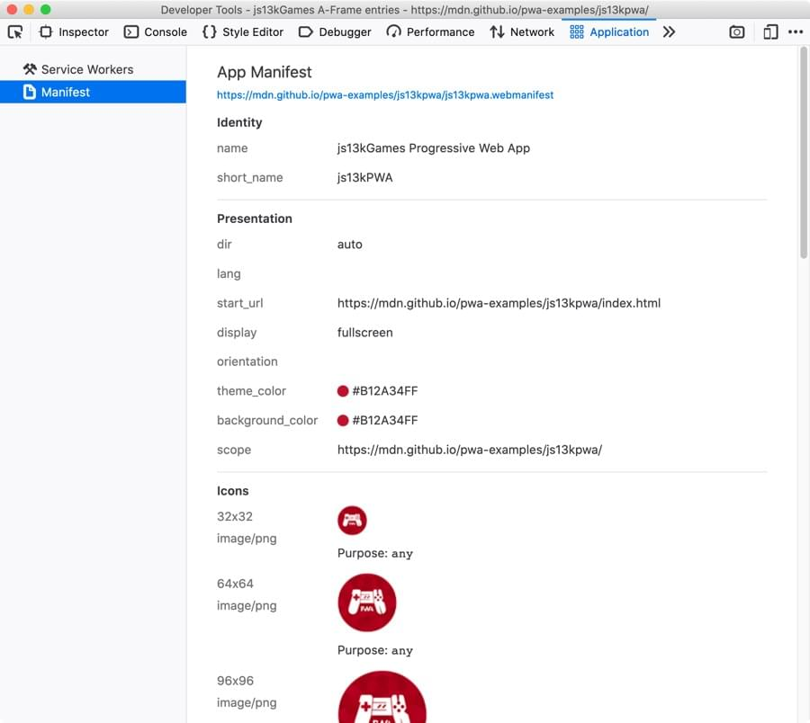

============================
Inspecting web app manifests
============================

In this article we will look at inspecting `app manifests <https://developer.mozilla.org/en-US/docs/Web/Manifest>`_ using the Firefox DevTools :doc:`Application panel <../index>`.

When you open the Application panel’s *Manifest* view on a page that doesn't have an app manifest successfully deployed, you'll get the following output shown:

Deploying a manifest
********************

To get a manifest deployed successfully, you need to include a `<link> <https://developer.mozilla.org/en-US/docs/Web/HTML/Element/link>`_ element in the `<head> <https://developer.mozilla.org/en-US/docs/Web/HTML/Element/head>`_ of your document that points to your ``.webmanifest`` file:

.. code-block:: html

  <link rel="manifest" href="/manifest.webmanifest">

The ``.webmanifest`` extension is recommended in the spec, and should be served with an ``application/manifest+json`` mime type, although browsers generally tend to support manifests with other appropriate extensions like ``.json`` (mime type: ``application/json``).

You also need to make sure the JSON inside the file is of the correct format.

Inspecting your manifest
************************

If your manifest is deployed successfully, you should end up with a display like the following on the *Manifest* view:

From here, you can inspect all the information in the manifest in an easy-to-digest way, making sure that it is all correct. It provides a link to the manifest file at the top which when clicked on brings up the JSON in a new tab.

It also loads all the icon files into the view, so you can see the relative size of them all, and any other information associated with them.

List of manifest members
************************

We won't provide an exhaustive list of all the members that can appear in a web manifest here; you can already find that in our `web manifest documentation <https://developer.mozilla.org/en-US/docs/Web/Manifest#members>`_.
