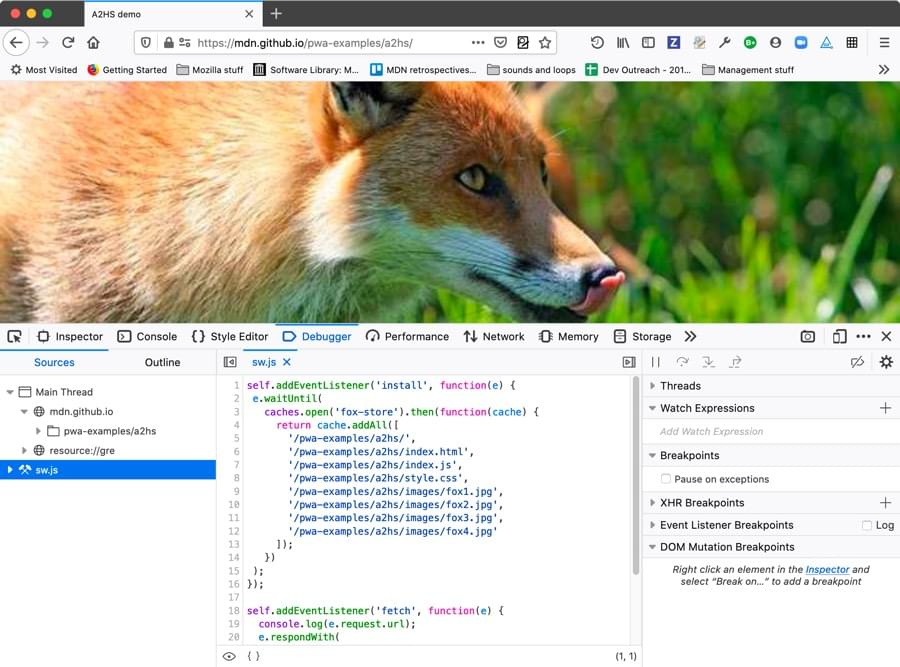

=========================
Debugging service workers
=========================

In this article we will look at debugging `service workers <https://developer.mozilla.org/en-US/docs/Web/API/Service_Worker_API>`_ using the Firefox DevTools :doc:`Application Panel <../index>`.

When you open the Application panel’s *Service Workers* view on a page that doesn't have a service worker registered, you'll get the following output shown:

This gives you some advice on what to do if you don't have a service worker registered, and were perhaps expecting there to be one registered! Let's start by troubleshooting this.

Getting your service worker to register
***************************************

Before you can look at your service worker in action in the *Applications* panel, you need to successfully register it. Registration is done with a block of code along these lines, using the `register() <https://developer.mozilla.org/en-US/docs/Web/API/ServiceWorkerContainer/register>`_ method:

.. code-block:: JavaScript

  if('serviceWorker' in navigator) {
    navigator.serviceWorker
             .register('sw.js')
             .then(function() { console.log('Service Worker Registered'); });
  }

If you get the path wrong, for example, you'll get an error in the :doc:`Web Console <../../web_console/index>` giving you a hint as to what's wrong, which depends on what exactly is wrong with the code. If this is not enough to help you figure out the problem, you could also try going to the :doc:`JavaScript Debugger <../../debugger/index>` and stepping through your code to pinpoint exactly where it is going wrong.

Debugging your service worker
*****************************

In any case, when the service worker is successfully registered, you'll see information about it displayed in the *Application* > *Service Workers* view (along with any other service workers registered on the same domain):

.. image:: sw-registered.jpg
  :alt: the application panel showing a registered service worker
  :class: border

This gives you a variety of information about your service worker:

- The URL that the service worker is registered on.
- That last time the service worker was updated (if the service has not been updated, this is when it was first installed).
- The path to the service worker source file.
- The server worker’s status, which can be one of the following:

  - *Stopped*: The service worker is installed, but not currently running. When the service worker is stopped, a *Start* button is provided to start it running, allowing you to trigger the service worker lifecycle.
  - *Running*: The service worker is running.

There are a couple of other useful controls on this view, too.

Unregister
**********

On the right-hand side of the *Service Workers* view there is an *Unregister* button, which when pressed unregisters the service worker. This is very useful because, once registered, the service worker will not necessarily update to the new version immediately, which can make debugging a pain. From `Updating your service worker <https://developer.mozilla.org/en-US/docs/Web/API/Service_Worker_API/Using_Service_Workers#updating_your_service_worker>`_:

*If your service worker has previously been installed, but then a new version of the worker is available on refresh or page load, the new version is installed in the background, but not yet activated. It is only activated when there are no longer any pages loaded that are still using the old service worker. As soon as there are no more such pages still loaded, the new service worker activates.*

Debug
*****

.. warning::

  **Important**: The *debugging* feature is currently enabled only in Firefox Nightly via the experimental feature "Developer Tools: Service Worker debugging". Enabling this can degrade the performance of the Debugger. See about:preferences#experimental.

When your service worker is running, the *Arrow* button available next to the Source information (it is disabled when the service worker is stopped). When pressed (and if service worker debugging is enabled), this takes you straight to the :doc:`JavaScript debugger <../../debugger/index>` view of your service worker code, and you can use the full power of the debugger to debug it — stepping through code, etc.

Testing a service worker cache
******************************

If you are using your service worker to store your site assets in Cache Storage (using the `Cache API <https://developer.mozilla.org/en-US/docs/Web/API/Cache>`_), which is essential for creating offline apps, it can be annoying to test the cache. When you fill up the cache with assets, but then want to alter the behavior slightly, you previously had to manually write code to empty the cache, and then fill it again.

The :doc:`Firefox DevTools Storage tab <../../storage_inspector/index>` has a Cache Storage section that lists all the different Caches you have stored under each different origin.

Right/:kbd:`Ctrl` clicking on one of the caches gives you two options:

- *Delete All* — delete all caches under this origin.
- *Delete "name of cache"* — delete only the highlighted cache.

You can also click on one of the individual items stored in the cache, then Right/:kbd:`Ctrl` click on it to get options for deleting just that item, or every item in the cache.

These options make it much easier to remove a cache if it is required for testing a code update.

It is also worth knowing that if you are testing an app's offline capabilities, you'll be able to see whether requests are being retrieved from a service worker-initiated cache rather than from the network by looking at :doc:`Network Monitor <../../network_monitor/index>`.

Resources retrieved from the cache are indicated with *service worker* in the *Transferred* column.

.. note::

  There is currently a bug whereby the Network Monitor cannot show network requests from a service worker running in a different process to the application `bug 1432311 <https://bugzilla.mozilla.org/show_bug.cgi?id=1432311>`_.

Finding registered service workers on other domains
***************************************************

As mentioned above, the *Service Worker* view of the *Application* panel shows all the service workers registered on the current domain. If you want to see a list of information concerning all the service workers registered on your browser, you can visit ``about:debugging#/runtime/this-firefox``. Below the list of installed extensions you'll find a list of all the service workers you have registered.
