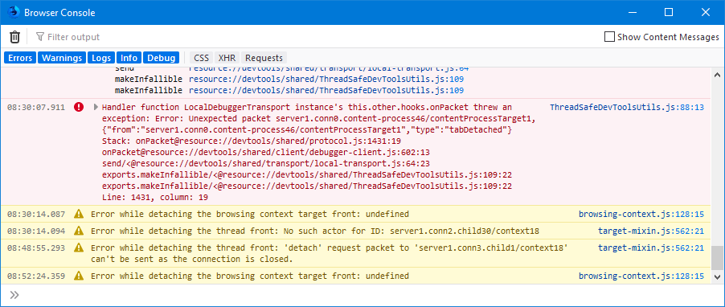
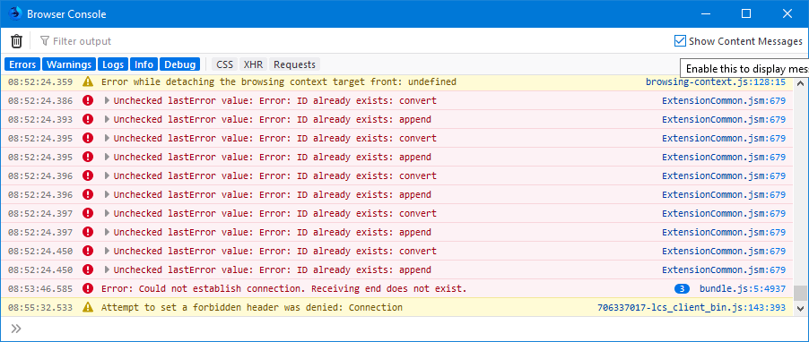
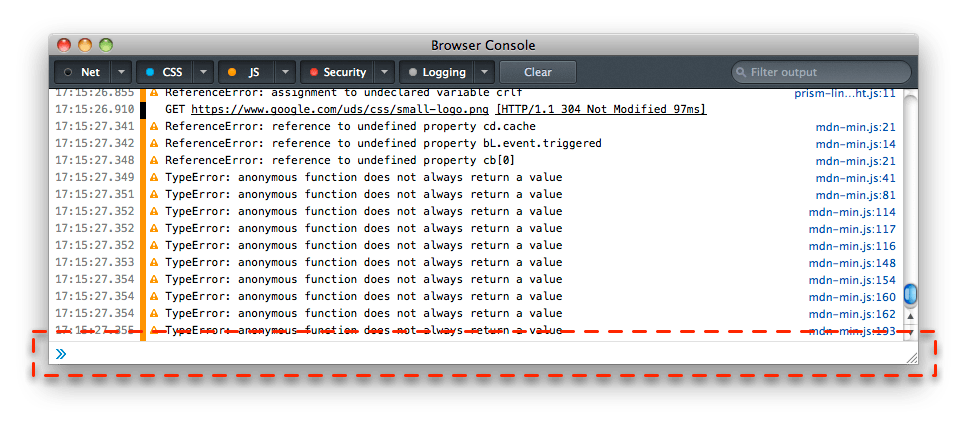
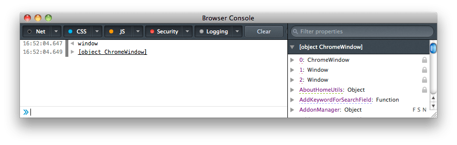
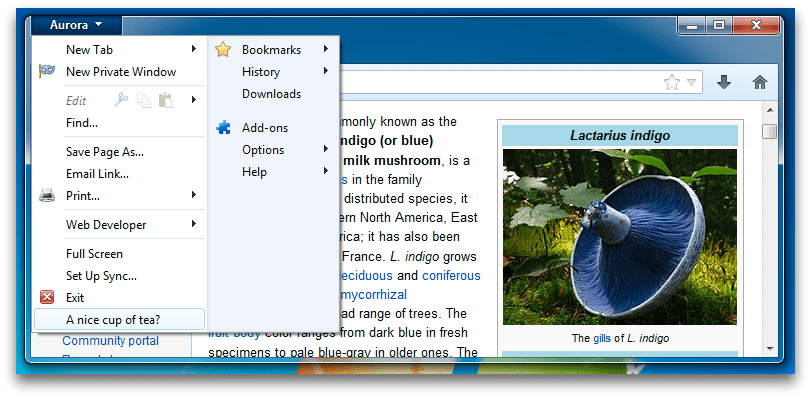
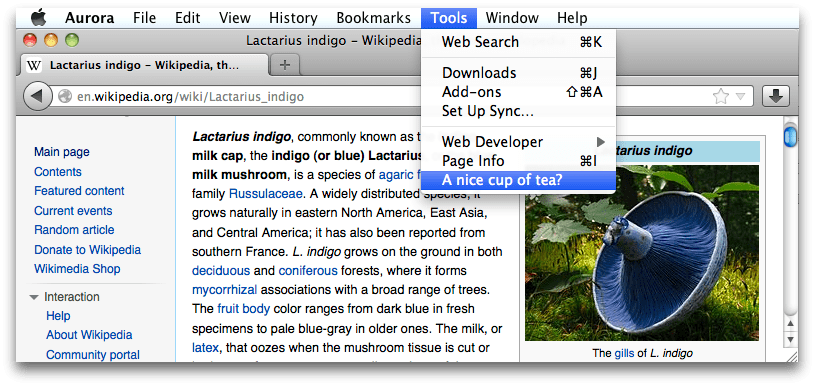

===============
Browser Console
===============

The Browser Console is like the :doc:`Web Console <../web_console/index>`, but applied to the whole browser rather than a single content tab.

So it logs the same sorts of information as the Web Console - network requests, JavaScript, CSS, and security errors and warnings, and messages explicitly logged by JavaScript code. However, rather than logging this information for a single content tab, it logs information for all content tabs, for add-ons, and for the browser's own code.

If you also want to use the other web developer tools in the regular Web :doc:`Toolbox <../tools_toolbox/index>` with add-on or browser code, consider using the :doc:`Browser Toolbox<../browser_toolbox/index>`.

Similarly, you can execute JavaScript expressions using the Browser Console. But while the Web Console executes code in the page window scope, the Browser Console executes them in the scope of the browser's chrome window. This means you can interact with all the browser's tabs using the ``gBrowser`` global, and even with the XUL used to specify the browser's user interface.

.. container:: block_quote

  NB: The Browser Console command line (to execute JavaScript expressions) is disabled by default. To enable it set the ``devtools.chrome.enabled`` preference to ``true`` in about:config, or set the "Enable browser `chrome <https://developer.mozilla.org/en-US/docs/Glossary/Chrome>`_ and add-on debugging toolboxes" (Firefox 40 and later) option in the :doc:`developer tool settings <../settings/index>`.

Opening the Browser Console
***************************

You can open the Browser Console in one of two ways:

1. from the menu: select "Browser Console" from the Browser Tools submenu in the Firefox Menu (or Tools menu if you display the menu bar or are on macOS).

2. from the keyboard: press :kbd:`Ctrl` + :kbd:`Shift` + :kbd:`J` (or :kbd:`Cmd` + :kbd:`Shift` + :kbd:`J` on a Mac).

You can also start the Browser Console by launching Firefox from the command line and passing the ``-jsconsole`` argument:

.. code-block:: bash

  /Applications/FirefoxAurora.app/Contents/MacOS/firefox -jsconsole

The Browser Console looks like this:

You can see that the Browser Console looks and behaves very much like the :doc:`Web Console <../web_console/index>`:

- most of the window is occupied by a :doc:`pane that display messages <../web_console/console_messages/index>`

- at the top, a :ref:`toolbar <web_console_ui_tour_toolbar>` enables you to filter the messages that appear.

- at the bottom, a :doc:`command line interpreter <../web_console/the_command_line_interpreter/index>` enables you to evaluate JavaScript expressions.

Beginning with Firefox 68, the Browser Console allows you to show or hide messages from the content process (i.e. the messages from scripts in all the opened pages) by setting or clearing the checkbox labeled **Show Content Messages**. The following image shows the browser console focused on the same page as above after clicking on the **Show Content Messages** checkbox.

Browser Console logging
***********************

The Browser console logs the same sorts of messages as the Web Console:

- :ref:`HTTP requests <web_console_console_messages>`

- :doc:`Warnings and errors <../web_console/console_messages/index>` (including JavaScript, CSS, security warnings and errors, and messages explicitly logged by JavaScript code using the `Console API <https://developer.mozilla.org/en-US/docs/Web/API/console>`_

- :ref:`Input/output messages <web_console_console_messages_interpreter_io>` commands send to the browser via the command line, and the result of executing them

However, it displays such messages from:

- web content hosted by all browser tabs
- the browser's own code
- add-ons

Messages from add-ons
---------------------

The Browser Console displays messages logged by all Firefox add-ons.

Console.sys.mjs
~~~~~~~~~~~~~~~

To use the console API from a traditional or bootstrapped add-on, get it from the Console module.

One exported symbol from ``Console.sys.mjs`` is ``console``. Below is an example of how to access it, which adds a message to the Browser Console.

.. code-block:: JavaScript

  const { console } = ChromeUtils.importESModule("resource://gre/modules/Console.sys.mjs");
  console.log("Hello from Firefox code"); //output messages to the console

Learn more:

- `Console API reference <https://developer.mozilla.org/en-US/docs/Web/API/console>`_
- :searchfox:`Console.sys.mjs source code <toolkit/modules/Console.sys.mjs>`

Browser Console command line
****************************

.. container:: block_quote

  The Browser Console command line is disabled by default. To enable it set the ``devtools.chrome.enabled`` preference to ``true`` in ``about:config``, or set the "Enable chrome debugging" option in the :doc:`developer tool settings <../settings/index>`.

Like the Web Console, the command line interpreter enables you to evaluate JavaScript expressions in real time:

Also like the Web Console's command line interpreter, this command line supports autocomplete, history, and various :ref:`keyboard shortcuts <keyboard-shortcuts-web-console>` and :doc:`helper commands <../web_console/helpers/index>`. If the result of a command is an object, you can click on the object to see its details.

But while the Web Console executes code in the scope of the content window it's attached to, the browser console executes code in the scope of the chrome window of the browser. You can confirm this by evaluating ``window``:

This means you can control the browser: opening, closing tabs and windows and changing the content that they host, and modify the browser's UI by creating, changing and removing XUL elements.

Controlling the browser
-----------------------

The command line interpreter gets access to the ``tabbrowser`` object, through the ``gBrowser`` global, and that enables you to control the browser through the command line. Try running this code in the Browser Console's command line (remember that to send multiple lines to the Browser Console, use :kbd:`Shift` + :kbd:`Enter`):

.. code-block:: JavaScript

  var newTabBrowser = gBrowser.getBrowserForTab(gBrowser.selectedTab);
  newTabBrowser.addEventListener("load", function() {
   newTabBrowser.contentDocument.body.innerHTML = "<h1>this page has been eaten</h1>";
  }, true);
  newTabBrowser.contentDocument.location.href = "https://mozilla.org/";

It adds a listener to the currently selected tab's ``load`` event that will eat the new page, then loads a new page.

.. note::

  You can restart the browser with the command :kbd:`Ctrl` + :kbd:`Alt` + :kbd:`R` (Windows, Linux) or :kbd:`Cmd` + :kbd:`Alt` + :kbd:`R` (Mac) This command restarts the browser with the same tabs open as before the restart.

Modifying the browser UI
------------------------

Since the global ``window`` object is the browser's chrome window, you can also modify the browser's user interface. On Windows, the following code will add a new item to the browser's main menu:

.. code-block:: JavaScript

  var parent = window.document.getElementById("appmenuPrimaryPane");
  var makeTheTea = gBrowser.ownerDocument.defaultView.document.createElementNS("http://www.mozilla.org/keymaster/gatekeeper/there.is.only.xul", "menuitem");
  makeTheTea.setAttribute("label", "A nice cup of tea?");
  parent.appendChild(makeTheTea);

On macOS, this similar code will add a new item to the **Tools** menu:

.. code-block:: JavaScript

  var parent = window.document.getElementById("menu_ToolsPopup");
  var makeTheTea = gBrowser.ownerDocument.defaultView.document.createElementNS("http://www.mozilla.org/keymaster/gatekeeper/there.is.only.xul", "menuitem");
  makeTheTea.setAttribute("label", "A nice cup of tea?");
  parent.appendChild(makeTheTea);

