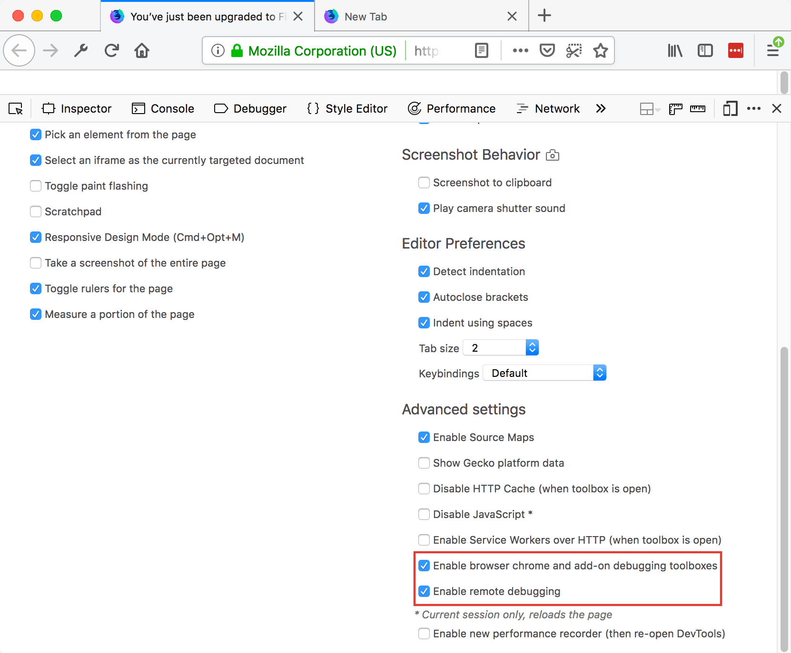
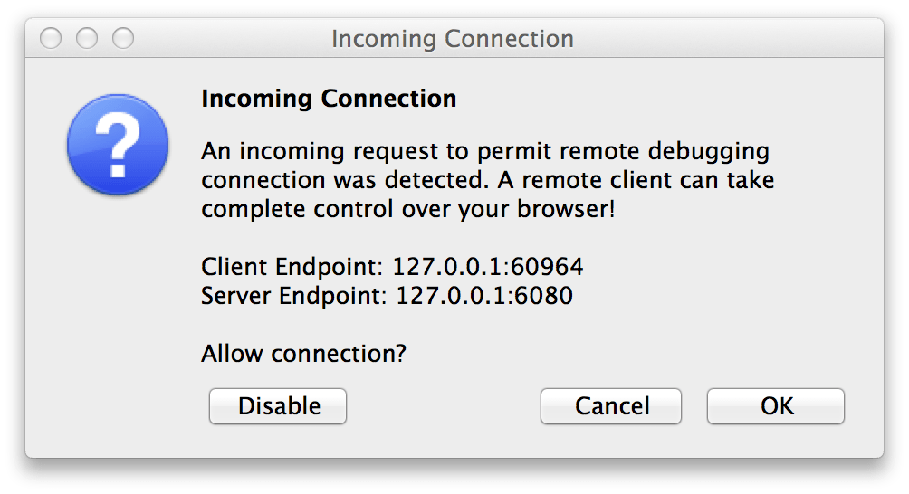
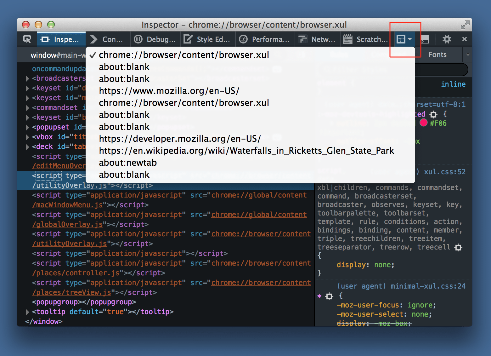
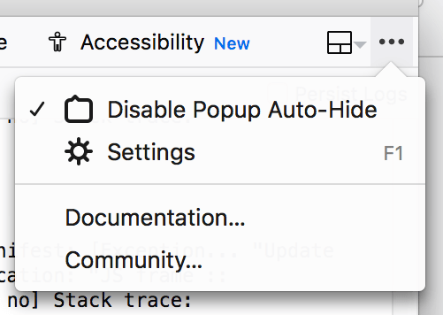

===============
Browser Toolbox
===============

The Browser Toolbox enables you to debug add-ons and the browser's own JavaScript code rather than just web pages like the normal :doc:`Toolbox <../tools_toolbox/index>`. The Browser Toolbox's context is the whole browser rather than justsingle page on a single tab.

Enabling the Browser Toolbox
****************************

The Browser Toolbox is not enabled by default. To enable it you need to check the settings "Enable chrome and addon debugging" and "Enable remote debugging".

To do this, open the Developer Tools :doc:`Settings <../settings/index>`, go to the section :ref:`Advanced Settings <settings_advanced_settings>`, and check the settings "Enable browser chrome and add-on debugging toolboxes" and "Enable remote debugging".

Opening the Browser Toolbox
***************************

.. |image1| image:: 2014-01-10-13-08-08-f52b8c.png
  :alt: new fx menu

Open the Browser Toolbox through the menu button |image1| and the menu items "Developer" then "Browser Toolbox".

You can also open it with the :kbd:`Ctrl` + :kbd:`Alt` + :kbd:`Shift` + :kbd:`I` key combination (:kbd:`Cmd` + :kbd:`Opt` + :kbd:`Shift` + :kbd:`I` on a Mac).

You will be presented with a dialog like this (it can be removed by setting the ``devtools.debugger.prompt-connection`` property to false):

Click OK, and the Browser Toolbox will open in its own window:

.. image:: browser-toolbox.png

You'll be able to inspect the browser's chrome windows and see, and be able to debug, all the JavaScript files loaded by the browser itself and by any add-ons that are running. Altogether you will have access to the following developer tools:

- :doc:`Debugger <../debugger/index>`
- :doc:`Console <../browser_console/index>`
- :doc:`Style Editor <../style_editor/index>`
- :doc:`Performance <../performance/index>`
- :doc:`Network Monitor <../network_monitor/index>`
- :doc:`Page Inspector <../page_inspector/index>`
- :doc:`Accessibility Inspector <../accessibility_inspector/index>`

You can debug chrome: and about: pages using the normal :doc:`Debugger <../debugger/index>`, just as if they were ordinary content pages.

Targeting a document
********************

In the normal toolbox, there's a :doc:`button in the toolbar enabling you to target specific iframes in the document <../working_with_iframes/index>`. The same button appears in the browser toolbox where it lists all the top-level chrome and content windows as well as any iframes they contain. This enables you to inspect documents in individual chrome windows and popups, as well as in content tabs.

For example, here's what the frame selection popup lists when there are two browser windows open, one with one content tab, and one with two:

Debugging popups
****************

It's hard to debug popups, because the browser hides them as soon as you click outside them. There is a way to disable this behavior. Click the toolbox menu and select **Disable popup auto-hide**.

Now when you open any popup, it will stay open until you press the :kbd:`Esc` key. You can use the Inspector's node picker to select that panel, and examine and modify its content.

You can use the same technique to debug `popups created by add-ons <https://extensionworkshop.com/documentation/develop/debugging/#debugging_popups>`_.

.. note::
  This change is not persistent across browser restarts. When you close the browser toolbox, the setting will be cleared.
