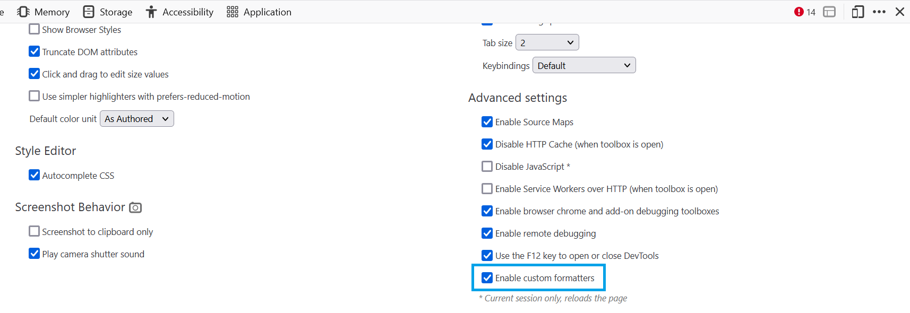
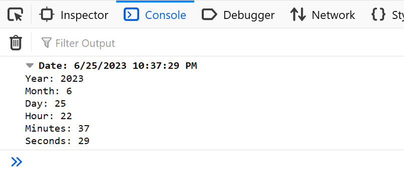
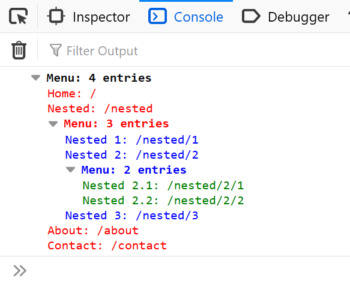

=================
Custom Formatters
=================

Custom formatters allow a website to control the display of variables within the :doc:`Web Console <../web_console/index>` and the :doc:`Debugger <../debugger/index>`.

This feature can be particularly useful for web applications that deal with complex object structures, or for JavaScript frameworks that define objects for native variables, or for frameworks that compile to JavaScript like ClojureScript.

Custom formatting enhances the debugging process by displaying a more intuitive and informative representation of their variables.

Enabling custom formatting
**************************

To enable custom formatting, switch to the :doc:`Settings <../settings/index>` panel and check the option called "Enable custom formatters" under "Advanced settings". The setting takes effect the next time you open the DevTools.

API
***

Once custom formatters are enabled, websites can customize how certain variables are displayed in the Web Console and the Debugger. This is achieved by defining custom formatters using a global array called ``devtoolsFormatters``. Each entry in this array represents a specific formatter that may handle a particular type of variable. If there's no formatter defined for a variable, it is displayed using its default formatting.

Custom formatter structure
--------------------------

Each formatter must at least contain a ``header`` function. This function must either return a JsonML array or ``null``. If ``null`` is returned, the ``header`` function of the next entry in ``devtoolsFormatters`` will be called. If all ``header`` functions return ``null``, then the object will be displayed with the default rendering of the DevTools.

In addition to the ``header`` function, a formatter can contain a ``body`` function. The existence of a ``body`` is indicated by the ``hasBody`` function. If ``hasBody`` returns ``true``, the object can be expanded to show more details. The actual body is then returned by the ``body`` function. Like the ``header`` function, it can either return a JsonML object or ``null``.

All three functions take the object as the first parameter and an optional configuration object as the second parameter, which allows passing additional information.

Here's a more detailed description of the functions:

``header(object, config)``
    Returns a JsonML array or ``null``. If ``null`` is returned, the default format is used to display the object.
    The ``config`` parameter is optional. This parameter can be passed using the special ``object`` template (see :ref:`generating-child-elements`).

``hasBody(object, config)``
    Returns a boolean indicating whether the object can be expanded to show more details.
    The ``config`` parameter is optional. This parameter can be passed using the special ``object`` template (see :ref:`generating-child-elements`).

``body(object, config)``
    Returns a JsonML array or ``null``. If ``null`` is returned, the default format is used to display the object.
    The ``config`` parameter is optional. This parameter can be passed using the special ``object`` template (see :ref:`generating-child-elements`).

HTML template format
--------------------

Each HTML template is encoded in a format based on the `JsonML <http://www.jsonml.org/>`_ standard. Each element is represented as list in the format

.. code-block:: javascript

    [tagName, {"style": "name: value; ..."}, child1, …]

The following HTML tags are allowed:

````, ``
``, ``<ol>``, ``<ul>``, ``<li>``, ``<table>``, ``<tr>``, and ``<td>``.

The optional ``style`` attribute may contain a string of CSS declarations. CSS properties that can be applied are:

- ``align*``
- ``background*`` (``background-image`` only allows ``data:`` URLs)
- ``border*``
- ``box*``
- ``clear``
- ``color``
- ``cursor``
- ``display``
- ``float``
- ``font*``
- ``justify*``
- ``line*``
- ``margin*``
- ``padding*``
- ``position`` (only the values ``static`` and ``relative`` are accepted)
- ``text*``
- ``transition*``
- ``outline*``
- ``vertical-align``
- ``white-space``
- ``word*``
- ``writing*``
- ``width``
- ``min-width``
- ``max-width``
- ``height``
- ``min-height``
- ``max-height``

A child can be another element, a string, or an object reference.

.. _generating-child-elements:

Generating child elements
-------------------------

Child elements can be created by defining a special ``object`` template. The format of this template is:

.. code-block:: javascript

    ["object", {"object": objectToInspect, "config": configObject}]

Examples
********

Simple example
--------------

Let's take a look at a simple example to illustrate the concept of custom formatters:

.. code-block:: javascript

    window.devtoolsFormatters = [
      {
        header: variable => {
          if (variable.hasOwnProperty('foo')) {
            return [
              'span', {
                'style': `
                  font-family: "Comic Sans MS", fantasy;
                  font-size: 3rem;
                  color: green;
                `
              },
              'foo'
            ];
          }
          return null;
        }
      }
    ];

In the example above, a custom formatter is defined for a variable. The `header` property of the formatter is a function that determines how the variable is displayed. In this case, if the variable has a property named `foo`, it will be rendered as a `` element with a specific style. It will be logged to the Web Console like this:

.. image:: simple-custom-formatter-example.png

Complete example
----------------

For a more complex example, let's consider displaying a `Date` object:

.. code-block:: html

    <!DOCTYPE html>
    <html>
      <head>
        <title>Custom formatter for dates</title>
      </head>
      <body>
        
      </body>
    </html>

With this custom formatter, a ``Date`` object logged to the console will display the date and time in a formatted manner, along with separate breakdowns of its individual components. Within the console, the object will be logged like this:

Example with object references
------------------------------

.. code-block:: html

    <!DOCTYPE html>
    <html>
      <head>
        <meta charset="utf-8"/>
        <title>Menu custom formatter</title>
        
      </head>
      <body>
      </body>
    </html>

This example displays a menu object with nested subitems. The custom formatter is recursive, so it will display all subitems as well. The output of this example looks like this:

Debugging Custom Formatters
***************************

If a custom formatter contains an error, an error message is logged to the console, explaining the issue. Whenever possible, the error message also includes a source link pointing to the exact location of the error within the code.

.. image:: custom-formatter-error.png

Further tips
************

- Analyze the structure and behavior of the variables you intend to format, understanding the key properties or class hierarchy that differentiate them.
- When testing for an object's type, use ``instanceof`` if the objects are instances of a specific class. If the objects are plain objects, use ``hasOwnProperty`` to check for particular properties.
- Test your formatters with different types of variables to ensure they function as expected and handle various cases accurately.
- Nest formatters by :ref:`generating-child-elements` to display complex objects in a more readable manner.
- Use the ``config`` parameter to pass additional information to the formatter, such as the current level of recursion.
- If you have multiple formatters, keep in mind to check for the type of the object in each formatter, and return ``null`` if the object is not of the expected type. Otherwise, the formatter will be applied to all objects, which may result in unexpected behavior.
- Choose your formatting wisely. For large objects it may be better to display only a summary of the object, and allow the user to expand it if needed.
- Each logged object will call the formatters hooks, which can have an impact on performance. So you should aim for small and fast hooks.

Existing Formatters
*******************

There are existing formatters available that cover different needs. Some examples include:

- `andrewdavey/immutable-devtools <https://github.com/andrewdavey/immutable-devtools>`_: Custom formatter for Immutable-js values
- `disjukr/vector-devtools <https://github.com/disjukr/vector-devtools#vector-devtools>`_: Custom formatter for vector values
- `binaryage/cljs-devtools <https://github.com/binaryage/cljs-devtools#cljs-devtools---->`_: Collection of DevTools enhancements for ClojureScript developers
- Three.js object formatters:

  - `twitter.com/thespite/status/656585905151545344 <https://twitter.com/thespite/status/656585905151545344>`_
  - `twitter.com/thespite/status/656499298230734849 <https://twitter.com/thespite/status/656499298230734849>`_
