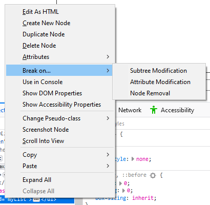
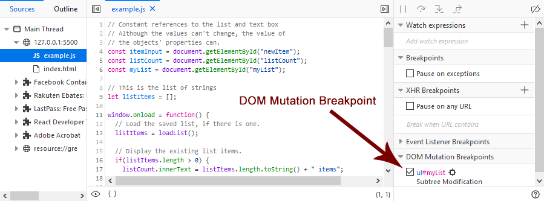
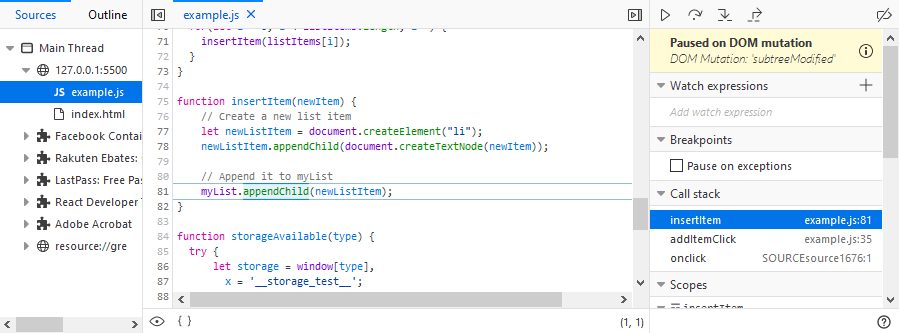

=====================
Break on DOM mutation
=====================

A DOM Mutation Breakpoint pauses the code when the DOM node on which you have set the breakpoint is modified.

You set a DOM Mutation Breakpoint in the :doc:`Page Inspector <../../page_inspector/index>`. Navigate to the DOM node in which you are interested and use the context menu to set the breakpoint.

There are three choices:

**Subtree Modification**

  Execution pauses if any of the element's descendant nodes are modified. 
  That means, the script execution is stopped whenever a child node or descendant node deeper in the DOM structure is added to or removed from the element the option is set on.

  Examples for when this breakpoint is triggered are calling `Node.appendChild() <https://developer.mozilla.org/en-US/docs/Web/API/Node/appendChild>`_ and `Node.removeChild() <https://developer.mozilla.org/en-US/docs/Web/API/Node/removeChild>`_, calling `Element.remove() <https://developer.mozilla.org/en-US/docs/Web/API/Element/remove>`_ or setting `Element.innerHTML <https://developer.mozilla.org/en-US/docs/Web/API/Element/innerHTML>`_ on one of the subnodes.

**Attribute Modification**

  Execution pauses when any of the elements' attributes are modified. 
  That means, the script execution is stopped whenever an attribute is added to or removed from the element the option is set on or the value of one of its attributes is changed.

  Examples for when this breakpoint is triggered are calling `Element.setAttribute() <https://developer.mozilla.org/en-US/docs/Web/API/Element/setAttribute>`_, `Element.removeAttribute() <https://developer.mozilla.org/en-US/docs/Web/API/Element/removeAttribute>`_, and `Element.classList.add() <https://developer.mozilla.org/en-US/docs/Web/API/Element/classList#methods>`_, or setting `Element.id <https://developer.mozilla.org/en-US/docs/Web/API/Element/id>`_.

**Node Removal**
  Execution pauses if the element the option is set on is removed.

  Examples for when this breakpoint is triggered are calling `Element.remove() <https://developer.mozilla.org/en-US/docs/Web/API/Element/remove>`_ or `Node.removeChild() <https://developer.mozilla.org/en-US/docs/Web/API/Node/removeChild>`_ on its parent node.

Once you set the breakpoint, go to the Debugger. You can see the breakpoint listed in the right-most panel under **DOM Mutation Breakpoints**.

Click on the icon following the node name to go back to the Page Inspector with the node selected.

When you execute the code, the debugger will pause execution when the DOM mutation occurs. In the following example, the selected node (the unordered list) is modified by adding a new child node.

The panel on the right shows that execution is "Paused on DOM mutation" and you, as with any other breakpoint, you can see the call stack and view any Watch expressions you may have set up.

Inline variable preview
***********************

New in Firefox 71, the :ref:`source pane <debugger_ui_tour_source_pane>` now gives you an instant preview of the variables on each line of code you've stepped through. See :ref:`Set a breakpoint > Inline variable preview <debugger-how-to-set-a-breakpoint-variable-preview>` for more information.
