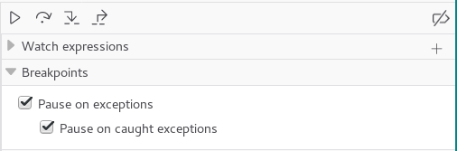
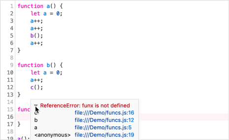

======================
Breaking on exceptions
======================

To instruct the debugger to pause on an `exception <https://developer.mozilla.org/en-US/docs/Web/JavaScript/Reference/Global_Objects/Error>`_, tick these checkboxes in the :ref:`Breakpoints list <debugger-ui-tour-breakpoints-list>`:

- Pause on exceptions
- Pause on caught exceptions

When an exception occurs, the line where it occurs is highlighted in the source pane, with a squiggly red line under the problematic code. A tooltip describes the exception. Starting in Firefox 80, a disclosure triangle within the tooltip reveals a stack trace.

