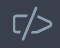
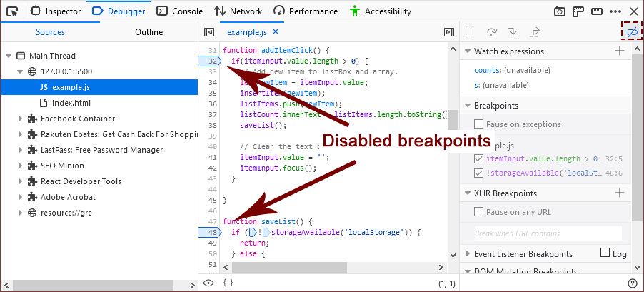

===================
Disable breakpoints
===================

To disable a single breakpoint, uncheck the checkbox next to it in the :ref:`breakpoints list <debugger-ui-tour-breakpoints-list>`.

To disable all breakpoints, click this icon: |image1| in the :ref:`toolbar <debugger-ui-tour-toolbar>`.

After you click the icon to disable breakpoints, the appearance of the breakpoints will change to a lighter color with a dark-colored border. For example:

