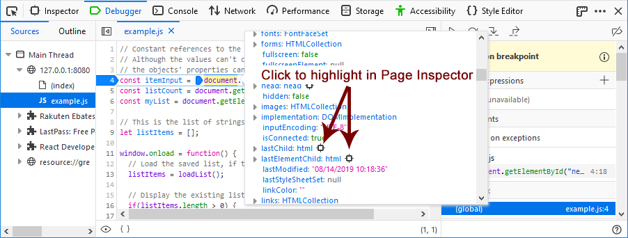

===============================
Highlight and inspect DOM nodes
===============================

If you hover over a DOM node in the Watch Expressions, it will be highlighted in the page.

When you are working with DOM nodes in the debugger, you can easily highlight the node on the page or view it in the Page Inspector. A DOM object in the Watch Expressions area, for example, includes a target. Hover over the target to highlight the item on the page, Click on the target to switch to the Page Inspector with the item highlighted.

.. raw:: html

  <iframe width="560" height="315" src="https://www.youtube.com/embed/G8KUW87zkK8" title="YouTube video player" frameborder="0" allow="accelerometer; autoplay; clipboard-write; encrypted-media; gyroscope; picture-in-picture" allowfullscreen></iframe>
   
   

Also, when you view the details of a DOM node in the code panel, objects that you can highlight in the list will also have a target next to them. You can click any one of these targets to switch to the Page Inspector with this item highlighted.

