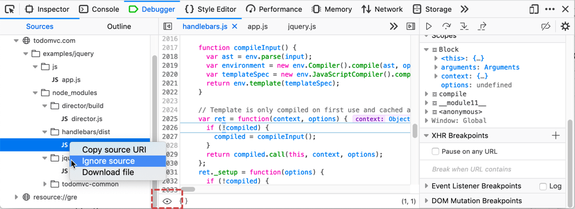

===============
Ignore a source
===============

In modern web development, we often rely on libraries like `jQuery <https://jquery.com/>`_, `Ember <https://emberjs.com/>`_, or `Angular <https://angularjs.org/>`_, and 99% of the time we can safely assume that they “just work”. We don’t care about the internal implementation of these libraries. However, a library’s abstraction leaks during debugging sessions when you are forced to step through its stack frames in order to reach your own code. However, you can tell the debugger to ignore the details of selected sources.

You can enable or disable ignoring a source file in a couple of ways:

- In the :ref:`source list pane <debugger-ui-tour-source-list-pane>`, right-click the filename and choose **Ignore source** (or **Unignore source**).
- If the source file is displayed in the :ref:`source pane <debugger_ui_tour_source_pane>`, click the "eye" icon at the bottom.

When a source file is ignored:

- Any breakpoints it may have defined are disabled.
- When “Pause on Exceptions” is enabled in the :ref:`Debugger settings <settings-debugger>`, the debugger won’t pause when an exception is thrown in the ignored source; instead it waits until (and if) the stack unwinds to a frame in a source that isn’t ignored.
- The debugger skips through ignored sources when stepping.
