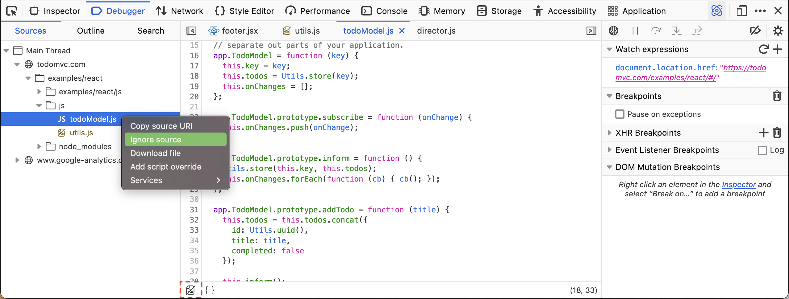
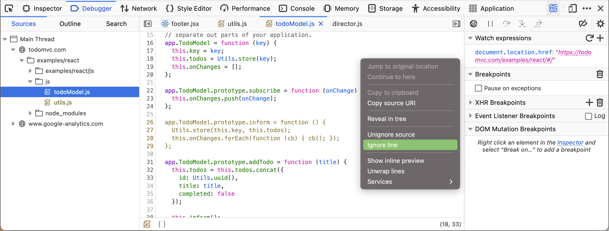
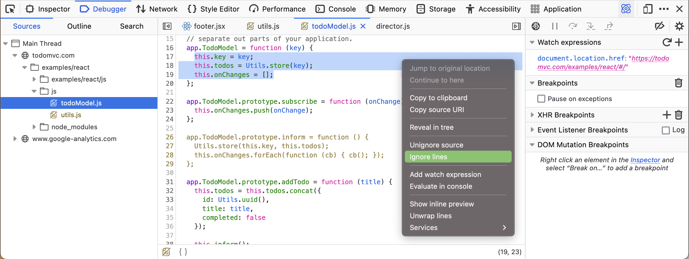
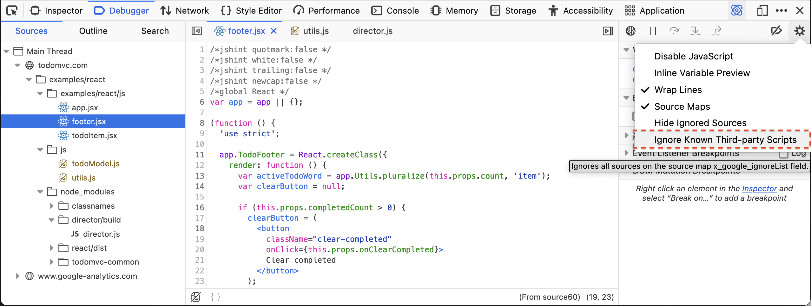

================
Ignoring sources
================

In modern web development, we often rely on libraries like `jQuery <https://jquery.com/>`_, `Ember <https://emberjs.com/>`_, or `Angular <https://angularjs.org/>`_, and 99% of the time we can safely assume that they “just work”. We don’t care about the internal implementation of these libraries. However, a library’s abstraction leaks during debugging sessions when you are forced to step through its stack frames in order to reach your own code. However, you can tell the debugger to ignore the details of selected sources.

What happens when source(s) or line(s) are ignored:

- Any breakpoints defined are disabled and are not hit on execution.
- When “Pause on Exceptions” is enabled in the :ref:`Debugger settings <settings-debugger>`, the debugger won’t pause when an exception is thrown in the ignored source; instead it waits until (and if) the stack unwinds to a frame in a source that isn’t ignored.
- The debugger skips through ignored sources when stepping.
- Any ``debugger`` statements are skipped when stepping.
- Any frames related to the source/line/lines won't be visible in the call stack.

Ignore a source
****************

To enable or disable ignoring a source file:

- In the :ref:`source list pane <debugger-ui-tour-source-list-pane>`, right-click the filename and choose **Ignore source** (or **Unignore source**).
- If the source file is displayed in the :ref:`source pane <debugger_ui_tour_source_pane>`, click the "crossed out source" icon at the bottom.

Ignore a single line
**********************

To ignore a single line in a source file:

- When the source file is displayed in the :ref:`source pane <debugger_ui_tour_source_pane>`, right-click the content on the specific line and choose **Ignore line** (or **Unignore line**)
- Also right-click on the gutter at the specific line and choose **Ignore line** (or **Unignore line**)

Ignore multiple lines
***********************

To ignore multiple lines in a source file:

- When the source file is displayed in the :ref:`source pane <debugger_ui_tour_source_pane>`, select the specific lines, then right-click on the selection and choose **Ignore lines** (or **Unignore lines**)

Ignore third-party scripts
****************************

Frameworks and bundlers can define third-party scripts which should be ignored, using the `x_google_ignoreList <https://developer.chrome.com/articles/x-google-ignore-list/>`_ sourcemap extension.
The debugger parses and reads this field from the sourcemap to automatically ignore these sources.

To ignore third-party scripts:

- Click the debugger settings menu and choose **Ignore Known Third-party Scripts**

