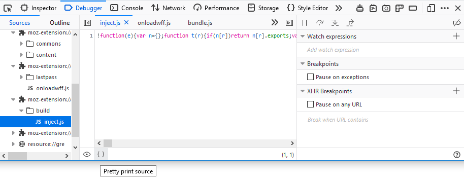
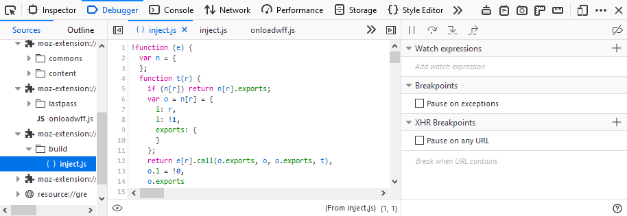

============================
Pretty-print a minified file
============================

To prettify a minified file, click the **Pretty print source** icon |image1| at the bottom of the :ref:`source pane <debugger_ui_tour_source_pane>`. The debugger formats the source and displays it as a new file with a name like: "{ } [original-name]".

After you click the icon, the source code looks like this:

The **Pretty print source** icon is available only if the source file is minified (i.e., not an original file), and is not already "prettified".

.. note::

  Currently Firefox `does not support <https://bugzilla.mozilla.org/show_bug.cgi?id=1010150>`_ pretty printing inline Javascript.
