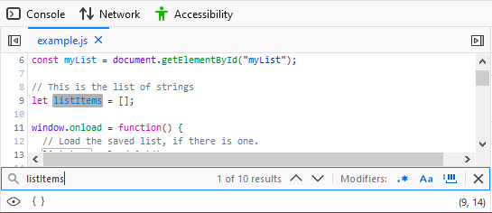
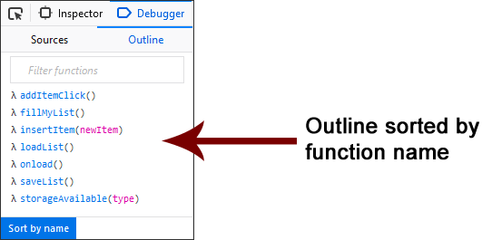
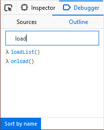
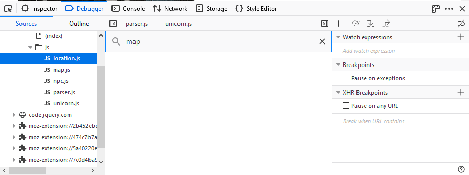
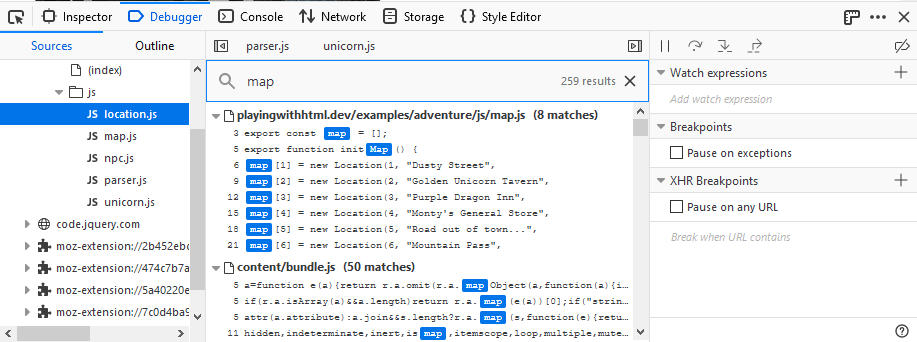

======
Search
======

.. _debugger-how-to-search-searching-for-files:

Searching for files
*******************

To search for a particular file, press :kbd:`Control` + :kbd:`P` (or :kbd:`Command` + :kbd:`P` on a Mac) and type the search term. The :ref:`source pane <debugger_ui_tour_source_pane>` will display a list of all matching files as you type. You can use the up and down arrows to move through the list, and :kbd:`Return` to open the file you want:

.. raw:: html

  <iframe width="560" height="315" src="https://www.youtube.com/embed/xXsfYx0THWg" title="YouTube video player" frameborder="0" allow="accelerometer; autoplay; clipboard-write; encrypted-media; gyroscope; picture-in-picture" allowfullscreen></iframe>
   
   

.. _debugger-how-to-search-searching-within-a-file:

Searching within a file
***********************

To search for a particular substring in the file currently loaded into the :ref:`source pane <debugger_ui_tour_source_pane>`, press :kbd:`Control` + :kbd:`F` (or :kbd:`Command` + :kbd:`F` on a Mac) while the source pane is focused. Press :kbd:`Return` to search. The debugger will display the number of matches in the code and highlight each result:

Using the Outline tab
---------------------

If you are searching for a specific function within the current JavaScript file, you can use the Outline tab in the debugger to find it quickly. The Outline tab lists the functions in the current file. The default sort order is by the order in the file but you can simplify the search by click on "Sort by name" at the bottom of the tab.

You can further simplify the search by filtering the list. Enter text into the text input above the list to limit the results in the Outline. For example, if I enter "load" when viewing the above list, I get the following:

Only the functions with load in their name are shown.

This feature may not seem terribly useful when searching a file with a handful of functions in it but when you are searching through a file with dozens of functions, it comes in handy.

Searching in all files
**********************

You can also search for a string in all of the files included in the currently opened project. Press :kbd:`Shift` + :kbd:`Ctrl` + :kbd:`F` (Windows and Linux) or :kbd:`Shift` + :kbd:`Cmd` + :kbd:`F` (macOS) and then enter the string you are trying to find.

If the string exists in any of the files in the project, the search will return a list showing a list by file and line number.

Click on any entry in the list to go directly to the line in the file where the string occurs.
