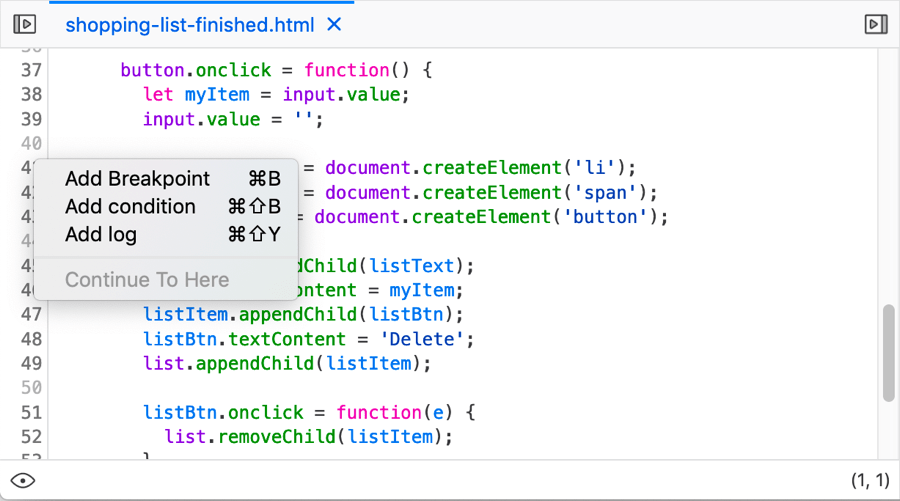
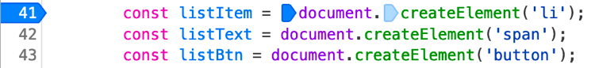
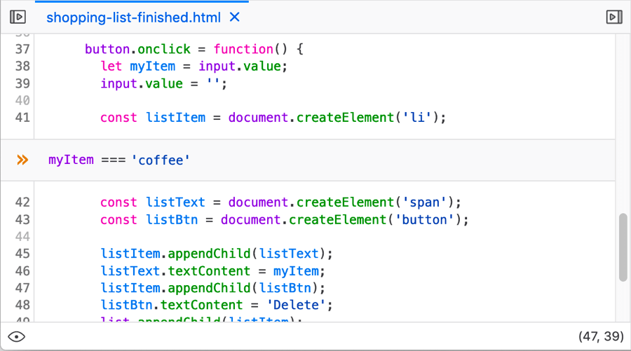
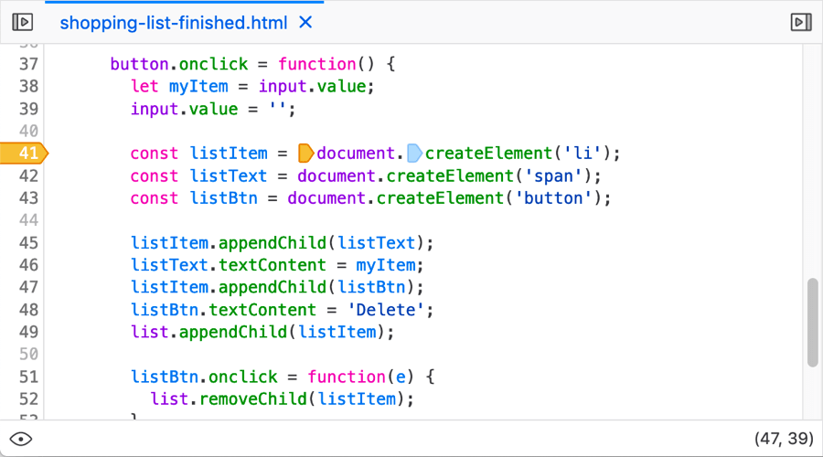
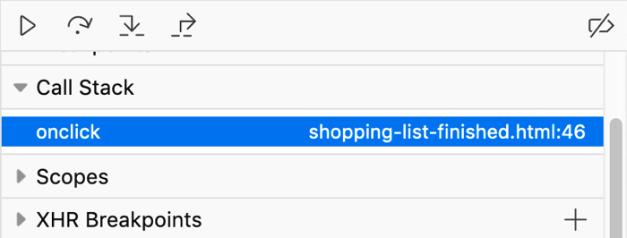
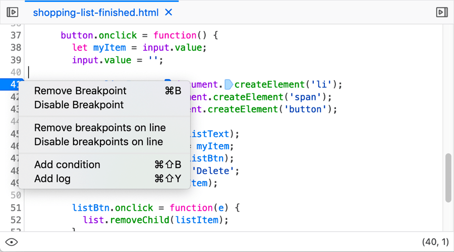
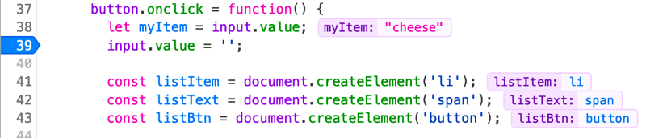

================
Set a breakpoint
================

There are many different types of breakpoint that can be set in the debugger; this article covers standard (unconditional) breakpoints and conditional breakpoints.

Breakpoints in brief
********************

Breakpoints are very useful when debugging JavaScript — you basically set a point in your code where you would like execution of the code to pause. At this point you can do useful things like studying the value of different variables at that point, allowing you to work out why a problem is occurring.

The source pane context menu
****************************

In the :ref:`source pane <debugger_ui_tour_source_pane>`, you can handle setting breakpoints by bringing up the context menu over a line number.

There are a few options available here:

- *Add breakpoint*: Add a standard **unconditional breakpoint** at this line number (see below).

- *Add condition*: Add a condition and create a **conditional breakpoint** (see below).

- *Add log*: Add a :doc:`log point <../../set_a_logpoint/index>`, which logs a value to your console rather than pausing execution as a breakpoint does.

- *Continue to here*: When :doc:`stepping through code <../step_through_code/index>`, this option tells the debugging to continue execution through to this point.

Unconditional breakpoints
*************************

An unconditional breakpoint is one where the code will always pause execution when it is reached. You can set an unconditional breakpoint using the context menu (see above), or by:

- Clicking on the line number for the line you want to break at in the source pane.
- Highlighting the line you want to break at in the source pane and pressing :kbd:`Ctrl` + :kbd:`B` (Windows/Linux) or :kbd:`Cmd` + :kbd:`B` (macOS).

The line number is highlighted in blue:

In addition, if the line contains multiple function calls, each one will be given a small blue arrow icon to the left of it. These are called **column breakpoints**, and allow you to set the breakpoint to happen exactly on any one of the function calls in the line (or multiple calls), by clicking on each relevant one.

Conditional breakpoints
***********************

A conditional breakpoint is one where the code will pause execution when it is reached, only if a certain condition is met, such a variable having a certain value at the time. You can set a conditional breakpoint using the context menu (see above), or by highlighting the line you want to break at in the source pane and pressing :kbd:`Ctrl` + :kbd:`Shift` + :kbd:`B` (Windows/Linux) or :kbd:`Cmd` + :kbd:`Shift` + :kbd:`B` (macOS).

When you first choose to set a conditional breakpoint, a text entry line will appear into which you add the condition you want it to break on:

Once you've entered your condition and pressed :kbd:`Enter`/:kbd:`Return`, the line number will be highlighted in orange:

Breakpoints list
****************

Once you've set some breakpoints, the :ref:`breakpoints list <debugger-ui-tour-breakpoints-list>` in the right-hand column shows the filename and line number for each one:

Unsetting a breakpoint
**********************

Once a breakpoint has been set, you can unset it again in various ways:

- Click on the line number highlight.
- Highlight the line of code the breakpoint is set on and pressing :kbd:`Ctrl` + :kbd:`B` (Windows/Linux) or :kbd:`Cmd` + :kbd:`B` (macOS).
- Bring up the context menu over the line highlight and choose the *Remove Breakpoint* option.

Other context menu options worth mentioning are:

- *Disable Breakpoint:* turn it off, but don't remove it completely.
- *Disable breakpoints on line* and *Remove breakpoints on line*: Remove or disable column breakpoints.
- If the breakpoint is an unconditional breakpoint, you'll get an option *Add condition*, which allows you to turn it into a conditional breakpoint.
- If the breakpoint is a conditional breakpoint, you'll get an option *Edit condition*, which allows you to change the previously set condition.

.. _debugger-how-to-set-a-breakpoint-variable-preview:

Inline variable preview
***********************

New in Firefox 71, the :ref:`source pane <debugger_ui_tour_source_pane>` now gives you an inline preview of the variables on each line of code you've stepped through:

This is a very useful timesaver when stepping through your code. Previously you’d have to scroll through the Scopes panel to find variable values, or hover over a variable in the source pane. Now when execution pauses, you can view relevant variables immediately.

.. note::

  There is also a new option in the context menu for the actual code in the source pane — *Hide inline preview*/*Show inline preview* — which allows you to turn the inline variables on/off.
