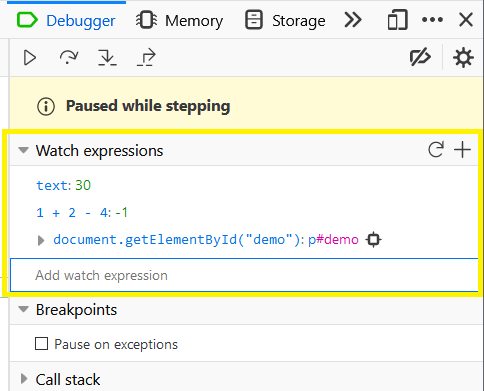
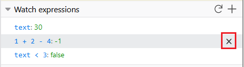

=====================
Set watch expressions
=====================

The Debugger *Watch expressions* pane allows you to specify JavaScript expressions that will be reevaluated and displayed every time the debugger pauses. As you step through code, the debugger will watch the expression and return any results.Watches are most commonly used to group individual*variables* of interest for easier observation. Watching more complicated expressions can sometimes also be useful:for example, to check that variables are within certain limits or values.

The screenshot below shows the *Watch expressions* panel with a number of expressions already defined. Each line shows the expression and its value at the current step,separated by a colon. Expressions that evaluate to an object can be expanded using the caret symbol to the left.

To add a watch expression click the **+** button in the top right corner of the panel. Then type the expression into the text entry field that appears at the bottom of the panel, and press :kbd:`Enter` to save it. The expression will be evaluated when you save, when you step through the code, or when you select the *Refresh* icon (next to **+**).

You can enter any valid expression into the watch, and even declare new "watch" variables and reuse them. For example, ``mywatchvar1 = 3`` and ``mywatchvar2 = mywatchvar1 + 2`` will evaluate ``mywatchvar2`` as 5. You can also declare an expression that modifies a variable value in the code, and this will be re-evaluated whenever you step through the code or refresh the watch expression.

.. warning::

  **Important**: Changing values in the code using a watch expression may affect normal code execution.

To remove a watch expression, select the **X** button that appears when you hover over a line.

