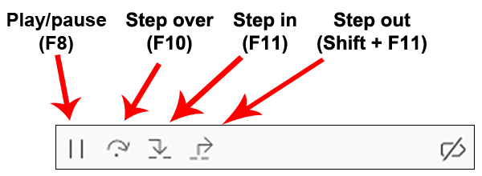
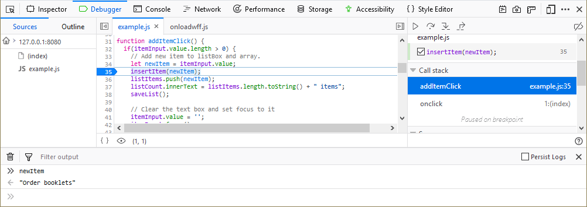
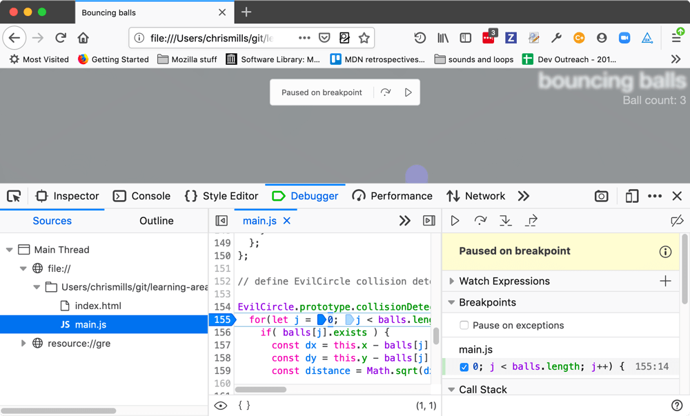

=================
Step through code
=================

When the debugger is stopped at a breakpoint, you can step through it using four buttons in the :ref:`toolbar <debugger-ui-tour-toolbar>`:

In order, the buttons are:

- Play: run to the next breakpoint
- Step over: advance to the next line in the same function.
- Step in: advance to the next line in the function, unless on a function call, in which case enter the function being called
- Step out: run to the end of the current function, in which case, the debugger will skip the return value from a function, returning execution to the caller

Split console
*************

When paused, you can press the Esc key to open and close the split console to gain more insight into errors and variables:

Pause on breakpoints overlay
****************************

Since Firefox 70, when your code is paused on a breakpoint an overlay appears on the viewport of the tab you are debugging.

This lets you know what kind of breakpoint the code is paused on (breakpoint, event breakpoint, etc.), and also provides a step button and a play button. The thinking here is that if you've got your DevTools open in a separate window, as many people do, it can be easier to have the buttons available right there to move the code forward while you are looking at the result.

Inline variable preview
***********************

New in Firefox 71, the :ref:`source pane <debugger_ui_tour_source_pane>` now gives you an instant preview of the variables on each line of code you've stepped through. See :ref:`Set a breakpoint > Inline variable preview <debugger-how-to-set-a-breakpoint-variable-preview>` for more information.
