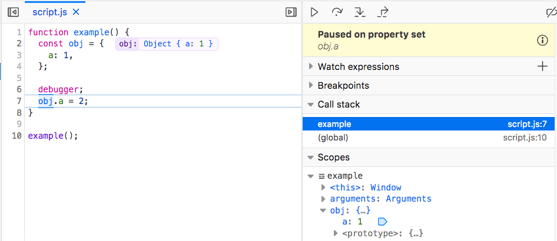

===============
Use watchpoints
===============

When debugging JavaScript code, it can be useful to know when properties on objects are read or modified. In a large, complex codebase, it's not always easy to know where in the code a given property is accessed. In the Firefox Debugger, this information can be provided by *watchpoints*. By setting a watchpoint on the property, rather than a breakpoint at a particular line, you can discover where that access occurs.

There are three types of watchpoints: *get*, *set*, and *get or set*. A *get* watchpoint pauses whenever a property is read; a *set* watchpoint pauses whenever a property value changes; a *get or set* watchpoint pauses whenever a property value is accessed in either way.

Set a watchpoint
****************

1. Run and then pause the debugger.
2. In the Scopes pane on the right side of the Debugger user interface, find an object you want to watch, and right-click it to open its context menu.
3. Choose **Break on**, and then one of

   - **Property set**
   - **Property get**
   - **Property get or set**

  .. image:: watchpoint-get-or-set.png
    :alt: Screenshot showing the context menu for setting a watchpoint on an object
    :class: border

  A watchpoint icon appears to the right of the property in the Scopes pane. *Set* watchpoint icons are blue, *get* watchpoint icons are reddish, and *get or set* watchpoint icons are dark yellow.

  .. image:: watchpoint-icons.png
    :alt: Screenshot highlighting the 3 types of watchpoint icons
    :class: border

4. Click **Play** or press :kbd:`F8` to resume execution.

View a watchpoint
*****************

When the watched property is accessed in the way specified by the watchpoint type (get or set), the debugger pauses, enabling you to see line of code responsible, and to inspect anything else you wish at that time.

In the following screenshot, the debugger pauses at line 7, where ``obj.a`` is set. The message panel in the upper right corner indicates that the debugger is "Paused on property set".

Delete a watchpoint
*******************

- Locate the watched property in the Scopes pane.
- Click the watchpoint icon, or right-click and choose **Remove watchpoint**. The watchpoint is removed.

See also
********

- `Debugging variables with watchpoints in Firefox 72 <https://hacks.mozilla.org/2019/12/debugging-variables-with-watchpoints-in-firefox-72/>`_
