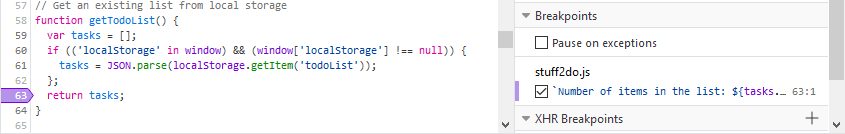
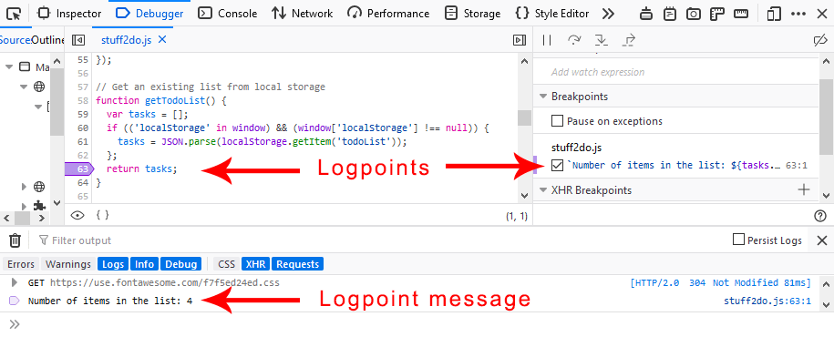

==============
Set a logpoint
==============

Sometimes you want to view a value in your code but you don't want to pause execution. Rather than sprinkle `console.log() <https://developer.mozilla.org/en-US/docs/Web/API/console/log>`_ statements throughout your code, you can use a special type of breakpoint, the logpoint. Logpoints print a message to the Console panel instead of pausing code execution.

The logpoint is especially useful in cases where breaking the execution breaks testing procedures, such as when you are debugging popup windows, or executing focus-related logic.

To create a logpoint:

1. Right click on a line number in the Debugger panel and pick **Add log** action from the context menu.

  .. image:: add_logpoint.png
    :class: center

2. Create an expression inline. The result is logged in the console panel every time the line with the logpoint executes. You can use any variable or function available in the current scope.

  .. image:: creating_the_log_point.png
    :class: center

Working with logpoints
**********************

When you set a logpoint, the indicator is purple, rather than the blue of an unconditional breakpoint or the orange of a conditional breakpoint.

You can view the list of logpoints in the Breakpoints side panel.

When execution hits a logpoint, the message you have defined is logged to the console. You can make it easier to see the message by opening a split console under the debugger. (Either press :kbd:`Esc` or select the ellipsis menu (**...**) and then click **Show Split Console**.)

When should you use logpoints?
------------------------------

- When you want to know that a specific line in your code has executed, but you don’t want to break code execution, set a logpoint.
- Logpoints are useful to log the value of a variable at a specific point in the code. It’s faster than changing the underlying source code itself to add calls to the ``console.log`` method.
- If you need to execute additional logic related to the source code and you can’t change the source code itself, you can use a logpoint.
- Note that you can use logpoints with :doc:`source-mapped code <../using_the_debugger_map_scopes_feature/index>`, as well as with your unmapped source files.

See also
********

- :doc:`Set a breakpoint <../how_to/set_a_breakpoint/index>`
- :doc:`Set a conditional breakpoint <../how_to/set_a_conditional_breakpoint/index>`
- :doc:`Set an XHR breakpoint <../set_an_xhr_breakpoint/index>`
- :doc:`Disable breakpoints <../how_to/disable_breakpoints/index>`
