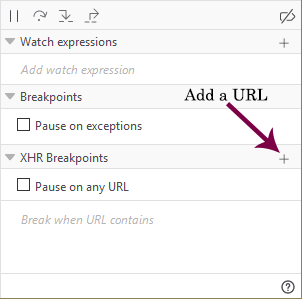
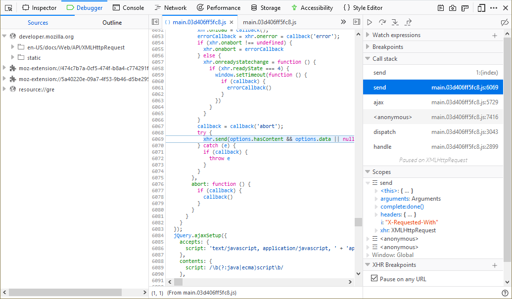

=====================
Set an XHR breakpoint
=====================

An XHR (XMLHttpRequest) breakpoint breaks code execution when an XHR request is dispatched so that you can examine the current state of the program. You can break on all requests or on those that include a specific URL. To turn on the feature:

1. Open the debugger
2. Click on "Pause on any URL" which acts as a wild card, causing the code to pause on any call, or,
3. Click the plus sign next to the XHR breakpoints header, enter the URL in which you are interested, and press :kbd:`Enter`.

.. note::

  If you enter a key word instead of a URL, code execution will pause on any call to a URL that contains that keyword.

When your code breaks on an XHR request, the right hand pane will have two additional sections:

**Call stack**
  The list of functions that were executed in order to get to the currently executing code. Click on an item in the call stack to jump to the associated line in the code display.

**Scopes**
  A list of the values that are in scope in the function, method, or event handler where the break occurred.

Inline variable preview
***********************

New in Firefox 71, the :ref:`source pane <debugger_ui_tour_source_pane>` now gives you an instant preview of the variables on each line of code you've stepped through. See :ref:`Set a breakpoint > Inline variable preview <debugger-how-to-set-a-breakpoint-variable-preview>` for more information.
