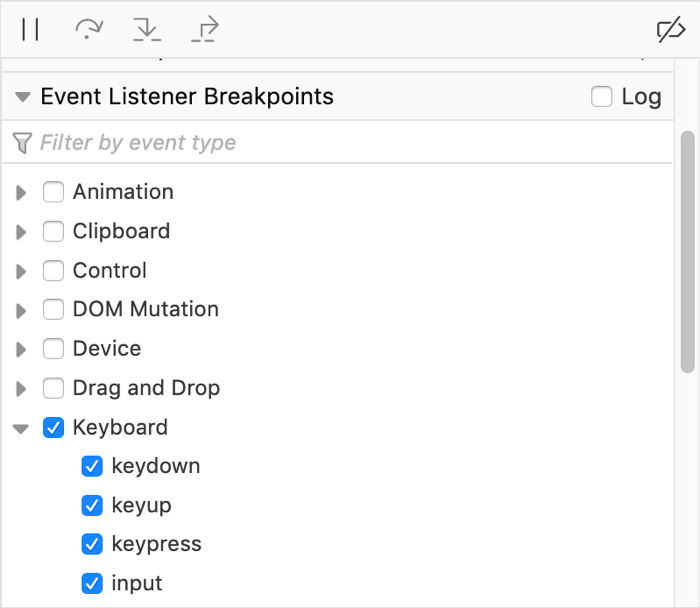
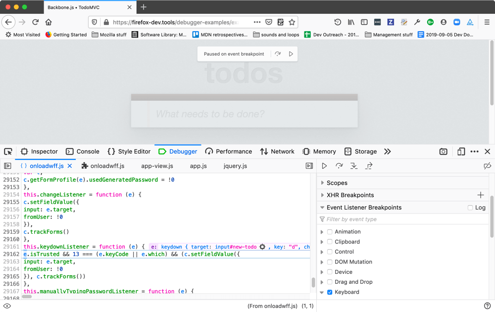
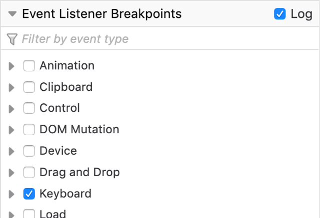
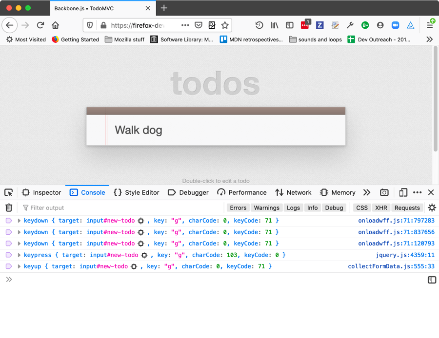
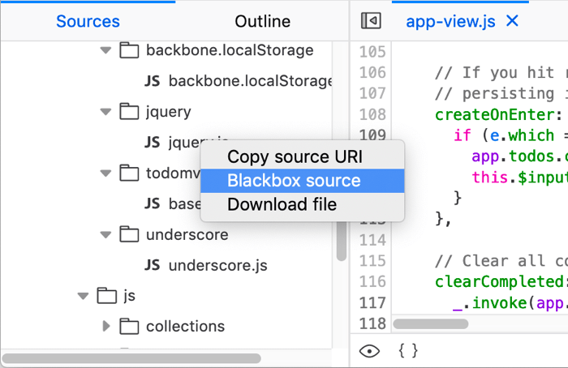
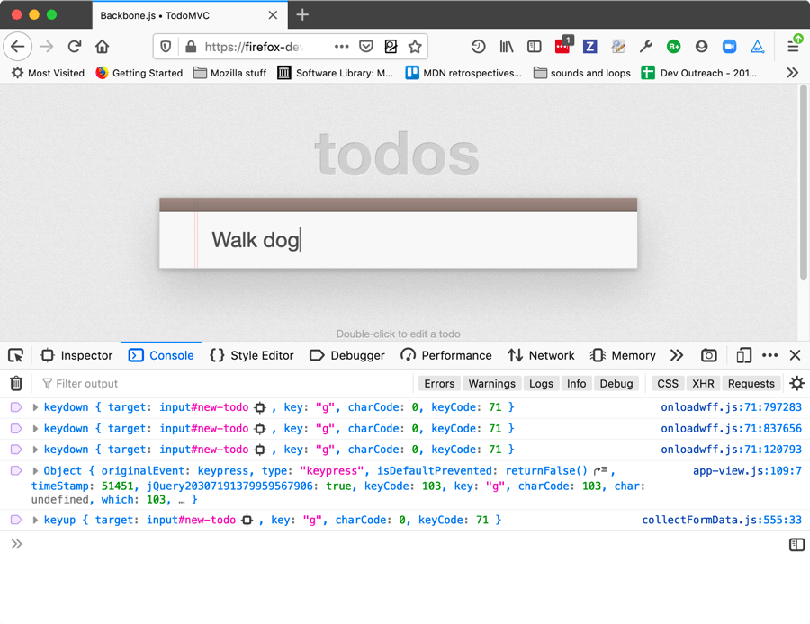
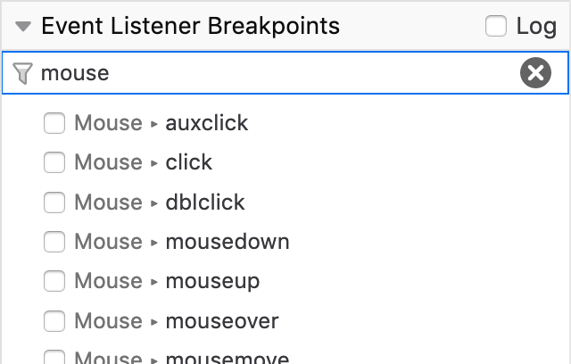

==============================
Set event listener breakpoints
==============================

Starting with Firefox 69, debugging an application that includes event handlers is simplified because the debugger now includes the ability to automatically break when the code hits an event handler. This article explains how to use it.

Using a standard event breakpoint
*********************************

To use an event breakpoint, you open up the JavaScript debugger, and find and expand the Event Listener Breakpoints section in the right hand column.

To break when event listeners are hit, check the boxes next the events you are interested in. All of the standard events supported in your version of Firefox are listed, arranged by which API or API area they're part of.

Now when a `keydown <https://developer.mozilla.org/en-US/docs/Web/API/Document/keydown_event>`_, `keyup <https://developer.mozilla.org/en-US/docs/Web/API/Document/keyup_event>`_, `keypress <https://developer.mozilla.org/en-US/docs/Web/API/Document/keypress_event>`_, or `input <https://developer.mozilla.org/en-US/docs/Web/API/HTMLElement/input_event>`_ event occurs, execution will pause as soon as it enters the listener code.

When execution pauses, the :ref:`source pane <debugger_ui_tour_source_pane>` displays the highlighted line of the JavaScript code that is next to be executed, along with the surrounding code for context. In addition, you get a box overlaid on the viewport saying "Paused on event breakpoint", with buttons to step over that line of code or resume execution.

You *could* add regular breakpoints at the entry point of the listener to achieve the same effect. If however you have multiple elements, all of which have event listeners attached that you want to break on, this becomes an enormous time saver.

This is also useful when debugging code that you're unfamiliar with, to save time over hunting down your event handler within your code, or when trying to understand why a web site isn't working as expected in your browser. Use event breakpoints to stop execution at the triggering event for the action that fails, then step through the code or watch the console to see what happens.

Logging on events
*****************

In Firefox 71 onwards, the “Log” checkbox is available in the *Event Listener Breakpoints* list. Selecting this and then choosing some events to break on will mean that when you step through code, information about events fired will be logged to the console instead of the DevTools breaking on each one.

So if we choose to log keyboard events, for example, the code no longer pauses as each event is fired:

Instead, we can then switch to the console, and whenever we press a key we are given a log of where related events were fired.

There's an issue here — the console is showing that the `keypress event <https://developer.mozilla.org/en-US/docs/Web/API/Document/keypress_event>`_ is being fired somewhere inside jQuery. Instead, it’d be far more useful if we showed where in our own app code is calling the jQuery that fired the event. This can be done by finding ``jquery.js`` in the Sources panel, and choosing the **Ignore source option** from its context menu.

Now the logs will show where in your app jQuery was called, rather than where in jQuery the event was fired:

Filter by event type
********************

Also added to Firefox 71 is a new *Filter by event type...* text input, which can also be found at the top of the *Event Listener Breakpoints* list. When you click in this input and type a search term, the list of event listener types will filter by that term allowing you to find the events you want to break on more easily.

Inline variable preview
***********************

New in Firefox 71, the :ref:`source pane <debugger_ui_tour_source_pane>` now gives you an instant preview of the variables on each line of code you've stepped through. See :ref:`Set a breakpoint > Inline variable preview <debugger-how-to-set-a-breakpoint-variable-preview>` for more information.
