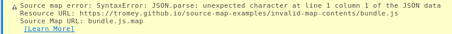
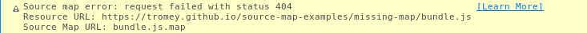
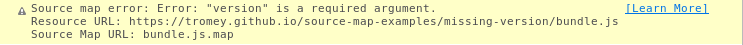
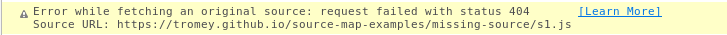
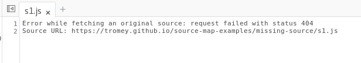

=================
Source map errors
=================

Source maps are JSON files providing a way to associate transformed sources, as seen by the browser, with their original sources, as written by the developer. You can sometimes encounter problems working with source maps. This page explains the most common problems and how to fix them.

.. note::

  If you're new to source maps, you can learn more about them in :doc:`How to use a source map <../how_to/use_a_source_map/index>`.

General source map error reporting
**********************************

If you do see a problem, a message will appear in the webconsole. This message will show an error message, the resource URL, and the source map URL:

Here, the resource URL tells us that ``bundle.js`` mentions a source map, and the source map URL tells us where to find the source map data (in this case, relative to the resource). The error tells us that the source map is not JSON data — so we're serving the wrong file.

There are a few common ways that source maps can go wrong; they are detailed in the following sections.

Source map missing or inaccessible
**********************************

The source map resource can be missing or inaccessible.

The fix here is to make sure the file is being served and is accessible to the browser

Invalid source map
******************

The source map data can be invalid — either not a JSON file at all, or with an incorrect structure. Typical error messages here are:

- ``SyntaxError: JSON.parse: unexpected character at line 1 column 1 of the JSON data``
- ``Error: "version" is a required argument``

Original source missing
***********************

An original source may be missing. You may encounter this when trying to open one of the original sources in the debugger. The message looks a little different in this case:

In this case, the error will also be displayed in the source tab in the debugger:

NetworkError when attempting to fetch resource
**********************************************

A bug in Firefox prevents it from loading source maps for WebExtensions.

See `Bug 1437937: WebExtensions Doesn't Find Source Maps <https://bugzilla.mozilla.org/show_bug.cgi?id=1437937>`_ for details.

.. code-block: html
  Source-Map-Fehler: TypeError: NetworkError when attempting to fetch resource.
  Ressourcen-Adresse: moz-extension://c7f0f003-4fcf-49fd-8ec0-c49361266581/background.js
  Source-Map-Adresse: background.js.map</pre>

The only workaround is to manually change the map URL to a public one (http://localhost:1234/file.map.js) and start a local webserver at this port.
